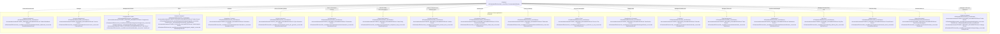

# Unnamed CodeViz Diagram

```mermaid
graph TD

    student_features.cv::student["**Student**<br>d:/Graduation/EduVerse/edu_verse/Roles_Documentation/Student"]
    subgraph student_features.cv::eduVerseApp["**EduVerse Flutter Application**<br>[External]"]
        student_features.cv::dashboard["**Student Dashboard**<br>d:/Graduation/EduVerse/edu_verse/features documentation/student/STUDENT_FEATURES_DOCUMENTATION.md `Student Dashboard Screen`, d:/Graduation/EduVerse/edu_verse/lib/screens/student/dashboard/student_dashboard_screen.dart `StudentDashboardScreen`"]
        student_features.cv::courses["**Courses Management**<br>d:/Graduation/EduVerse/edu_verse/features documentation/student/STUDENT_FEATURES_DOCUMENTATION.md `Courses Screen`, d:/Graduation/EduVerse/edu_verse/lib/screens/student/courses/courses_screen.dart `CoursesScreen`"]
        student_features.cv::assignments["**Assignments & Labs**<br>d:/Graduation/EduVerse/edu_verse/features documentation/student/STUDENT_FEATURES_DOCUMENTATION.md `Assignments Screen`, d:/Graduation/EduVerse/edu_verse/lib/screens/student/assignments/assignments_screen.dart `AssignmentsScreen`, d:/Graduation/EduVerse/edu_verse/features documentation/student/STUDENT_FEATURES_DOCUMENTATION.md `Labs Screen`, d:/Graduation/EduVerse/edu_verse/lib/screens/student/labs/labs_screen.dart `LabsScreen`"]
        student_features.cv::grades["**Grades & Analysis**<br>d:/Graduation/EduVerse/edu_verse/features documentation/student/STUDENT_FEATURES_DOCUMENTATION.md `Grades Screen`, d:/Graduation/EduVerse/edu_verse/lib/screens/student/grades/grades_screen.dart `GradesScreen`, d:/Graduation/EduVerse/edu_verse/features documentation/student/STUDENT_FEATURES_DOCUMENTATION.md `Grade Analysis Screen`, d:/Graduation/EduVerse/edu_verse/lib/screens/student/grades/grade_analysis_screen.dart `GradeAnalysisScreen`"]
        student_features.cv::attendance["**Attendance Tracking**<br>d:/Graduation/EduVerse/edu_verse/features documentation/student/STUDENT_FEATURES_DOCUMENTATION.md `Attendance Screen`, d:/Graduation/EduVerse/edu_verse/lib/screens/student/attendance/attendance_screen.dart `AttendanceScreen`"]
        student_features.cv::aiQuiz["**AI Quiz Generator**<br>d:/Graduation/EduVerse/edu_verse/features documentation/student/STUDENT_FEATURES_DOCUMENTATION.md `AI Quiz Generator Screen`, d:/Graduation/EduVerse/edu_verse/lib/screens/student/ai_quiz/ai_quiz_generator_screen.dart `AIQuizGeneratorScreen`"]
        student_features.cv::summarizer["**AI Summarizer**<br>d:/Graduation/EduVerse/edu_verse/features documentation/student/STUDENT_FEATURES_DOCUMENTATION.md `Summarizer Screen`, d:/Graduation/EduVerse/edu_verse/lib/screens/student/summarizer/summarizer_screen.dart `SummarizerScreen`"]
        student_features.cv::smartStudy["**Smart Study Planner**<br>d:/Graduation/EduVerse/edu_verse/features documentation/student/STUDENT_FEATURES_DOCUMENTATION.md `Smart Study Screen`, d:/Graduation/EduVerse/edu_verse/lib/screens/student/smart_study/smart_study_screen.dart `SmartStudyScreen`"]
        student_features.cv::aiNotes["**AI Notes Generator**<br>d:/Graduation/EduVerse/edu_verse/features documentation/student/STUDENT_FEATURES_DOCUMENTATION.md `AI Notes Screen`, d:/Graduation/EduVerse/edu_verse/lib/screens/student/ai_notes/ai_notes_screen.dart `AINotesScreen`"]
        student_features.cv::aiAssistant["**AI Assistant (Chatbot)**<br>d:/Graduation/EduVerse/edu_verse/features documentation/student/STUDENT_FEATURES_DOCUMENTATION.md `AI Chat Screen (AI Assistant)`, d:/Graduation/EduVerse/edu_verse/lib/screens/student/ai_chat/ai_chat_screen.dart `AIChatScreen`"]
        student_features.cv::flashcards["**Flashcards**<br>d:/Graduation/EduVerse/edu_verse/features documentation/student/STUDENT_FEATURES_DOCUMENTATION.md `Flashcards Screen`, d:/Graduation/EduVerse/edu_verse/lib/screens/student/flashcards/flashcards_screen.dart `FlashcardsScreen`"]
        student_features.cv::voiceToText["**Voice to Text**<br>d:/Graduation/EduVerse/edu_verse/features documentation/student/STUDENT_FEATURES_DOCUMENTATION.md `Voice to Text Screen`, d:/Graduation/EduVerse/edu_verse/lib/screens/student/voice_to_text/voice_to_text_screen.dart `VoiceToTextScreen`"]
        student_features.cv::gamification["**Gamification & Rewards**<br>d:/Graduation/EduVerse/edu_verse/features documentation/student/STUDENT_FEATURES_DOCUMENTATION.md `Gamification Screen`, d:/Graduation/EduVerse/edu_verse/lib/screens/student/gamification/gamification_screen.dart `GamificationScreen`"]
        student_features.cv::calendar["**Calendar**<br>d:/Graduation/EduVerse/edu_verse/features documentation/student/STUDENT_FEATURES_DOCUMENTATION.md `Calendar Screen`, d:/Graduation/EduVerse/edu_verse/lib/screens/student/calendar/calendar_screen.dart `CalendarScreen`"]
        student_features.cv::tasks["**Task Management**<br>d:/Graduation/EduVerse/edu_verse/features documentation/student/STUDENT_FEATURES_DOCUMENTATION.md `Tasks Screen`, d:/Graduation/EduVerse/edu_verse/lib/screens/student/tasks/tasks_screen.dart `TasksScreen`"]
        student_features.cv::notifications["**Notifications**<br>d:/Graduation/EduVerse/edu_verse/features documentation/student/STUDENT_FEATURES_DOCUMENTATION.md `Notifications Screen`, d:/Graduation/EduVerse/edu_verse/lib/screens/student/notifications/notifications_screen.dart `NotificationsScreen`"]
        student_features.cv::myFiles["**My Files**<br>d:/Graduation/EduVerse/edu_verse/features documentation/student/STUDENT_FEATURES_DOCUMENTATION.md `My Files Screen`, d:/Graduation/EduVerse/edu_verse/lib/screens/student/my_files/my_files_screen.dart `MyFilesScreen`"]
        student_features.cv::globalSearch["**Global Search**<br>d:/Graduation/EduVerse/edu_verse/features documentation/student/STUDENT_FEATURES_DOCUMENTATION.md `Overall Search Screen`, d:/Graduation/EduVerse/edu_verse/lib/screens/student/search/overall_search_screen.dart `OverallSearchScreen`"]
        student_features.cv::chat["**Chat & Messaging**<br>d:/Graduation/EduVerse/edu_verse/features documentation/student/STUDENT_FEATURES_DOCUMENTATION.md `Chat Screen (Messages)`, d:/Graduation/EduVerse/edu_verse/lib/screens/student/chat/chat_screen.dart `ChatScreen`"]
        student_features.cv::profileSettings["**Profile & Settings**<br>d:/Graduation/EduVerse/edu_verse/features documentation/student/STUDENT_FEATURES_DOCUMENTATION.md `Profile Screen`, d:/Graduation/EduVerse/edu_verse/lib/screens/student/profile/profile_screen.dart `ProfileScreen`, d:/Graduation/EduVerse/edu_verse/features documentation/student/STUDENT_FEATURES_DOCUMENTATION.md `Settings Screen`, d:/Graduation/EduVerse/edu_verse/lib/screens/student/settings/settings_screen.dart `SettingsScreen`"]
    end
    %% Edges at this level (grouped by source)
    student_features.cv::student["**Student**<br>d:/Graduation/EduVerse/edu_verse/Roles_Documentation/Student"] -->|"Views and Interacts with"| student_features.cv::dashboard["**Student Dashboard**<br>d:/Graduation/EduVerse/edu_verse/features documentation/student/STUDENT_FEATURES_DOCUMENTATION.md `Student Dashboard Screen`, d:/Graduation/EduVerse/edu_verse/lib/screens/student/dashboard/student_dashboard_screen.dart `StudentDashboardScreen`"]
    student_features.cv::student["**Student**<br>d:/Graduation/EduVerse/edu_verse/Roles_Documentation/Student"] -->|"Manages"| student_features.cv::courses["**Courses Management**<br>d:/Graduation/EduVerse/edu_verse/features documentation/student/STUDENT_FEATURES_DOCUMENTATION.md `Courses Screen`, d:/Graduation/EduVerse/edu_verse/lib/screens/student/courses/courses_screen.dart `CoursesScreen`"]
    student_features.cv::student["**Student**<br>d:/Graduation/EduVerse/edu_verse/Roles_Documentation/Student"] -->|"Manages and Submits"| student_features.cv::assignments["**Assignments & Labs**<br>d:/Graduation/EduVerse/edu_verse/features documentation/student/STUDENT_FEATURES_DOCUMENTATION.md `Assignments Screen`, d:/Graduation/EduVerse/edu_verse/lib/screens/student/assignments/assignments_screen.dart `AssignmentsScreen`, d:/Graduation/EduVerse/edu_verse/features documentation/student/STUDENT_FEATURES_DOCUMENTATION.md `Labs Screen`, d:/Graduation/EduVerse/edu_verse/lib/screens/student/labs/labs_screen.dart `LabsScreen`"]
    student_features.cv::student["**Student**<br>d:/Graduation/EduVerse/edu_verse/Roles_Documentation/Student"] -->|"Views"| student_features.cv::grades["**Grades & Analysis**<br>d:/Graduation/EduVerse/edu_verse/features documentation/student/STUDENT_FEATURES_DOCUMENTATION.md `Grades Screen`, d:/Graduation/EduVerse/edu_verse/lib/screens/student/grades/grades_screen.dart `GradesScreen`, d:/Graduation/EduVerse/edu_verse/features documentation/student/STUDENT_FEATURES_DOCUMENTATION.md `Grade Analysis Screen`, d:/Graduation/EduVerse/edu_verse/lib/screens/student/grades/grade_analysis_screen.dart `GradeAnalysisScreen`"]
    student_features.cv::student["**Student**<br>d:/Graduation/EduVerse/edu_verse/Roles_Documentation/Student"] -->|"Monitors"| student_features.cv::attendance["**Attendance Tracking**<br>d:/Graduation/EduVerse/edu_verse/features documentation/student/STUDENT_FEATURES_DOCUMENTATION.md `Attendance Screen`, d:/Graduation/EduVerse/edu_verse/lib/screens/student/attendance/attendance_screen.dart `AttendanceScreen`"]
    student_features.cv::student["**Student**<br>d:/Graduation/EduVerse/edu_verse/Roles_Documentation/Student"] -->|"Uses to Generate Quizzes"| student_features.cv::aiQuiz["**AI Quiz Generator**<br>d:/Graduation/EduVerse/edu_verse/features documentation/student/STUDENT_FEATURES_DOCUMENTATION.md `AI Quiz Generator Screen`, d:/Graduation/EduVerse/edu_verse/lib/screens/student/ai_quiz/ai_quiz_generator_screen.dart `AIQuizGeneratorScreen`"]
    student_features.cv::student["**Student**<br>d:/Graduation/EduVerse/edu_verse/Roles_Documentation/Student"] -->|"Uses to Summarize Content"| student_features.cv::summarizer["**AI Summarizer**<br>d:/Graduation/EduVerse/edu_verse/features documentation/student/STUDENT_FEATURES_DOCUMENTATION.md `Summarizer Screen`, d:/Graduation/EduVerse/edu_verse/lib/screens/student/summarizer/summarizer_screen.dart `SummarizerScreen`"]
    student_features.cv::student["**Student**<br>d:/Graduation/EduVerse/edu_verse/Roles_Documentation/Student"] -->|"Uses for Study Recommendations"| student_features.cv::smartStudy["**Smart Study Planner**<br>d:/Graduation/EduVerse/edu_verse/features documentation/student/STUDENT_FEATURES_DOCUMENTATION.md `Smart Study Screen`, d:/Graduation/EduVerse/edu_verse/lib/screens/student/smart_study/smart_study_screen.dart `SmartStudyScreen`"]
    student_features.cv::student["**Student**<br>d:/Graduation/EduVerse/edu_verse/Roles_Documentation/Student"] -->|"Uses to Generate and Manage Notes"| student_features.cv::aiNotes["**AI Notes Generator**<br>d:/Graduation/EduVerse/edu_verse/features documentation/student/STUDENT_FEATURES_DOCUMENTATION.md `AI Notes Screen`, d:/Graduation/EduVerse/edu_verse/lib/screens/student/ai_notes/ai_notes_screen.dart `AINotesScreen`"]
    student_features.cv::student["**Student**<br>d:/Graduation/EduVerse/edu_verse/Roles_Documentation/Student"] -->|"Interacts with"| student_features.cv::aiAssistant["**AI Assistant (Chatbot)**<br>d:/Graduation/EduVerse/edu_verse/features documentation/student/STUDENT_FEATURES_DOCUMENTATION.md `AI Chat Screen (AI Assistant)`, d:/Graduation/EduVerse/edu_verse/lib/screens/student/ai_chat/ai_chat_screen.dart `AIChatScreen`"]
    student_features.cv::student["**Student**<br>d:/Graduation/EduVerse/edu_verse/Roles_Documentation/Student"] -->|"Uses for Learning"| student_features.cv::flashcards["**Flashcards**<br>d:/Graduation/EduVerse/edu_verse/features documentation/student/STUDENT_FEATURES_DOCUMENTATION.md `Flashcards Screen`, d:/Graduation/EduVerse/edu_verse/lib/screens/student/flashcards/flashcards_screen.dart `FlashcardsScreen`"]
    student_features.cv::student["**Student**<br>d:/Graduation/EduVerse/edu_verse/Roles_Documentation/Student"] -->|"Uses for Transcription"| student_features.cv::voiceToText["**Voice to Text**<br>d:/Graduation/EduVerse/edu_verse/features documentation/student/STUDENT_FEATURES_DOCUMENTATION.md `Voice to Text Screen`, d:/Graduation/EduVerse/edu_verse/lib/screens/student/voice_to_text/voice_to_text_screen.dart `VoiceToTextScreen`"]
    student_features.cv::student["**Student**<br>d:/Graduation/EduVerse/edu_verse/Roles_Documentation/Student"] -->|"Engages with"| student_features.cv::gamification["**Gamification & Rewards**<br>d:/Graduation/EduVerse/edu_verse/features documentation/student/STUDENT_FEATURES_DOCUMENTATION.md `Gamification Screen`, d:/Graduation/EduVerse/edu_verse/lib/screens/student/gamification/gamification_screen.dart `GamificationScreen`"]
    student_features.cv::student["**Student**<br>d:/Graduation/EduVerse/edu_verse/Roles_Documentation/Student"] -->|"Manages Schedule with"| student_features.cv::calendar["**Calendar**<br>d:/Graduation/EduVerse/edu_verse/features documentation/student/STUDENT_FEATURES_DOCUMENTATION.md `Calendar Screen`, d:/Graduation/EduVerse/edu_verse/lib/screens/student/calendar/calendar_screen.dart `CalendarScreen`"]
    student_features.cv::student["**Student**<br>d:/Graduation/EduVerse/edu_verse/Roles_Documentation/Student"] -->|"Manages Tasks with"| student_features.cv::tasks["**Task Management**<br>d:/Graduation/EduVerse/edu_verse/features documentation/student/STUDENT_FEATURES_DOCUMENTATION.md `Tasks Screen`, d:/Graduation/EduVerse/edu_verse/lib/screens/student/tasks/tasks_screen.dart `TasksScreen`"]
    student_features.cv::student["**Student**<br>d:/Graduation/EduVerse/edu_verse/Roles_Documentation/Student"] -->|"Receives and Manages"| student_features.cv::notifications["**Notifications**<br>d:/Graduation/EduVerse/edu_verse/features documentation/student/STUDENT_FEATURES_DOCUMENTATION.md `Notifications Screen`, d:/Graduation/EduVerse/edu_verse/lib/screens/student/notifications/notifications_screen.dart `NotificationsScreen`"]
    student_features.cv::student["**Student**<br>d:/Graduation/EduVerse/edu_verse/Roles_Documentation/Student"] -->|"Manages Personal Files with"| student_features.cv::myFiles["**My Files**<br>d:/Graduation/EduVerse/edu_verse/features documentation/student/STUDENT_FEATURES_DOCUMENTATION.md `My Files Screen`, d:/Graduation/EduVerse/edu_verse/lib/screens/student/my_files/my_files_screen.dart `MyFilesScreen`"]
    student_features.cv::student["**Student**<br>d:/Graduation/EduVerse/edu_verse/Roles_Documentation/Student"] -->|"Searches using"| student_features.cv::globalSearch["**Global Search**<br>d:/Graduation/EduVerse/edu_verse/features documentation/student/STUDENT_FEATURES_DOCUMENTATION.md `Overall Search Screen`, d:/Graduation/EduVerse/edu_verse/lib/screens/student/search/overall_search_screen.dart `OverallSearchScreen`"]
    student_features.cv::student["**Student**<br>d:/Graduation/EduVerse/edu_verse/Roles_Documentation/Student"] -->|"Communicates via"| student_features.cv::chat["**Chat & Messaging**<br>d:/Graduation/EduVerse/edu_verse/features documentation/student/STUDENT_FEATURES_DOCUMENTATION.md `Chat Screen (Messages)`, d:/Graduation/EduVerse/edu_verse/lib/screens/student/chat/chat_screen.dart `ChatScreen`"]
    student_features.cv::student["**Student**<br>d:/Graduation/EduVerse/edu_verse/Roles_Documentation/Student"] -->|"Manages Profile and Settings in"| student_features.cv::profileSettings["**Profile & Settings**<br>d:/Graduation/EduVerse/edu_verse/features documentation/student/STUDENT_FEATURES_DOCUMENTATION.md `Profile Screen`, d:/Graduation/EduVerse/edu_verse/lib/screens/student/profile/profile_screen.dart `ProfileScreen`, d:/Graduation/EduVerse/edu_verse/features documentation/student/STUDENT_FEATURES_DOCUMENTATION.md `Settings Screen`, d:/Graduation/EduVerse/edu_verse/lib/screens/student/settings/settings_screen.dart `SettingsScreen`"]

```
---
*Generated by [CodeViz.ai](https://codeviz.ai) on 5/2/2026, 7:11:50 PM*
