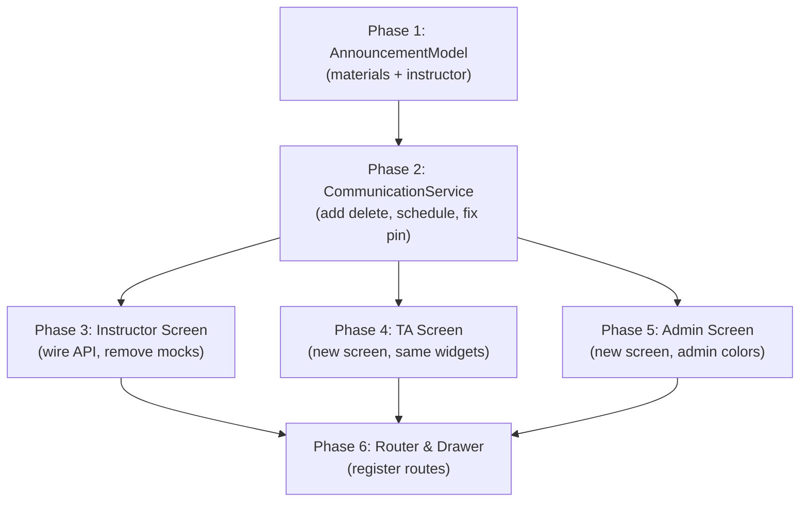

# Announcement & Communication API Migration

Replace all mock/local data in the Announcement Manager (Instructor, TA) and Admin Communication screens with real backend API calls, achieving 1:1 feature parity with the React web frontend.

## Endpoint Audit

| # | Backend Endpoint | Method | Web Service Method | Flutter Service Method | Status |
|---|---|---|---|---|---|
| 1 | `GET /api/announcements` | GET | `getAnnouncements(params?)` | `getAnnouncements()` | ✅ Exists |
| 2 | `GET /api/announcements?courseId=X` | GET | (via params) | `getAnnouncementsByCourseId()` | ✅ Exists |
| 3 | `POST /api/announcements` | POST | `createAnnouncement(data)` | `createAnnouncement(body)` | ✅ Exists |
| 4 | `GET /api/announcements/:id` | GET | `getAnnouncement(id)` | `getAnnouncementById(id)` | ✅ Exists |
| 5 | `PUT /api/announcements/:id` | PUT | `updateAnnouncement(id, data)` | `updateAnnouncement(id, body)` | ✅ Exists |
| 6 | `DELETE /api/announcements/:id` | DELETE | `deleteAnnouncement(id)` | ❌ **Missing** | 🔴 Must Add |
| 7 | `PATCH /api/announcements/:id/publish` | PATCH | `publishAnnouncement(id)` | `publishAnnouncement(id)` | ✅ Exists |
| 8 | `PATCH /api/announcements/:id/schedule` | PATCH | — | ❌ **Missing** | 🔴 Must Add |
| 9 | `PATCH /api/announcements/:id/pin` | PATCH | `pinAnnouncement(id, isPinned)` | `pinAnnouncement(id)` | ⚠️ Missing body |
| 10 | `GET /api/announcements/:id/analytics` | GET | — | `getAnnouncementAnalytics(id)` | ✅ Exists |

## User Review Required

> [!IMPORTANT]
> **UI Preservation Rule**: The Instructor's Announcement Manager screen UI is considered "modern and well-structured" and will NOT be modified structurally. Only the data layer (`_loadAnnouncements`, `_addOrUpdateAnnouncement`, etc.) will be rewired to use real API calls.

> [!IMPORTANT]
> **TA Screen**: Will be a new screen at `lib/screens/ta/announcements/` that imports and reuses the exact same widget set from `lib/widgets/instructor/announcements/`. The TA will see the identical Announcement Manager UI as the Instructor.

> [!IMPORTANT]
> **Admin Screen**: Will be a new screen at `lib/screens/admin/announcements/` that also reuses the Instructor's widget set but with Admin-themed colors. The Admin drawer already has the route `/admin/announcements` defined.

## Open Questions

> [!NOTE]
> **Pin Endpoint Signature**: The web frontend sends `{ isPinned: boolean }` in the body for pin/unpin. The backend controller's `togglePin` method doesn't seem to use the body (it toggles internally). The Flutter service currently sends no body. I will align with the web pattern and send `{ isPinned }` in the body for parity, as it's harmless if the backend ignores it.

> [!NOTE]  
> **Schedule Endpoint**: The backend has `PATCH /api/announcements/:id/schedule` with a `ScheduleAnnouncementDto` body. The web frontend doesn't use it, but the Flutter Instructor form dialog has scheduling UI. I will add this endpoint to the service for completeness and wire it into the form dialog.

---

## Proposed Changes

### Phase 1: Model Alignment

#### [MODIFY] [announcement_model.dart](file:///D:\Graduation\EduVerse\edu_verse/lib/models/materials/announcement_model.dart)

The existing `AnnouncementModel` is missing critical fields from the backend entity. Update to match the full backend response shape:

**Fields to add:**
- `announcementType` (String? — 'course', 'campus', 'system', 'department')
- `targetAudience` (String? — 'all', 'students', 'instructors', 'admins')
- `isPublished` (int — 0 or 1, matching backend tinyint)
- `isPinned` (int? — 0 or 1)
- `viewCount` (int)
- `author` (nested `AnnouncementAuthor?` — firstName, lastName, email, profilePictureUrl)
- `course` (nested `AnnouncementCourse?` — id, name, code)
- `attachmentFileId` (String?)

**Fields to change:**
- `createdBy` → make nullable/optional since backend sends it via `author` relation
- `publishedAt` → make nullable (drafts have no publishedAt)

**New nested classes:**
```dart
class AnnouncementAuthor {
  final int? userId;
  final String? firstName;
  final String? lastName;
  final String? email;
  final String? profilePictureUrl;
}

class AnnouncementCourse {
  final String? id;
  final String? name;
  final String? code;
}
```

---

#### [MODIFY] [announcement_model.dart](file:///D:\Graduation\EduVerse\edu_verse/lib/models/instructor/announcement_model.dart)

Add a `fromApi()` factory that converts from the API `AnnouncementModel` to the UI `AnnouncementItem`:

```dart
factory AnnouncementItem.fromApi(AnnouncementModel api) {
  return AnnouncementItem(
    id: api.id,
    title: api.title,
    content: api.content,
    status: api.isPublished == 1
        ? AnnouncementStatus.published
        : AnnouncementStatus.draft,
    createdAt: api.createdAt,
    publishedAt: api.publishedAt,
    audience: _buildAudienceLabel(api),
    totalAudience: 0,
    readCount: api.viewCount,
    courseName: api.course?.name,
    courseId: api.courseId,
    isPinned: api.isPinned == 1,
    priority: api.priority,
    announcementType: api.announcementType,
    authorName: _buildAuthorLabel(api),
  );
}
```

Add new fields to `AnnouncementItem`:
- `isPinned` (bool)
- `priority` (String?)
- `announcementType` (String?)
- `authorName` (String?)

---

### Phase 2: Service Fixes

#### [MODIFY] [communication_service.dart](file:///D:\Graduation\EduVerse\edu_verse/lib/services/api/communication_service.dart)

1. **Add `deleteAnnouncement(id)`** — `DELETE /announcements/{id}`
2. **Add `scheduleAnnouncement(id, body)`** — `PATCH /announcements/{id}/schedule`
3. **Fix `pinAnnouncement(id)` → `pinAnnouncement(id, {bool? isPinned})`** — send `{ isPinned }` body for web parity
4. **Update all announcement methods** to use the updated `AnnouncementModel` with the new fields

---

### Phase 3: Instructor Screen API Wiring

#### [MODIFY] [announcement_manager_screen.dart](file:///D:\Graduation\EduVerse\edu_verse/lib/screens/instructor/announcements/announcement_manager_screen.dart)

Replace all mock data operations with real API calls:

1. **`_loadAnnouncements()`** → Call `communicationService.getAnnouncements()`, convert each `AnnouncementModel` to `AnnouncementItem` via `AnnouncementItem.fromApi()`
2. **`_addOrUpdateAnnouncement()`** → Call `createAnnouncement()` or `updateAnnouncement()` based on whether editing
3. **`_deleteAnnouncement()`** → Call `deleteAnnouncement(id)`
4. **`_publishAnnouncement()`** → Call `publishAnnouncement(id)`, then reload
5. **Add pin support** → Call `pinAnnouncement(id, isPinned)`, then reload
6. **Remove `_getMockAnnouncements()`** entirely
7. **Inject `CommunicationService`** via constructor or provider lookup

**Service Access Pattern** (matching the Attendance migration):
```dart
late final CommunicationService _communicationService;

@override
void initState() {
  super.initState();
  _communicationService = CommunicationService(
    coreApiClient: context.read<CoreApiClient>(),
  );
  // ...
}
```

#### [MODIFY] [announcement_form_dialog.dart](file:///D:\Graduation\EduVerse\edu_verse/lib/widgets/instructor/announcements/announcement_form_dialog.dart)

1. **Add `courseId` selection** — Accept `List<TeachingCourseModel>` courses parameter (fetched from `EnrollmentService`)
2. **Add `priority` dropdown** — low / medium / high / urgent
3. **Wire schedule** to use the real schedule endpoint
4. **Remove mock audience options** — Replace with real course list from API

#### [MODIFY] [announcement_card.dart](file:///D:\Graduation\EduVerse\edu_verse/lib/widgets/instructor/announcements/announcement_card.dart)

1. **Add Pin action** to the PopupMenu (Pin/Unpin toggle)
2. **Display priority badge** on the card
3. **Display course label** on the card
4. **Display author name** on the card

---

### Phase 4: TA Announcement Manager Screen

#### [NEW] [ta_announcement_manager_screen.dart](file:///D:\Graduation\EduVerse\edu_verse/lib/screens/ta/announcements/ta_announcement_manager_screen.dart)

A near-identical copy of `AnnouncementManagerScreen` that:
- Uses the same widget set from `lib/widgets/instructor/announcements/`
- Uses the same `CommunicationService` for API calls
- Uses TA-specific navigation (back to TA dashboard)
- The backend automatically filters announcements by role (TA sees their courses + own drafts)

---

### Phase 5: Admin Announcement Manager Screen

#### [NEW] [admin_announcement_manager_screen.dart](file:///D:\Graduation\EduVerse\edu_verse/lib/screens/admin/announcements/admin_announcement_manager_screen.dart)

Reuses the same widget pattern as the Instructor screen but:
- Uses AdminColors where applicable  
- The backend returns ALL announcements for admin role
- Admin sees Campus-wide as the default audience
- Omits course-specific audience filtering (admin manages system-wide)

---

### Phase 6: Router & Drawer Integration

#### [MODIFY] [app_router.dart](file:///D:\Graduation\EduVerse\edu_verse/lib/config/app_router.dart)

Add routes:
```dart
GoRoute(
  path: '/ta/announcements',
  builder: (context, state) => const TAAnnouncementManagerScreen(),
),
GoRoute(
  path: '/admin/announcements',
  builder: (context, state) => const AdminAnnouncementManagerScreen(),
),
```

#### [MODIFY] [ta_drawer.dart](file:///D:\Graduation\EduVerse\edu_verse/lib/widgets/ta/dashboard/ta_drawer.dart)

Add announcement manager entry to the TA drawer's main menu items (after attendance):
```dart
_MenuItem(
  icon: Icons.campaign_outlined,
  activeIcon: Icons.campaign,
  title: l10n.announcementsManager,
  route: '/ta/announcements',
  category: 'main',
),
```

---

## Dependency Graph



---

## Files Impact Summary

| Action | File | Phase |
|--------|------|-------|
| MODIFY | `lib/models/materials/announcement_model.dart` | 1 |
| MODIFY | `lib/models/instructor/announcement_model.dart` | 1 |
| MODIFY | `lib/services/api/communication_service.dart` | 2 |
| MODIFY | `lib/screens/instructor/announcements/announcement_manager_screen.dart` | 3 |
| MODIFY | `lib/widgets/instructor/announcements/announcement_form_dialog.dart` | 3 |
| MODIFY | `lib/widgets/instructor/announcements/announcement_card.dart` | 3 |
| NEW | `lib/screens/ta/announcements/ta_announcement_manager_screen.dart` | 4 |
| NEW | `lib/screens/admin/announcements/admin_announcement_manager_screen.dart` | 5 |
| MODIFY | `lib/config/app_router.dart` | 6 |
| MODIFY | `lib/widgets/ta/dashboard/ta_drawer.dart` | 6 |

**Total: 8 modified files, 2 new files**

---

## Verification Plan

### Automated Tests
1. `flutter analyze` — Ensure no static analysis errors after all changes
2. `flutter build apk --debug` — Verify the app compiles successfully

### Manual Verification
1. **Instructor flow**: Login as instructor → navigate to Announcement Manager → verify announcements load from API → create, edit, publish, pin, delete an announcement → verify all changes persist via API
2. **TA flow**: Login as TA → navigate to Announcement Manager (same UI) → verify role-filtered announcements → create and manage announcements
3. **Admin flow**: Login as admin → navigate to Announcements → verify all announcements visible → full CRUD operations
4. **Error handling**: Disconnect network → verify error state shows → reconnect → pull-to-refresh works
