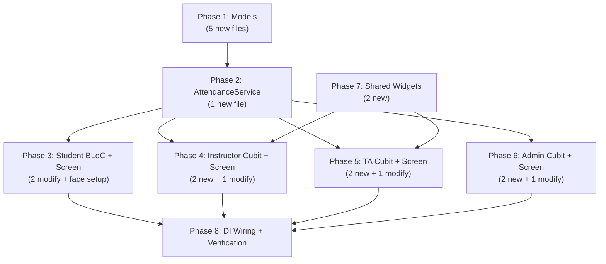

# Attendance & AI Attendance — Full API-Parity Migration Plan

Migrate the Flutter attendance module from 100% mock/local data to production API-driven attendance management, achieving 1:1 feature parity with the React web frontend for all roles (Student, Instructor, TA, Admin).

> [!IMPORTANT]
> **UI Preservation Rule**: No existing UI widget files will be structurally changed for the Student role. Only the **data source** (the cubits/state they read from) will be updated to emit real API data instead of mocks. The Instructor, TA, and Admin screens require more significant rewrites to match web frontend flows that go beyond simple data substitution.

---

## Endpoint Audit — Verified Against Backend Controller & Web Frontend

> [!CAUTION]
> **All endpoint paths verified line-by-line** against:
> - Backend: `src/modules/attendance/controllers/attendance.controller.ts` (lines 1–998)
> - Web Frontend: `src/services/api/attendanceService.ts` (lines 1–131)
> - Web Instructor: `src/pages/instructor-dashboard/components/attendance/LectureAttendanceFlow.tsx` (lines 1–1143)
> - Web TA: `src/pages/ta-dashboard/components/AttendancePage.tsx` (lines 1–1041)
> - Web Student: `src/pages/student-dashboard/components/AttendanceOverview.tsx` (lines 1–719)
> - Web Admin: `src/pages/admin-dashboard/components/AttendanceManagementPage.tsx` (lines 1–511)

### Verified Endpoint Map

| # | Method | Endpoint | Role(s) | Web Frontend Method | Purpose |
|---|--------|----------|---------|-------------------|---------|
| 1 | `GET` | `/attendance/my` | Student | `AttendanceService.getMyAttendance()` | Student's own attendance summary across all courses |
| 2 | `GET` | `/attendance/by-student/:userId` | Instructor, Admin | `AttendanceService.getByStudent(id)` | Get a specific student's attendance |
| 3 | `GET` | `/attendance/sessions` | Instructor, TA, Admin | `AttendanceService.getSessions(params)` | List sessions (paginated, filterable by `sectionId`, `courseId`, `status`; sortable by `sortBy`+`sortOrder`) |
| 4 | `POST` | `/attendance/sessions` | Instructor, TA | `AttendanceService.createSession(data)` | Create a new attendance session |
| 5 | `GET` | `/attendance/sessions/:id` | Instructor, TA, Admin | `AttendanceService.getSessionDetails(id)` | Get session detail **with nested `records[]`** |
| 6 | `PUT` | `/attendance/sessions/:id` | Instructor, TA | `AttendanceService.updateSession(id, data)` | Update session metadata |
| 7 | `DELETE` | `/attendance/sessions/:id` | Instructor | `AttendanceService.deleteSession(id)` | Delete a session |
| 8 | `PATCH` | `/attendance/sessions/:id/close` | Instructor, TA | `ApiClient.patch('~/attendance/sessions/${id}/close')` | Close/complete a session |
| 9 | `POST` | `/attendance/records/batch` | Instructor, TA | `AttendanceService.markBatchAttendance(data)` | Batch mark attendance: `{sessionId, records: [{userId, attendanceStatus}]}` |
| 10 | `GET` | `/attendance/summary/:sectionId` | Instructor, TA, Admin | `AttendanceService.getSectionSummary(id)` | Section-level attendance summary |
| 11 | `POST` | `/attendance/face-references/me` | Student | `AttendanceService.uploadMyFaceReference(file)` | Upload face reference for AI (multipart field `image`) |
| 12 | `GET` | `/attendance/face-references/me` | Student | `AttendanceService.listMyFaceReferences()` | List my face references |
| 13 | `DELETE` | `/attendance/face-references/me/:id` | Student | `AttendanceService.deleteMyFaceReference(id)` | Delete a face reference |
| 14 | `POST` | `/attendance/ai-photo` | Instructor, TA | `AttendanceService.uploadAiAttendancePhoto(sessionId, photo)` | Upload class photo for AI (multipart `photo` + `sessionId`), returns `processingId` |
| 15 | `GET` | `/attendance/ai-photo/:processingId` | Instructor, TA | `AttendanceService.getAiProcessingResult(id)` | Poll AI processing status and result |

---

## Cross-Feature Investigation Results

> [!NOTE]
> **Thoroughly investigated** the following Flutter files for attendance integration points:
>
> | File | Has Attendance Nav? | Has Route? | Current Data Source |
> |------|-------------------|-----------|-------------------|
> | [student_drawer.dart](file:///D:\Graduation\EduVerse\edu_verse/lib/widgets/student/dashboard/student_drawer.dart) (L391–396) | ✅ `route: '/attendance'` | ✅ | N/A (drawer only) |
> | [instructor_drawer.dart](file:///D:\Graduation\EduVerse\edu_verse/lib/widgets/instructor/dashboard/instructor_drawer.dart) (L373–378) | ✅ `route: '/instructor/attendance'` | ✅ | N/A (drawer only) |
> | [ta_drawer.dart](file:///D:\Graduation\EduVerse\edu_verse/lib/widgets/ta/dashboard/ta_drawer.dart) (L386–392) | ✅ `route: '/ta/attendance'` | ✅ | N/A (drawer only) |
> | [admin_drawer.dart](file:///D:\Graduation\EduVerse\edu_verse/lib/widgets/admin/dashboard/admin_drawer.dart) (L382–388) | ✅ `route: '/admin/attendance'` | ✅ | N/A (drawer only) |
> | [app_router.dart](file:///D:\Graduation\EduVerse\edu_verse/lib/config/app_router.dart) (L47, L68, L103, L147, L392–394) | N/A | ✅ All 4 routes registered | N/A |
> | [attendance_screen.dart](file:///D:\Graduation\EduVerse\edu_verse/lib/screens/student/attendance/attendance_screen.dart) | N/A | N/A | ❌ 100% mock (`_generateDemoRecords()` in cubit) |
> | [attendance_manager_screen.dart](file:///D:\Graduation\EduVerse\edu_verse/lib/screens/instructor/attendance/attendance_manager_screen.dart) | N/A | N/A | ❌ 100% mock (`_loadData()` with hardcoded lists) |
> | [ta_attendance_screen.dart](file:///D:\Graduation\EduVerse\edu_verse/lib/screens/ta/attendance/ta_attendance_screen.dart) | N/A | N/A | ❌ 100% mock (`_loadStudents()` with hardcoded maps) |
> | [admin_attendance_screen.dart](file:///D:\Graduation\EduVerse\edu_verse/lib/screens/admin/attendance/admin_attendance_screen.dart) | N/A | N/A | ❌ 100% mock (`_loadData()` with hardcoded lists) |
> | `lib/services/api/attendance_service.dart` | N/A | N/A | ❌ **Does NOT exist** — must be created |
>
> **Conclusion**: All 4 drawer items and all 4 router entries already exist. **No drawer or router changes needed.** Only the data layer (service + cubits) and screen wiring must be created/updated.

---

## Existing Flutter Service Pattern (Reference)

> [!TIP]
> **Pattern source**: [enrollment_service.dart](file:///D:\Graduation\EduVerse\edu_verse/lib/services/api/enrollment_service.dart) (440 lines)
>
> All services follow this pattern:
> ```dart
> class ServiceName {
>   final CoreApiClient _client;
>   ServiceName({required CoreApiClient coreApiClient}) : _client = coreApiClient;
>
>   Future<ServiceResult<T>> methodName() {
>     return RetryHelper.execute<T>(() async {
>       final response = await _client.dio.get('/endpoint');
>       return Model.fromJson(_extractMap(response.data));
>     }, fallbackMessage: 'Failed to ...');
>   }
>
>   // Void operations use:
>   Future<ServiceResult<void>> voidMethod() {
>     return RetryHelper.executeVoid(() async {
>       await _client.dio.delete('/endpoint');
>     }, fallbackMessage: 'Failed to ...');
>   }
> }
> ```
>
> **Helper methods** (`_extractMap`, `_extractList`) handle backend response wrapping (`{data: ...}`).

---

## User Review Required

> [!WARNING]
> **AI Attendance on Mobile**: The web frontend's AI flow (upload photo → get `processingId` → poll until complete → reload roster) is fully replicated. The TA dashboard on the web still uses mock data for its AI attendance — mobile will implement the real API endpoints even though the web TA view is partially mocked.

> [!IMPORTANT]
> **No breaking changes to existing widgets.** Student attendance widgets (`attendance_stats_card.dart`, `attendance_calendar.dart`, `course_attendance_list.dart`, `attendance_records_list.dart`) remain untouched — they receive the same data shapes via `AttendanceState`.

---

## Proposed Changes

### Phase 1 — Data Models (`lib/models/attendance/`)

All new. These Dart models mirror the backend entity/DTO shapes and the web frontend's TypeScript interfaces from `attendanceService.ts` lines 3–46.

---

#### [NEW] [attendance_session_model.dart](file:///D:\Graduation\EduVerse\edu_verse/lib/models/attendance/attendance_session_model.dart)

Maps: `GET /attendance/sessions` response items AND `GET /attendance/sessions/:id` detail response.

**MUST match web `AttendanceService.getSessions()` response + `LectureAttendanceFlow.tsx` types (lines 30–53):**

```dart
import 'package:equatable/equatable.dart';
import 'attendance_record_model.dart';

class AttendanceSessionModel extends Equatable {
  final int id;                    // Backend: session.id
  final int sectionId;             // Backend: session.sectionId
  final String sessionDate;        // Backend: "YYYY-MM-DD"
  final String? sessionType;       // Backend: "lecture" | "lab" | "tutorial" | "exam"
  final String status;             // Backend: "scheduled" | "in_progress" | "completed" | "cancelled"
  final int presentCount;          // Backend: computed aggregate
  final int absentCount;
  final int lateCount;
  final int excusedCount;
  final int? totalMinutes;
  final List<AttendanceRecordModel> records;  // Only populated on getSessionDetails()

  // Computed helpers
  bool get isOpen => status == 'scheduled' || status == 'in_progress';
  bool get isClosed => status == 'completed' || status == 'cancelled';

  // fromJson, toJson, props, copyWith
}
```

---

#### [NEW] [attendance_record_model.dart](file:///D:\Graduation\EduVerse\edu_verse/lib/models/attendance/attendance_record_model.dart)

Maps: nested `records[]` from `GET /attendance/sessions/:id` response.

**MUST match `LectureAttendanceFlow.tsx` types (lines 45–51):**

```dart
import 'package:equatable/equatable.dart';

class AttendanceRecordModel extends Equatable {
  final int userId;                    // Backend: record.userId
  final String attendanceStatus;       // "present" | "absent" | "late" | "excused"
  final String? markedBy;              // "manual" | "ai"
  final double? confidenceScore;       // 0.0–1.0 from AI, null for manual
  final String? notes;
  final String? checkinTime;           // ISO datetime
  // Nested user info (from backend JOIN)
  final String? firstName;             // user.firstName
  final String? lastName;              // user.lastName
  final String? email;                 // user.email

  // Computed:
  String get displayName {
    final parts = [firstName, lastName].where((s) => s != null && s!.isNotEmpty);
    if (parts.isNotEmpty) return parts.join(' ');
    if (email != null && email!.isNotEmpty) return email!;
    return 'Student #$userId';
  }

  // fromJson (handles nested `user` object), props
}
```

> [!NOTE]
> The `fromJson` must handle both flat fields (`json['firstName']`) and nested user object (`json['user']['firstName']`), matching `LectureAttendanceFlow.tsx` `displayName()` function at line 90–96.

---

#### [NEW] [student_attendance_summary_model.dart](file:///D:\Graduation\EduVerse\edu_verse/lib/models/attendance/student_attendance_summary_model.dart)

Maps: `GET /attendance/my` and `GET /attendance/by-student/:id` responses.

**MUST match web `AttendanceRecord` interface at `attendanceService.ts` lines 3–14:**

```dart
import 'package:equatable/equatable.dart';

class StudentAttendanceSummaryModel extends Equatable {
  final int courseId;           // Web: courseId
  final String courseName;     // Web: courseName
  final String courseCode;     // Web: courseCode
  final int totalClasses;      // Web: totalClasses
  final int attended;          // Web: attended
  final int absent;            // Web: absent
  final int late;              // Web: late (Dart keyword — use as field name with backtick or rename)
  final int excused;           // Web: excused? (optional in TS, default 0)
  final double percentage;     // Web: percentage
  final String? lastClassDate; // Web: lastClassDate?

  // Computed:
  String get statusLabel {
    if (percentage >= 90) return 'excellent';
    if (percentage >= 80) return 'good';
    return 'warning';
  }

  // fromJson (handles backend response which may wrap in {summary: [...]}),
  // as seen in AttendanceOverview.tsx lines 220–240
}
```

---

#### [NEW] [ai_processing_result_model.dart](file:///D:\Graduation\EduVerse\edu_verse/lib/models/attendance/ai_processing_result_model.dart)

Maps: `POST /attendance/ai-photo` response AND `GET /attendance/ai-photo/:id` poll response.

**MUST match web `AiProcessingResult` interface at `attendanceService.ts` lines 38–46:**

```dart
import 'package:equatable/equatable.dart';

class AiProcessingResultModel extends Equatable {
  final int processingId;            // Web: processingId
  final String status;               // "pending" | "processing" | "completed" | "failed" | "manual_review"
  final int? detectedFacesCount;     // Web: detectedFacesCount?
  final int? matchedStudentsCount;   // Web: matchedStudentsCount?
  final int? unmatchedFacesCount;    // Web: unmatchedFacesCount?
  final String? errorMessage;        // Web: errorMessage?
  final int? processingTimeMs;       // Web: processingTimeMs?

  // Computed:
  bool get isCompleted => status.toLowerCase() == 'completed';
  bool get isFailed => status.toLowerCase() == 'failed';
  bool get needsManualReview => status.toLowerCase() == 'manual_review';
  bool get isProcessing => !isCompleted && !isFailed && !needsManualReview;

  // fromJson, props
}
```

---

#### [NEW] [student_face_reference_model.dart](file:///D:\Graduation\EduVerse\edu_verse/lib/models/attendance/student_face_reference_model.dart)

Maps: `GET /attendance/face-references/me` response items.

**MUST match web `StudentFaceReference` interface at `attendanceService.ts` lines 27–36:**

```dart
import 'package:equatable/equatable.dart';

class StudentFaceReferenceModel extends Equatable {
  final int id;                 // Web: id
  final int userId;             // Web: userId
  final String storagePath;     // Web: storagePath
  final String? mimeType;       // Web: mimeType
  final int? fileSize;          // Web: fileSize
  final bool isPrimary;         // Web: isPrimary
  final String? createdAt;      // Web: createdAt
  final String? signedUrl;      // Web: signedUrl (nullable — pre-signed S3 URL)

  // fromJson, props
}
```

---

### Phase 2 — Attendance API Service

#### [NEW] [attendance_service.dart](file:///D:\Graduation\EduVerse\edu_verse/lib/services/api/attendance_service.dart)

Follows the exact pattern from [enrollment_service.dart](file:///D:\Graduation\EduVerse\edu_verse/lib/services/api/enrollment_service.dart): `CoreApiClient` + `RetryHelper` + `ServiceResult` + `_extractMap`/`_extractList` helpers.

**1:1 with web `AttendanceService` at `attendanceService.ts` lines 48–130:**

```dart
class AttendanceService {
  final CoreApiClient _client;
  AttendanceService({required CoreApiClient coreApiClient}) : _client = coreApiClient;

  // ── Student Endpoints ──

  /// GET /attendance/my — Web: AttendanceService.getMyAttendance() line 49
  Future<ServiceResult<List<StudentAttendanceSummaryModel>>> getMyAttendance()

  /// GET /attendance/by-student/:userId — Web: AttendanceService.getByStudent(id) line 60
  /// NOTE: Backend response may be {summary: [...]} or just [...] — handle both
  /// (see AttendanceOverview.tsx lines 220-240 normalization)
  Future<ServiceResult<List<StudentAttendanceSummaryModel>>> getByStudent(int userId)

  // ── Session Endpoints ──

  /// GET /attendance/sessions — Web: AttendanceService.getSessions(params) line 64
  /// Query params: sectionId, courseId, status, limit, sortBy, sortOrder
  /// (see LectureAttendanceFlow.tsx line 298: params {sectionId, limit:30, sortBy:'sessionDate', sortOrder:'DESC'})
  Future<ServiceResult<List<AttendanceSessionModel>>> getSessions({
    int? sectionId, int? courseId, String? status,
    int? limit, String? sortBy, String? sortOrder,
  })

  /// POST /attendance/sessions — Web: AttendanceService.createSession(data) line 72
  /// Body: {sectionId, sessionDate, sessionType, totalMinutes?}
  Future<ServiceResult<AttendanceSessionModel>> createSession({
    required int sectionId, required String sessionDate,
    required String sessionType, int? totalMinutes,
  })

  /// GET /attendance/sessions/:id — Web: AttendanceService.getSessionDetails(id) line 89
  /// Returns session WITH nested records[] array
  Future<ServiceResult<AttendanceSessionModel>> getSessionDetails(int id)

  /// PUT /attendance/sessions/:id — Web: AttendanceService.updateSession(id, data) line 81
  Future<ServiceResult<AttendanceSessionModel>> updateSession(int id, Map<String, dynamic> data)

  /// DELETE /attendance/sessions/:id — Web: AttendanceService.deleteSession(id) line 85
  Future<ServiceResult<void>> deleteSession(int id)

  /// PATCH /attendance/sessions/:id/close — Web: LectureAttendanceFlow.tsx line 436
  /// NOTE: PATCH not PUT, and path /close not /status
  Future<ServiceResult<void>> closeSession(int id)

  // ── Records Endpoints ──

  /// POST /attendance/records/batch — Web: AttendanceService.markBatchAttendance(data) line 93
  /// Body: {sessionId, records: [{userId, attendanceStatus}]}
  /// (see LectureAttendanceFlow.tsx lines 414-431: saveBatch())
  Future<ServiceResult<void>> markBatchAttendance({
    required int sessionId,
    required List<Map<String, dynamic>> records,
  })

  /// GET /attendance/summary/:sectionId — Web: AttendanceService.getSectionSummary(id) line 100
  Future<ServiceResult<Map<String, dynamic>>> getSectionSummary(int sectionId)

  // ── Face Reference Endpoints (Student Only) ──

  /// POST /attendance/face-references/me — Web: line 105 (multipart field: 'image')
  Future<ServiceResult<StudentFaceReferenceModel>> uploadMyFaceReference(File image)

  /// GET /attendance/face-references/me — Web: line 111
  Future<ServiceResult<List<StudentFaceReferenceModel>>> listMyFaceReferences()

  /// DELETE /attendance/face-references/me/:id — Web: line 115
  Future<ServiceResult<void>> deleteMyFaceReference(int id)

  // ── AI Attendance Endpoints ──

  /// POST /attendance/ai-photo — Web: line 120 (multipart: 'photo' + 'sessionId')
  /// Returns {processingId, status, ...}
  Future<ServiceResult<AiProcessingResultModel>> uploadAiPhoto({
    required int sessionId, required File photo,
  })

  /// GET /attendance/ai-photo/:processingId — Web: line 127
  Future<ServiceResult<AiProcessingResultModel>> getAiProcessingResult(int processingId)

  /// Convenience: polls getAiProcessingResult() in a loop with 2.5s interval, 120s timeout
  /// Matches web's polling logic at LectureAttendanceFlow.tsx lines 486-500
  Future<ServiceResult<AiProcessingResultModel>> pollAiResult(int processingId, {
    Duration timeout = const Duration(seconds: 120),
    Duration interval = const Duration(milliseconds: 2500),
  })

  // ── Helpers (same as enrollment_service.dart) ──
  static Map<String, dynamic> _extractMap(dynamic payload)
  static List<dynamic> _extractList(dynamic payload)
}
```

> [!CAUTION]
> **Critical Implementation Notes:**
> - `closeSession()` uses `PATCH` not `PUT` — verified at `LectureAttendanceFlow.tsx` line 436: `ApiClient.patch()`
> - `uploadAiPhoto()` sends `sessionId` as string in FormData — verified at `attendanceService.ts` line 123: `fd.append('sessionId', String(sessionId))`
> - `getByStudent()` must handle both `{summary: [...]}` wrapper and bare `[...]` array — verified at `AttendanceOverview.tsx` lines 221-222

---

### Phase 3 — Student BLoC Rewrite

#### [MODIFY] [attendance_state.dart](file:///D:\Graduation\EduVerse\edu_verse/lib/bloc/attendance/attendance_state.dart)

**Current state** (282 lines): Contains `AttendanceRecord`, `CourseAttendance`, `AttendanceStatistics`, `WeeklyAttendance`, `AttendanceState` — all used by student UI widgets.

**Changes:**

1. **Keep ALL existing classes** — `AttendanceRecord`, `CourseAttendance`, `AttendanceStatistics`, `WeeklyAttendance` (lines 9–143) — these are UI display DTOs
2. **Remove** the custom `TimeOfDay` class (lines 49–60) — use Flutter's `flutter:material` `TimeOfDay` instead
3. **Remove** the `_DefaultDate` class (lines 225–281) — replace with `DateTime.now()` default
4. **Add** to `AttendanceState`:
   - `List<StudentFaceReferenceModel> faceReferences` (default `const []`)
   - `bool isFaceUploading` (default `false`)
   - `String? faceUploadError`
5. **Add** `fromApi()` factory on `CourseAttendance`:
   ```dart
   factory CourseAttendance.fromApi(StudentAttendanceSummaryModel s, List<int> gradientColors) {
     return CourseAttendance(
       courseId: s.courseId.toString(),
       courseName: s.courseName,
       courseCode: s.courseCode,
       totalClasses: s.totalClasses,
       presentCount: s.attended,
       absentCount: s.absent,
       lateCount: s.late,
       excusedCount: s.excused,
       gradientColors: gradientColors,
     );
   }
   ```
6. **Update** `copyWith()` and `props` to include new fields

---

#### [MODIFY] [attendance_cubit.dart](file:///D:\Graduation\EduVerse\edu_verse/lib/bloc/attendance/attendance_cubit.dart)

**Current state** (333 lines): 100% mock data via `_generateDemoRecords()` (lines 137–209), `_generateCourseAttendances()` (lines 212–265), `_calculateStatistics()` (lines 268–297).

**Changes:**

1. **Add** constructor parameter: `AttendanceService attendanceService`
2. **Replace** `loadAttendance()` (lines 8–35):
   - **Remove** `Future.delayed(800ms)` and `_generateDemoRecords()`
   - **Add** `final result = await _attendanceService.getMyAttendance()`
   - **Map** API data → existing display DTOs using `CourseAttendance.fromApi()` factory
   - **Derive** `AttendanceStatistics` from API summaries (sum totals across courses)
   - **Derive** `AttendanceRecord` list from course summaries (for calendar/records tabs)
3. **Remove** entirely:
   - `_generateDemoRecords()` (lines 137–209)
   - `_generateCourseAttendances()` (lines 212–265)
   - `_calculateWeeklyTrend()` (lines 300–331)
4. **Keep unchanged**: `setSelectedDate()`, `setSelectedCourse()`, `setFilter()`, `setViewMode()`, `setSelectedTab()`, `setSearchQuery()`, `clearError()` — these all filter in-memory, same pattern as web
5. **Add** face reference methods:
   - `loadFaceReferences()` → `_attendanceService.listMyFaceReferences()`
   - `uploadFaceReference(File image)` → `_attendanceService.uploadMyFaceReference(image)`
   - `deleteFaceReference(int id)` → `_attendanceService.deleteMyFaceReference(id)`

---

#### [MODIFY] [attendance_screen.dart](file:///D:\Graduation\EduVerse\edu_verse/lib/screens/student/attendance/attendance_screen.dart)

**Current state** (634 lines): Uses `BlocProvider(create: (context) => AttendanceCubit()..loadAttendance())` at line 50-51.

**Changes:**

1. **Line 50-51**: Update `BlocProvider` to inject `AttendanceService`:
   ```dart
   BlocProvider(
     create: (context) => AttendanceCubit(
       attendanceService: context.read<AttendanceService>(),
     )..loadAttendance(),
   ```
2. **Add Face Setup section** in the Overview tab (after the stats cards):
   - Show list of existing face references with thumbnails (from `signedUrl`)
   - "Upload Face Photo" button → opens `image_picker` → calls `cubit.uploadFaceReference(file)`
   - Delete button per reference
   - Matches web's `StudentFaceSetup` component (imported at `AttendanceOverview.tsx` line 19)
3. **No other UI structural changes** — all widgets continue receiving data via `AttendanceState`

---

### Phase 4 — Instructor Attendance Rewrite

#### [NEW] [instructor_attendance_state.dart](file:///D:\Graduation\EduVerse\edu_verse/lib/bloc/attendance/instructor_attendance_state.dart)

New state class managing the 3-step Lecture Attendance Flow (matching web's `LectureAttendanceFlow.tsx` lines 215-216: `type View = 'classes' | 'section' | 'roster'`):

```dart
enum InstructorAttendanceView { classes, section, roster }

class RosterRow extends Equatable {
  final int userId;
  final String name;
  final String email;
  final String status;          // "present" | "absent" | "late" | "excused"
  final String initialStatus;   // For tracking dirty state
  final double? aiConfidence;   // From AI processing
  final bool isAiMarked;
  // props
}

class InstructorAttendanceState extends Equatable {
  final InstructorAttendanceView view;
  final bool isLoading;
  final String? error;

  // Classes view
  final List<TeachingCourseModel> teachingSections;

  // Section view
  final int? selectedSectionId;
  final TeachingCourseModel? selectedSection;
  final List<AttendanceSessionModel> sessions;
  final String newSessionDate;     // "YYYY-MM-DD"
  final String newSessionType;     // "lecture" | "lab" | "tutorial" | "exam"

  // Roster view
  final AttendanceSessionModel? activeSession;
  final List<RosterRow> rosterRows;
  final bool isRosterReadOnly;     // true when session is completed/cancelled
  final bool isRosterDirty;        // true when local changes haven't been saved

  // AI panel
  final bool isAiLoading;
  final String? aiError;
  final AiProcessingResultModel? aiResult;
  final int aiUnknownCount;

  // copyWith, props
}
```

---

#### [NEW] [instructor_attendance_cubit.dart](file:///D:\Graduation\EduVerse\edu_verse/lib/bloc/attendance/instructor_attendance_cubit.dart)

**Methods (1:1 with `LectureAttendanceFlow.tsx` callbacks):**

| Cubit Method | Web Equivalent (LectureAttendanceFlow.tsx) | Line Ref |
|-----------|---------------------------|----------|
| `loadTeachingSections()` | `loadTeaching()` | L272–283 |
| `openSection(section, sectionId)` | `openSection()` | L319–325 |
| `loadSessionsForSection(sectionId)` | `loadOpenSessions()` | L295–317 |
| `createSession()` | `createSession()` | L598+ |
| `openRosterFromSession(session)` | `openRosterFromSession()` | L332–343 |
| `loadRosterData(sessionId, readOnly)` | `loadRosterData()` | L345–368 |
| `backToClasses()` | `backToClasses()` | L327–330 |
| `backToSection()` | `backToSection()` | L370–373 |
| `applyStatus(userId, status)` | `applyStatus()` | L375–380 |
| `setAllStatus(status)` | `setAllStatus()` | L382–412 |
| `saveBatch()` | `saveBatch()` | L414–431 |
| `closeSession()` | `closeSession()` | L433–443 |
| `setAiFile(File)` | `setAiFile` state | L244 |
| `runAiAttendance()` | `runLocalAiAttendance()` | L462–517 |
| `applyAiResultsToRoster()` | `applyAiReviewToRoster()` | L573–596 |

---

#### [MODIFY] [attendance_manager_screen.dart](file:///D:\Graduation\EduVerse\edu_verse/lib/screens/instructor/attendance/attendance_manager_screen.dart)

**Current state** (932 lines): All mock data (`_courses`, `_weeks`, `_students` hardcoded at lines 24–26, 65–80, 83–163).

**Complete rewrite to match web's `LectureAttendanceFlow` with 3 views:**

1. **Remove** all mock data (lines 24–163)
2. **Remove** `_loadData()` (lines 55–163)
3. **Wrap** with `BlocProvider<InstructorAttendanceCubit>`
4. **Classes View** (web lines L630+):
   - `ListView` of teaching section cards
   - Each card shows: course code, course name, section number, semester
   - Tap → `cubit.openSection(section, sectionId)`
5. **Section View** (web lines L650+):
   - Back arrow → `cubit.backToClasses()`
   - Session list: each row shows date, type badge, status badge, "Open" button
   - Filter: only show `scheduled` + `in_progress` sessions (web line 310)
   - **Create Session form**: Date picker + session type dropdown + "Create" button
6. **Roster View** (web lines L750+):
   - Back arrow → `cubit.backToSection()`
   - Header with session info (date, type, status)
   - "Mark All Present" / "Mark All Absent" buttons with confirmation dialog (web lines 382-412)
   - Student list with `StatusToggleWidget` per row (4-way: present/absent/late/excused)
   - "Save" FAB → `cubit.saveBatch()`
   - "Close Session" button → confirmation → `cubit.closeSession()`
   - **AI Attendance Panel** (expandable):
     - Image picker (camera/gallery via `image_picker` package)
     - "Run AI Attendance" button → shows loading with progress text
     - Results summary (detected/matched/unmatched counts)
     - "Apply AI Results" button → `cubit.applyAiResultsToRoster()`
     - AI review: flagged students sorted to top with confidence indicators (web lines 561-571)

---

### Phase 5 — TA Attendance Rewrite

#### [NEW] [ta_attendance_state.dart](file:///D:\Graduation\EduVerse\edu_verse/lib/bloc/attendance/ta_attendance_state.dart)

Matching web's TA `AttendancePage.tsx` view states (line 212: `'upload' | 'processing' | 'results' | 'history'`):

```dart
enum TAAttendanceView { upload, processing, results, history }

class TAAttendanceState extends Equatable {
  final TAAttendanceView view;
  final bool isLoading;
  final String? error;

  // Upload view
  final List<Map<String, dynamic>> availableLabs;  // From teaching sections
  final String selectedLab;
  final String selectedCourse;
  final File? selectedFile;

  // Processing view (during AI)
  final double processingProgress;   // 0.0–1.0 for animation

  // Results view
  final List<DetectedStudentRow> detectedStudents;  // With status + confidence
  final int totalDetected;
  final int totalStudents;
  final bool isEditing;

  // History view
  final List<AttendanceSessionModel> pastSessions;

  // copyWith, props
}
```

---

#### [NEW] [ta_attendance_cubit.dart](file:///D:\Graduation\EduVerse\edu_verse/lib/bloc/attendance/ta_attendance_cubit.dart)

**Methods (1:1 with web's TA `AttendancePage` callbacks):**

| Cubit Method | Web Equivalent (AttendancePage.tsx) | Line Ref |
|-----------|---------------------------|----------|
| `loadAvailableLabs()` | Labs list at lines 221-226 | L221 |
| `selectFile(File)` | `handleFileInput()` | L237 |
| `processAttendance()` | `handleProcess()` | L242–250 |
| `overrideStatus(studentId, newStatus)` | `handleStatusChange()` | L252–260 |
| `saveResults()` | `handleSave()` | L262–278 |
| `exportCsv()` | `handleExport()` | L280–301 |
| `loadHistory()` | sessions state | L213 |
| `viewHistoryDetails(session)` | `handleViewHistoryDetails()` | L304–307 |
| `resetToUpload()` | Tab navigation to 'upload' | L323–327 |

---

#### [MODIFY] [ta_attendance_screen.dart](file:///D:\Graduation\EduVerse\edu_verse/lib/screens/ta/attendance/ta_attendance_screen.dart)

**Current state** (1612 lines): All mock data (`_students`, `_courses`, `_labs` hardcoded at lines 29–100+).

**Rewrite to match web's TA `AttendancePage`:**

1. **Remove** all mock data (lines 29–100+)
2. **Wrap** with `BlocProvider<TAAttendanceCubit>`
3. **Tab bar** (web lines 320–350): "Upload Photo" | "Results" (conditional) | "History (N)"
4. **Upload Photo view** (web lines 352+):
   - Course/Lab dropdown selectors
   - Image picker area with dashed border, camera icon (matching web's drag-and-drop area)
   - "Process with AI" button
5. **Processing view** (web lines 400+):
   - Animated brain icon with pulsing animation
   - "Processing attendance..." text
   - Progress dots animation
6. **Results view** (web lines 450+):
   - Summary stats: detected/total, present count, absent count, uncertain count
   - Student list with: name, status badge, confidence bar, manual override toggle
   - "Save Attendance" and "Export CSV" buttons
7. **History view** (web lines 550+):
   - Past session cards with: date, lab/course name, present/total count, "View" button

---

### Phase 6 — Admin Attendance Rewrite

#### [NEW] [admin_attendance_state.dart](file:///D:\Graduation\EduVerse\edu_verse/lib/bloc/attendance/admin_attendance_state.dart)

```dart
enum AdminAttendanceTab { overview, courses, students }

class AdminAttendanceState extends Equatable {
  final AdminAttendanceTab activeTab;
  final bool isLoading;
  final String? error;

  // Overview
  final int totalStudents;
  final int presentToday;
  final int absentToday;
  final int lateToday;
  final double overallRate;
  final List<DepartmentAttendance> departmentStats;
  final List<WeeklyTrend> weeklyTrends;

  // Courses tab
  final List<CourseAttendanceData> courses;
  final String courseSearch;
  final String departmentFilter;

  // Students tab
  final List<StudentAttendanceInfo> students;
  final String studentSearch;
  final String statusFilter;

  // Computed filtered lists
  List<CourseAttendanceData> get filteredCourses => ...;
  List<StudentAttendanceInfo> get filteredStudents => ...;
}
```

---

#### [NEW] [admin_attendance_cubit.dart](file:///D:\Graduation\EduVerse\edu_verse/lib/bloc/attendance/admin_attendance_cubit.dart)

**Methods matching web's `AttendanceManagementPage.tsx` (lines 109–182):**

| Cubit Method | Purpose |
|-----------|---------|
| `loadOverviewStats()` | Aggregate attendance stats across all sections |
| `loadCourses()` | Load course-level attendance data |
| `loadStudents()` | Load student-level attendance data with risk indicators |
| `setActiveTab(tab)` | Switch between overview/courses/students |
| `setCourseSearch(query)` | Filter courses (web line 168-173) |
| `setDepartmentFilter(dept)` | Filter by department (web line 168-173) |
| `setStudentSearch(query)` | Filter students (web line 176-181) |
| `setStatusFilter(status)` | Filter by status (web line 176-181) |

---

#### [MODIFY] [admin_attendance_screen.dart](file:///D:\Graduation\EduVerse\edu_verse/lib/screens/admin/attendance/admin_attendance_screen.dart)

**Current state** (1251 lines): All mock data (courses at lines 88–180, students at lines 182+, department stats, weekly trends).

**Keep existing 3-tab structure, replace mock data with API:**

1. **Remove** all mock data generation in `_loadData()` (lines 79–200+)
2. **Wrap** with `BlocProvider<AdminAttendanceCubit>`
3. **Overview tab** (web lines 184+):
   - Stats cards row (reuse existing admin widget components)
   - Department attendance bars
   - Weekly trend visualization
4. **Courses tab** (web lines 250+):
   - Search bar + Department filter dropdown
   - Course cards with attendance rate progress bars
5. **Students tab** (web lines 350+):
   - Search bar + Status filter dropdown
   - Student rows with risk badges (Low/Medium/High — web lines 154-164)

---

### Phase 7 — Shared Widgets

#### [NEW] [status_toggle_widget.dart](file:///D:\Graduation\EduVerse\edu_verse/lib/widgets/shared/attendance/status_toggle_widget.dart)

Reusable 4-way attendance status toggle matching web's `StatusFourToggle` at `LectureAttendanceFlow.tsx` lines 108-204:

```dart
class StatusToggleWidget extends StatelessWidget {
  final String currentStatus;     // "present" | "absent" | "late" | "excused"
  final ValueChanged<String> onChanged;
  final bool isDisabled;
  final bool isDark;

  // Layout: Row of 4 toggle buttons in a rounded container
  // Colors match web:
  //   present → emerald/green
  //   absent → red
  //   late → amber
  //   excused → sky/blue
  // Icons: CheckCircle, XCircle, Clock, HelpCircle
  // Selected state: filled background with ring
  // Unselected state: transparent with hover effect
  // Animated transitions (200ms)
}
```

---

#### [NEW] [ai_attendance_panel.dart](file:///D:\Graduation\EduVerse\edu_verse/lib/widgets/shared/attendance/ai_attendance_panel.dart)

Reusable AI attendance panel used by both Instructor and TA screens:

```dart
class AiAttendancePanel extends StatelessWidget {
  final int? sessionId;
  final bool isReadOnly;
  final bool isLoading;
  final String? error;
  final AiProcessingResultModel? result;
  final File? selectedPhoto;
  final VoidCallback onPickPhoto;
  final VoidCallback onRunAi;
  final VoidCallback onApplyResults;

  // Layout:
  // 1. Photo picker section (camera + gallery buttons, preview if selected)
  // 2. "Run AI Attendance" button (disabled if no photo/no session/read-only)
  // 3. Loading state: CircularProgressIndicator + "Processing..." text
  // 4. Error state: red error card
  // 5. Results: detected/matched/unmatched count cards + "Apply" button
}
```

---

### Phase 8 — DI Registration & Wiring

#### [MODIFY] Service locator / provider tree (wherever `EnrollmentService` is registered)

1. **Register** `AttendanceService(coreApiClient: coreApiClient)` alongside other services
2. **Ensure** it's available via `context.read<AttendanceService>()` in all 4 attendance screens
3. **Update** `AttendanceCubit` constructor call in student attendance screen to inject service

---

## File Impact Summary

| Action | File | Phase |
|--------|------|-------|
| **NEW** | `lib/models/attendance/attendance_session_model.dart` | 1 |
| **NEW** | `lib/models/attendance/attendance_record_model.dart` | 1 |
| **NEW** | `lib/models/attendance/student_attendance_summary_model.dart` | 1 |
| **NEW** | `lib/models/attendance/ai_processing_result_model.dart` | 1 |
| **NEW** | `lib/models/attendance/student_face_reference_model.dart` | 1 |
| **NEW** | `lib/services/api/attendance_service.dart` | 2 |
| **MODIFY** | `lib/bloc/attendance/attendance_state.dart` | 3 |
| **MODIFY** | `lib/bloc/attendance/attendance_cubit.dart` | 3 |
| **MODIFY** | `lib/screens/student/attendance/attendance_screen.dart` | 3 |
| **NEW** | `lib/bloc/attendance/instructor_attendance_state.dart` | 4 |
| **NEW** | `lib/bloc/attendance/instructor_attendance_cubit.dart` | 4 |
| **MODIFY** | `lib/screens/instructor/attendance/attendance_manager_screen.dart` | 4 |
| **NEW** | `lib/bloc/attendance/ta_attendance_state.dart` | 5 |
| **NEW** | `lib/bloc/attendance/ta_attendance_cubit.dart` | 5 |
| **MODIFY** | `lib/screens/ta/attendance/ta_attendance_screen.dart` | 5 |
| **NEW** | `lib/bloc/attendance/admin_attendance_state.dart` | 6 |
| **NEW** | `lib/bloc/attendance/admin_attendance_cubit.dart` | 6 |
| **MODIFY** | `lib/screens/admin/attendance/admin_attendance_screen.dart` | 6 |
| **NEW** | `lib/widgets/shared/attendance/status_toggle_widget.dart` | 7 |
| **NEW** | `lib/widgets/shared/attendance/ai_attendance_panel.dart` | 7 |
| **MODIFY** | DI wiring (provider/locator) | 8 |
| | | |
| **Total** | **14 NEW + 7 MODIFY = 21 files** | |

---

## Implementation Order (Dependency Graph)



---

## Key Design Decisions

### 1. Data Normalization (UI Preservation)
The web frontend normalizes API responses inline (e.g., `AttendanceOverview.tsx` lines 220-240 mapping). Flutter follows the same pattern: API models have `fromJson()`, and cubit mapping methods transform API models → existing UI display DTOs. This keeps existing student widgets (`attendance_stats_card.dart`, `course_attendance_list.dart`, etc.) completely untouched.

### 2. AI Attendance Polling Strategy
The web polls with `await sleep(2500)` in a loop with a 120s deadline (`LectureAttendanceFlow.tsx` lines 486-500). Flutter replicates with `await Future.delayed(const Duration(milliseconds: 2500))` loop within the cubit's `runAiAttendance()` method, emitting progress states on each iteration so the UI can show real-time updates.

### 3. Instructor Session Flow (Exact Web Parity)
Web uses: **Select Section → View/Create Sessions → Open Roster → Mark Status → Save Batch → (optionally) Run AI → Close Session**. The Flutter instructor screen MUST follow this exact 3-view state machine (`classes` → `section` → `roster`), matching `LectureAttendanceFlow.tsx` line 216.

### 4. Face Reference Management (Student)
Web has `StudentFaceSetup` component (imported at `AttendanceOverview.tsx` line 19) for students to upload face photos used for AI recognition. Flutter adds this to the existing student attendance screen as a new section in the Overview tab.

### 5. TA AI-First Flow
The web TA page is AI-first: upload photo → process → review results → save. This differs from the instructor flow which is roster-first (manual marking) with AI as optional. The Flutter TA screen MUST follow the TA-specific AI-first flow from `AttendancePage.tsx`.

---

## Verification Plan

### Build Verification
```bash
cd C:\Users\Friends\Desktop\Graduation\EduVerse
flutter analyze
flutter build apk --debug
```

### Manual Smoke Tests

| # | Role | Test | Steps |
|---|------|------|-------|
| 1 | Student | Attendance loads from API | Login → Attendance → Verify course cards show real data, not mock |
| 2 | Student | Face reference CRUD | Attendance → Face Setup → Upload → Verify in list → Delete |
| 3 | Instructor | Section list loads | Login → Attendance → Verify teaching sections from API |
| 4 | Instructor | Create session | Select section → Create session (date + type) → Verify appears in list |
| 5 | Instructor | Mark attendance | Open session → Toggle statuses → Save → Verify persisted |
| 6 | Instructor | AI attendance | Open session → Upload photo → Wait for processing → Review → Apply → Save |
| 7 | Instructor | Close session | After marking → Close → Verify read-only mode |
| 8 | TA | AI photo flow | Login → Attendance → Select lab → Upload photo → Process → Review → Save |
| 9 | TA | History view | After saving → Switch to History tab → Verify session appears |
| 10 | Admin | Overview stats | Login → Attendance → Verify stats cards show real data |
| 11 | Admin | Search/filter | Courses tab → Search → Students tab → Filter by status |

### Regression
- All other drawer items still navigate correctly
- Attendance navigation item highlights correctly when active
- No lint warnings from `flutter analyze`
