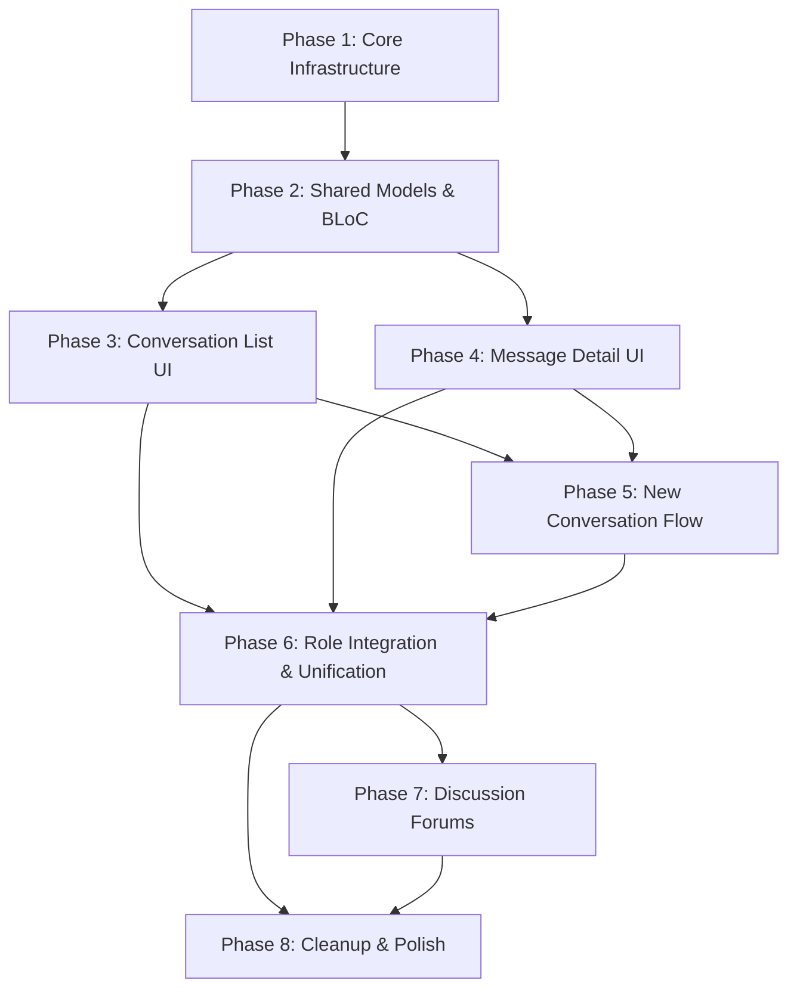

# EduVerse Flutter — Chat Backend Integration Plan

> **Goal:** Replace all static/mock chat data in the Flutter mobile app with live backend API and WebSocket integration, mirroring the website frontend's feature parity exactly.
>
> **Reference Docs:**
> - [Backend API](file:///d:/Graduation/EduVerse/edu_verse/Flutter_Chat_API_Docs_BACKEND.md)
> - [Frontend Website](file:///d:/Graduation/EduVerse/edu_verse/CHAT_FEATURE_DOCUMENTATION_FRONTEND_WEBSITE.md)

---

## Current State Audit

### What exists in the Flutter app (ALL static/mock)

| Role | Screen | Widgets | Uses BLoC? | Backend Connected? |
|------|--------|---------|------------|-------------------|
| **Student** | `ChatScreen` | 10 widgets in `widgets/student/chat/` | ✅ `ChatCubit` | ❌ All mock data |
| **Instructor** | `InstructorChatScreen` | 10 widgets in `widgets/instructor/chat/` | ❌ Local `setState` | ❌ All mock data |
| **TA** | `TAMessagesScreen` | Inline widgets (monolithic ~1176 lines) | ❌ Local `setState` | ❌ All mock data |
| **Admin** | `AdminMessagesScreen` | 5 widgets in `widgets/admin/messages/` | ❌ Local `setState` | ❌ All mock data |
| **IT Admin** | No dedicated chat screen | — | — | — |

### Critical Discrepancies with Website Frontend

| Feature | Website | Flutter App | Action |
|---------|---------|-------------|--------|
| Unified `MessagingChat` component | ✅ Single shared component | ❌ 4 separate implementations | **Must unify** |
| WebSocket real-time messaging | ✅ `socket.io-client` | ❌ Not present | **Must add** |
| REST API conversation CRUD | ✅ `ChatService` | ❌ Not present | **Must add** |
| New chat by email search | ✅ `searchUsers()` API | ❌ Mock user list only | **Must replace** |
| Reply to messages | ✅ via `replyToId` | ✅ UI exists (student only) | **Must wire to API** |
| Delete for me / everyone | ✅ via WebSocket | ❌ Local remove only | **Must wire to API** |
| Typing indicators | ✅ via WebSocket events | ❌ Not present | **Must add** |
| Message edit | ✅ Socket event exists (UI not exposed) | ❌ Not present | Skip (matches website) |
| File attachments | ✅ UI exists (upload not implemented) | ❌ Not present | Skip (matches website) |
| Voice/Video call buttons | ✅ UI placeholders | Partial | **Must add UI placeholders** |
| Online/offline status | ✅ via `user_status` event | ❌ Mock status only | **Must wire** |
| Connection status badge | ✅ "Live"/"Offline" | ❌ Not present | **Must add** |
| Emoji picker | ✅ Inline emoji row | ❌ Not present | **Must add** |
| Voice message toggle | ✅ UI placeholder | ❌ Not present | **Must add** |
| Course discussions | ❌ Not in website chat | ❌ Flutter has `ConversationType.course` | **Must remove** (from chat) |
| Filter: "courses" | ❌ Not in website | ✅ Flutter has it | **Must remove** |
| Filter: "instructors"/"students" | ❌ Website only has search | ✅ Flutter has it | **Keep** (mobile UX) |
| IT Admin chat screen | ✅ Full chat with `MessagingChat` | ❌ Missing entirely | **Must add** |
| Discussion Forums | ❌ Separate feature in website | ❌ Not in Flutter | **Must add** (if required) |

### Roles Using This Feature

Per the [Backend API docs](file:///d:/Graduation/EduVerse/edu_verse/Flutter_Chat_API_Docs_BACKEND.md) §4:

- **All roles** (student, instructor, teaching_assistant, admin, it_admin) use the **Messaging** feature (REST + WebSocket)
- **Discussion Forums** have role-based access: students (enrolled only), instructors/TAs (moderation), admins (global access)

---

## Phased Development Plan

### Phase 1: Core Chat Infrastructure (Services & Dependencies)
**Spec-Kit Name:** `chat-core-infrastructure`

> [!IMPORTANT]
> This phase builds the foundation all subsequent phases depend on. No UI changes.

#### Scope
- Add `socket_io_client` package to `pubspec.yaml`
- Create `ChatService` (REST API) in `lib/services/api/chat_service.dart`
  - `listConversations()` → `GET /api/messages/conversations`
  - `getConversationMessages(id, {page, limit})` → `GET /api/messages/conversations/:id`
  - `sendMessage(id, text)` → `POST /api/messages/conversations/:id`
  - `startConversation({participantIds, type, text, groupName})` → `POST /api/messages/conversations`
  - `searchUsers(query, {limit})` → `GET /api/messages/users/search`
  - `markRead(messageId)` → `PATCH /api/messages/:messageId/read`
  - `editMessage(id, text)` → `PATCH /api/messages/:id`
  - `deleteForMe(id)` → `DELETE /api/messages/:id`
  - `deleteForEveryone(id)` → `DELETE /api/messages/:id/everyone`
- Create `ChatSocketService` singleton in `lib/services/chat/chat_socket_service.dart`
  - Connect to `/messaging` namespace with JWT token
  - Emit: `join_conversation`, `leave_conversation`, `send_message`, `typing`, `mark_read`, `delete_message`, `edit_message`
  - Listen: `new_message`, `new_message_notification`, `user_typing`, `message_read`, `message_deleted`, `message_edited`, `user_status`, `message_sent`, `delete_confirmed`
  - Auto-reconnect (5 attempts, 1200ms delay)
  - Connection status stream (`connected` / `disconnected`)

#### Files
| Action | File |
|--------|------|
| **[NEW]** | `lib/services/api/chat_service.dart` |
| **[NEW]** | `lib/services/chat/chat_socket_service.dart` |
| **[MODIFY]** | `pubspec.yaml` (add `socket_io_client: ^3.0.2`) |

#### Verification
- Unit-test `ChatService` methods with mock Dio
- Verify `ChatSocketService` connects and emits/receives test events against running backend

---

### Phase 2: Shared Data Models & Conversation BLoC
**Spec-Kit Name:** `chat-shared-models`

> [!IMPORTANT]
> This phase replaces the 4 divergent model definitions with a single, API-aligned model layer.

#### Scope
- Rewrite `lib/bloc/chat/chat_models.dart` to match backend API response shapes exactly:
  - `ConversationModel` aligned to `ChatConversationApi` (website)
    - Fields: `conversationId` (int), `type` ('direct'/'group'), `name`, `participants`, `participantUsers`, `directDisplayUser`, `lastMessage`, `lastMessageInfo`, `unreadCount`, `lastMessageAt`
  - `ChatMessageModel` aligned to `ChatMessageApi` (website)
    - Fields: `id` (int), `text`, `senderId`, `senderName`, `sentAt`, `editedAt`, `isDeleted`, `replyToId`, `conversationId`, `status`
  - `ChatUserModel` aligned to `ChatUser` (website)
    - Fields: `userId` (int), `firstName`, `lastName`, `fullName`, `email`
  - Remove `ConversationType.course` (not in website)
  - Keep `ConversationType` as `direct` and `group` only (matching backend)
  - Remove `OnlineStatus.away`, `OnlineStatus.busy` — backend only sends `isOnline: bool`
- Rewrite `ChatCubit` → `ChatBloc` (flutter_bloc pattern, consistent with other blocs in the project):
  - `LoadConversations` event → calls `ChatService.listConversations()` + emits cached then live data
  - `SelectConversation` event → calls `ChatService.getConversationMessages(id)` + `ChatSocketService.joinConversation(id)` + `ChatSocketService.markRead(id)`
  - `SendMessage` event → optimistic append + `ChatSocketService.sendMessage()` with REST fallback
  - `SearchConversations` event → local filter on loaded conversations
  - `SearchUsers` event → calls `ChatService.searchUsers(query)`
  - `StartNewConversation` event → calls `ChatService.startConversation()`
  - `DeleteMessage` event → `ChatSocketService.deleteMessage()` or `ChatService.deleteForMe/Everyone()`
  - `MarkRead` event → `ChatSocketService.markRead()`
  - `TypingChanged` event → `ChatSocketService.emitTyping()`
  - Wire WebSocket incoming events to state updates (new messages, typing indicators, deletions, edits, user status)
- Rewrite `ChatState` to include:
  - `connectionStatus` (live/offline)
  - `typingUsers` map
  - `onlineUsers` set

#### Files
| Action | File |
|--------|------|
| **[MODIFY]** | `lib/bloc/chat/chat_models.dart` → complete rewrite |
| **[DELETE]** | `lib/bloc/chat/chat_cubit.dart` |
| **[NEW]** | `lib/bloc/chat/chat_bloc.dart` |
| **[NEW]** | `lib/bloc/chat/chat_event.dart` |
| **[MODIFY]** | `lib/bloc/chat/chat_state.dart` → complete rewrite |
| **[DELETE]** | `lib/widgets/instructor/chat/instructor_chat_models.dart` |
| **[MODIFY]** | `lib/main.dart` (register `ChatBloc` provider) |

#### Verification
- Integration test: `ChatBloc` loads conversations from running backend
- Verify WebSocket events trigger correct state transitions

---

### Phase 3: Unified Chat UI — Conversation List
**Spec-Kit Name:** `chat-conversation-list-ui`

> [!IMPORTANT]
> This phase creates the single shared conversation list component used by all roles, replacing the 4 separate implementations.

#### Scope
- Create **shared** conversation list widgets in `lib/widgets/shared/chat/`:
  - `shared_chat_header.dart` — header with "Messages" title, connection status badge (Live/Offline), "+" new chat button, search toggle
  - `shared_chat_search_bar.dart` — search input that filters by name, email, last message text
  - `shared_chat_filter_chips.dart` — "All" / "Unread" / "Groups" chips only (remove "Instructors", "Students", "Courses" filters — website doesn't have per-type filters)
  - `shared_conversation_tile.dart` — single conversation row with:
    - Avatar (initials for direct, group icon for group)
    - Online indicator dot
    - Name + last message preview + timestamp
    - Unread badge
    - Swipe actions: Pin, Mute, Delete
  - `shared_conversation_list.dart` — `ListView.builder` consuming `ChatBloc` state
  - `shared_chat_empty_state.dart` — empty state with new chat CTA
- Each widget receives `accentColor` and `isDark` props for per-role theming
- Remove role-specific filter types (instructor: "colleagues", TA: "instructors", admin: "system")

#### Files
| Action | File |
|--------|------|
| **[NEW]** | `lib/widgets/shared/chat/shared_chat_header.dart` |
| **[NEW]** | `lib/widgets/shared/chat/shared_chat_search_bar.dart` |
| **[NEW]** | `lib/widgets/shared/chat/shared_chat_filter_chips.dart` |
| **[NEW]** | `lib/widgets/shared/chat/shared_conversation_tile.dart` |
| **[NEW]** | `lib/widgets/shared/chat/shared_conversation_list.dart` |
| **[NEW]** | `lib/widgets/shared/chat/shared_chat_empty_state.dart` |

#### Verification
- Visual test: conversation list renders real backend data
- Verify filter chips work correctly
- Verify swipe actions trigger correct BLoC events

---

### Phase 4: Unified Chat UI — Message Detail View
**Spec-Kit Name:** `chat-message-detail-ui`

#### Scope
- Create **shared** message detail widgets in `lib/widgets/shared/chat/`:
  - `shared_chat_detail_view.dart` — full message view with:
    - Conversation header: avatar, name, typing indicator ("User X is typing..."), online status, voice/video call placeholders
    - Message list: scrollable, auto-scroll on new message
    - Reply preview bar (when replying to a message)
    - Input bar with: attachment button (placeholder), voice message toggle (placeholder), text input, emoji toggle, send button
  - `shared_message_bubble.dart` — message bubble with:
    - Sender avatar + name (for group chats)
    - Text content (or "This message was deleted" for `isDeleted`)
    - Timestamp + delivery status indicators
    - Long-press actions: Reply, Delete for me, Delete for everyone (own messages only)
    - Reply context (if replying to another message)
  - `shared_emoji_row.dart` — inline emoji row (matching website's emoji picker)
  - `shared_typing_indicator.dart` — animated typing dots
- Connection status badge in header (green "Live" / red "Offline")
- Optimistic message sending with deduplication (match website behavior):
  1. Add message with `pending: true` immediately
  2. On `message_sent` event: replace optimistic message with server-confirmed one
  3. On socket disconnect: fallback to REST `sendMessage()`

#### Files
| Action | File |
|--------|------|
| **[NEW]** | `lib/widgets/shared/chat/shared_chat_detail_view.dart` |
| **[NEW]** | `lib/widgets/shared/chat/shared_message_bubble.dart` |
| **[NEW]** | `lib/widgets/shared/chat/shared_emoji_row.dart` |
| **[NEW]** | `lib/widgets/shared/chat/shared_typing_indicator.dart` |

#### Verification
- End-to-end test: send message via Flutter, verify delivery on backend and receipt on another client
- Test typing indicator appears for other users
- Verify "Delete for everyone" removes message for all participants
- Test REST fallback when WebSocket is disconnected

---

### Phase 5: New Conversation Flow
**Spec-Kit Name:** `chat-new-conversation`

#### Scope
- Create **shared** new chat dialog in `lib/widgets/shared/chat/shared_new_chat_dialog.dart`:
  - **Email-based search** (matching website exactly):
    - Text input for email/name query
    - Calls `ChatService.searchUsers(query)` on input change (debounced)
    - Shows search results list with user name, email
    - Select user → set as participant
  - **First message input**: text field for initial message
  - **Start conversation**:
    - Calls `ChatService.startConversation({participantIds: [userId], type: 'direct', text: firstMessage})`
    - If conversation already exists (backend returns `existing: true`), send message to existing conversation
    - Refresh conversation list
    - Navigate to the new/existing conversation
  - Group chat creation (matching website):
    - Toggle between "Direct" and "Group" mode
    - Group name input (required for group)
    - Multiple participant selection
    - Create with `type: 'group'`

#### Files
| Action | File |
|--------|------|
| **[NEW]** | `lib/widgets/shared/chat/shared_new_chat_dialog.dart` |

#### Verification
- Search returns real users from backend
- Direct chat creates or routes to existing conversation
- Group chat creates with name and multiple participants

---

### Phase 6: Role-Specific Screen Integration & Unification
**Spec-Kit Name:** `chat-role-integration`

> [!WARNING]
> This phase deletes the 4 separate role-specific chat implementations and replaces them with one shared screen.

#### Scope
- Create **single shared** `ChatScreen` in `lib/screens/shared/chat_screen.dart`:
  - Props: `accentColor`, `currentUserName`, `currentUserId`, `isDark`
  - Composes: conversation list (Phase 3) + message detail (Phase 4) + new chat dialog (Phase 5)
  - Mobile: navigates between list ↔ detail views
  - Tablet/Desktop: side-by-side layout (list + detail) — matches instructor chat's existing behavior
- Wire into each role's dashboard/navigation:

  | Role | Route | Accent Color | Notes |
  |------|-------|-------------|-------|
  | **Student** | existing chat tab | `#3B82F6` (blue) | Replace current `ChatScreen` |
  | **Instructor** | existing chat tab | `#4F46E5` (indigo) | Replace `InstructorChatScreen` |
  | **TA** | existing messages tab | `#4F46E5` (indigo) | Replace `TAMessagesScreen` |
  | **Admin** | existing messages tab | `#4F46E5` (indigo) | Replace `AdminMessagesScreen` |
  | **IT Admin** | new chat tab | `#3B82F6` (blue) | Add new screen to IT Admin dashboard |

- Delete old role-specific chat screens and widgets:
  - `lib/screens/student/chat/chat_screen.dart` → replaced
  - `lib/screens/instructor/chat/instructor_chat_screen.dart` → replaced
  - `lib/screens/ta/messages/ta_messages_screen.dart` → replaced
  - `lib/screens/admin/messages/admin_messages_screen.dart` → replaced
  - All 10 widgets in `lib/widgets/student/chat/` → replaced
  - All 10 widgets in `lib/widgets/instructor/chat/` → replaced
  - All 5 widgets in `lib/widgets/admin/messages/` → replaced
- Update `go_router` navigation to point to new shared screen
- Ensure `ChatBloc` is provided at the appropriate scope (above all role dashboards)

#### Files
| Action | File |
|--------|------|
| **[NEW]** | `lib/screens/shared/chat_screen.dart` |
| **[DELETE]** | `lib/screens/student/chat/chat_screen.dart` |
| **[DELETE]** | `lib/screens/instructor/chat/instructor_chat_screen.dart` |
| **[DELETE]** | `lib/screens/ta/messages/ta_messages_screen.dart` |
| **[DELETE]** | `lib/screens/admin/messages/admin_messages_screen.dart` |
| **[DELETE]** | All files in `lib/widgets/student/chat/` (10 files) |
| **[DELETE]** | All files in `lib/widgets/instructor/chat/` (10 files) |
| **[DELETE]** | All files in `lib/widgets/admin/messages/` (5 files) |
| **[MODIFY]** | Router / navigation files (to wire new shared screen) |
| **[MODIFY]** | IT Admin dashboard (add chat tab) |

#### Verification
- All 5 roles can access chat from their dashboard
- Accent colors match per role (blue for Student/IT Admin, indigo for others)
- Conversation list, messaging, new chat work identically across all roles
- IT Admin has a working chat tab (previously missing)

---

### Phase 7: Discussion Forums Backend Integration
**Spec-Kit Name:** `chat-discussion-forums`

> [!NOTE]
> Discussions are a **separate module** from messaging in the backend (`/api/discussions`). The website treats them separately too. This phase adds the forums feature matching the backend's discussion endpoints.

#### Scope
- Create `DiscussionService` in `lib/services/api/discussion_service.dart`:
  - `listThreads(courseId, {page, limit})` → `GET /api/discussions?courseId=`
  - `createThread(courseId, title, description)` → `POST /api/discussions`
  - `getThread(id)` → `GET /api/discussions/:id` (returns thread + paginated replies)
  - `postReply(threadId, messageText, {parentMessageId})` → `POST /api/discussions/:id/reply`
  - `updateThread(id, title, description)` → `PUT /api/discussions/:id`
  - `deleteThread(id)` → `DELETE /api/discussions/:id`
  - `togglePin(id)` → `PATCH /api/discussions/:id/pin`
  - `toggleLock(id)` → `PATCH /api/discussions/:id/lock`
  - `markAsAnswer(replyId)` → `PATCH /api/discussions/replies/:replyId/mark-answer`
  - `endorseReply(replyId)` → `PATCH /api/discussions/replies/:replyId/endorse`
- Create `DiscussionBloc` with events/states for thread CRUD and moderation
- Create discussion UI widgets:
  - `discussion_thread_list.dart` — list of threads (pinned first), with view count, reply count, locked/pinned badges
  - `discussion_thread_detail.dart` — thread view with paginated replies, answer/endorsed badges
  - `discussion_create_thread.dart` — dialog for creating new threads
  - `discussion_reply_input.dart` — reply input with nested reply support
- **Role-based UI rendering** (matching backend §4 Action Matrix):
  - **Students**: can create/reply threads for enrolled courses only; CANNOT see Pin/Lock/Endorse/Mark Answer buttons; CAN edit/delete own threads/replies
  - **Instructors & TAs**: full moderation UI (Pin, Lock, Delete Thread, Endorse Reply, Mark as Answer)
  - **Admins & IT Admins**: global access to all discussions, full moderation powers
- Integrate into Instructor & TA Communication hubs (matching website's 3 sub-tabs: Announcements / Course Chats / Direct Messages)

#### Files
| Action | File |
|--------|------|
| **[NEW]** | `lib/services/api/discussion_service.dart` |
| **[NEW]** | `lib/bloc/discussions/discussion_bloc.dart` |
| **[NEW]** | `lib/bloc/discussions/discussion_event.dart` |
| **[NEW]** | `lib/bloc/discussions/discussion_state.dart` |
| **[NEW]** | `lib/models/discussion/discussion_models.dart` |
| **[NEW]** | `lib/widgets/shared/discussions/discussion_thread_list.dart` |
| **[NEW]** | `lib/widgets/shared/discussions/discussion_thread_detail.dart` |
| **[NEW]** | `lib/widgets/shared/discussions/discussion_create_thread.dart` |
| **[NEW]** | `lib/widgets/shared/discussions/discussion_reply_input.dart` |

#### Verification
- Students see only enrolled course discussions
- Instructors/TAs see moderation buttons
- Pin moves thread to top; Lock prevents new replies
- Mark as Answer and Endorse badges render correctly

---

### Phase 8: Cleanup, Caching & Polish
**Spec-Kit Name:** `chat-cleanup-polish`

#### Scope
- **Remove all remaining mock data**:
  - Delete `_generateSampleConversations()`, `_generateSampleMessages()`, `_generateAvailableUsers()` from old cubit
  - Delete `_simulateReply()` logic
  - Audit for any remaining hardcoded conversation/message data
- **Offline caching**:
  - Cache last-fetched conversations in `SharedPreferences` (JSON)
  - On load: emit cached data immediately, then fetch fresh data from API
  - Cache message history per conversation (last 50 messages)
- **Connection status UI**:
  - Green "Live" badge when WebSocket connected
  - Red "Offline" badge when disconnected
  - Auto-reconnect with visual feedback
- **Error handling & edge cases**:
  - Network failure fallback UI
  - Token expiration → auto-refresh via `CoreApiClient` interceptor
  - Empty state designs for no conversations, no messages, no search results
- **Performance optimization**:
  - Debounce search input (300ms)
  - Debounce typing indicator (1.5s auto-stop, matching website)
  - Pagination for conversation messages
  - Lazy-load conversation list if > 50 items
- **Remove Flutter-only features not in website**:
  - Remove `ConversationType.course` from models
  - Remove `ChatFilter.courses` and `ChatFilter.instructors` and `ChatFilter.students` filter chip
  - Remove `chat_swipe_settings_screen.dart` (if swipe settings become irrelevant)
- **Final parity audit**:
  - Cross-reference every field in the website's `ChatConversationApi` and `ChatMessageApi` interfaces with Flutter models
  - Ensure all WebSocket events are handled identically

#### Files
| Action | File |
|--------|------|
| **[MODIFY]** | Various — cleanup pass across all chat-related files |
| **[DELETE]** | `lib/models/chat/chat_swipe_action_model.dart` (if no longer needed) |
| **[DELETE]** | `lib/services/chat_swipe_settings_service.dart` (if no longer needed) |
| **[MODIFY]** | `lib/bloc/chat/chat_bloc.dart` (add caching, pagination) |

#### Verification
- Full end-to-end smoke test across all 5 roles
- Offline mode: cached data loads in < 2 seconds
- WebSocket reconnects after connection loss
- No mock data anywhere in the build

---

## Dependency Graph

## Spec-Kit Workflow Per Phase

For each phase, run the Spec-Kit workflow in order:

1. `/speckit.specify` — Generate the feature specification
2. `/speckit.clarify` — Resolve any ambiguities  
3. `/speckit.plan` — Create the implementation plan
4. `/speckit.tasks` — Break down into ordered tasks
5. `/speckit.implement` — Execute the implementation
6. `/speckit.analyze` — Validate cross-artifact consistency

---

## Open Questions

> [!IMPORTANT]
> **Q1:** The Flutter app currently has `ConversationType.course` with course-specific chat conversations. The website frontend does NOT have this — it only has `direct` and `group`. Should course discussions be handled entirely through the Discussion Forums (Phase 7), or do you want to keep some form of course-context?

> [!IMPORTANT]
> **Q2:** The website's Instructor and TA dashboards have a "Communication" page with 3 sub-tabs (Announcements / Course Chats / Direct Messages) that each embed the `MessagingChat` component. Do you want to replicate this 3-subtab communication hub in the Flutter app, or keep chat as a standalone top-level tab only?

> [!IMPORTANT]
> **Q3:** The TA's AI Assistant page and the Instructor's Evy AI Chatbot are separate from the messaging system (they don't use the chat backend). Should they be excluded from this plan entirely, or should integrating them be a separate future phase?
