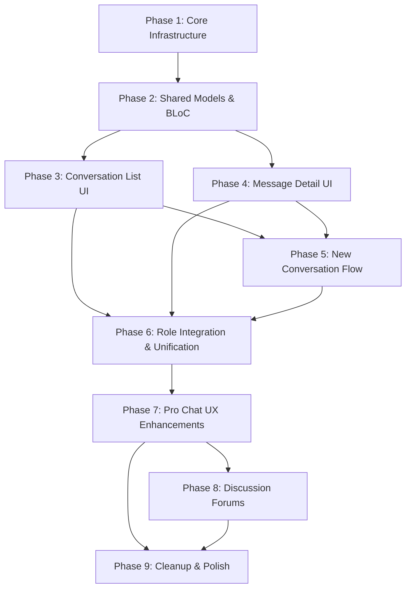

# EduVerse Flutter — Chat Backend Integration Plan

> **Goal:** Replace all static/mock chat data in the Flutter mobile app with live backend API and WebSocket integration, mirroring the website frontend's feature parity exactly.
>
> **Reference Docs:**
> - [Backend API](file:///d:/Graduation/EduVerse/edu_verse/Flutter_Chat_API_Docs_BACKEND.md)
> - [Frontend Website](file:///d:/Graduation/EduVerse/edu_verse/CHAT_FEATURE_DOCUMENTATION_FRONTEND_WEBSITE.md)

---

## Current State Audit

### What exists in the Flutter app (ALL static/mock)

| Role | Screen | Widgets | Uses BLoC? | Backend Connected? |
|------|--------|---------|------------|-------------------|
| **Student** | `ChatScreen` | 10 widgets in `widgets/student/chat/` | ✅ `ChatCubit` | ❌ All mock data |
| **Instructor** | `InstructorChatScreen` | 10 widgets in `widgets/instructor/chat/` | ❌ Local `setState` | ❌ All mock data |
| **TA** | `TAMessagesScreen` | Inline widgets (monolithic ~1176 lines) | ❌ Local `setState` | ❌ All mock data |
| **Admin** | `AdminMessagesScreen` | 5 widgets in `widgets/admin/messages/` | ❌ Local `setState` | ❌ All mock data |
| **IT Admin** | No dedicated chat screen | — | — | — |

### Critical Discrepancies with Website Frontend

| Feature | Website | Flutter App | Action |
|---------|---------|-------------|--------|
| Unified `MessagingChat` component | ✅ Single shared component | ❌ 4 separate implementations | **Must unify** |
| WebSocket real-time messaging | ✅ `socket.io-client` | ❌ Not present | **Must add** |
| REST API conversation CRUD | ✅ `ChatService` | ❌ Not present | **Must add** |
| New chat by email search | ✅ `searchUsers()` API | ❌ Mock user list only | **Must replace** |
| Reply to messages | ✅ via `replyToId` | ✅ UI exists (student only) | **Must wire to API** |
| Delete for me / everyone | ✅ via WebSocket | ❌ Local remove only | **Must wire to API** |
| Typing indicators | ✅ via WebSocket events | ❌ Not present | **Must add** |
| Message edit | ✅ Socket event exists (UI not exposed) | ❌ Not present | Skip (matches website) |
| File attachments | ✅ UI exists (upload not implemented) | ❌ Not present | Skip (matches website) |
| Voice/Video call buttons | ✅ UI placeholders | Partial | **Must add UI placeholders** |
| Online/offline status | ✅ via `user_status` event | ❌ Mock status only | **Must wire** |
| Connection status badge | ✅ "Live"/"Offline" | ❌ Not present | **Must add** |
| Emoji picker | ✅ Inline emoji row | ❌ Not present | **Must add** |
| Voice message toggle | ✅ UI placeholder | ❌ Not present | **Must add** |
| Course discussions | ❌ Not in website chat | ❌ Flutter has `ConversationType.course` | **Must remove** (from chat) |
| Filter: "courses" | ❌ Not in website | ✅ Flutter has it | **Must remove** |
| Filter: "instructors"/"students" | ❌ Website only has search | ✅ Flutter has it | **Keep** (mobile UX) |
| IT Admin chat screen | ✅ Full chat with `MessagingChat` | ❌ Missing entirely | **Must add** |
| Discussion Forums | ❌ Separate feature in website | ❌ Not in Flutter | **Must add** (if required) |

### Roles Using This Feature

Per the [Backend API docs](file:///d:/Graduation/EduVerse/edu_verse/Flutter_Chat_API_Docs_BACKEND.md) §4:

- **All roles** (student, instructor, teaching_assistant, admin, it_admin) use the **Messaging** feature (REST + WebSocket)
- **Discussion Forums** have role-based access: students (enrolled only), instructors/TAs (moderation), admins (global access)

---

## Phased Development Plan

### Phase 1: Core Chat Infrastructure (Services & Dependencies)
**Spec-Kit Name:** `chat-core-infrastructure`

> [!IMPORTANT]
> This phase builds the foundation all subsequent phases depend on. No UI changes.

#### Scope
- Add `socket_io_client` package to `pubspec.yaml`
- Create `ChatService` (REST API) in `lib/services/api/chat_service.dart`
  - `listConversations()` → `GET /api/messages/conversations`
  - `getConversationMessages(id, {page, limit})` → `GET /api/messages/conversations/:id`
  - `sendMessage(id, text)` → `POST /api/messages/conversations/:id`
  - `startConversation({participantIds, type, text, groupName})` → `POST /api/messages/conversations`
  - `searchUsers(query, {limit})` → `GET /api/messages/users/search`
  - `markRead(messageId)` → `PATCH /api/messages/:messageId/read`
  - `editMessage(id, text)` → `PATCH /api/messages/:id`
  - `deleteForMe(id)` → `DELETE /api/messages/:id`
  - `deleteForEveryone(id)` → `DELETE /api/messages/:id/everyone`
- Create `ChatSocketService` singleton in `lib/services/chat/chat_socket_service.dart`
  - Connect to `/messaging` namespace with JWT token
  - Emit: `join_conversation`, `leave_conversation`, `send_message`, `typing`, `mark_read`, `delete_message`, `edit_message`
  - Listen: `new_message`, `new_message_notification`, `user_typing`, `message_read`, `message_deleted`, `message_edited`, `user_status`, `message_sent`, `delete_confirmed`
  - Auto-reconnect (5 attempts, 1200ms delay)
  - Connection status stream (`connected` / `disconnected`)

#### Files
| Action | File |
|--------|------|
| **[NEW]** | `lib/services/api/chat_service.dart` |
| **[NEW]** | `lib/services/chat/chat_socket_service.dart` |
| **[MODIFY]** | `pubspec.yaml` (add `socket_io_client: ^3.0.2`) |

#### Verification
- Unit-test `ChatService` methods with mock Dio
- Verify `ChatSocketService` connects and emits/receives test events against running backend

---

### Phase 2: Shared Data Models & Conversation BLoC
**Spec-Kit Name:** `chat-shared-models`

> [!IMPORTANT]
> This phase replaces the 4 divergent model definitions with a single, API-aligned model layer.

#### Scope
- Rewrite `lib/bloc/chat/chat_models.dart` to match backend API response shapes exactly:
  - `ConversationModel` aligned to `ChatConversationApi` (website)
    - Fields: `conversationId` (int), `type` ('direct'/'group'), `name`, `participants`, `participantUsers`, `directDisplayUser`, `lastMessage`, `lastMessageInfo`, `unreadCount`, `lastMessageAt`
  - `ChatMessageModel` aligned to `ChatMessageApi` (website)
    - Fields: `id` (int), `text`, `senderId`, `senderName`, `sentAt`, `editedAt`, `isDeleted`, `replyToId`, `conversationId`, `status`
  - `ChatUserModel` aligned to `ChatUser` (website)
    - Fields: `userId` (int), `firstName`, `lastName`, `fullName`, `email`
  - Remove `ConversationType.course` (not in website)
  - Keep `ConversationType` as `direct` and `group` only (matching backend)
  - Remove `OnlineStatus.away`, `OnlineStatus.busy` — backend only sends `isOnline: bool`
- Rewrite `ChatCubit` → `ChatBloc` (flutter_bloc pattern, consistent with other blocs in the project):
  - `LoadConversations` event → calls `ChatService.listConversations()` + emits cached then live data
  - `SelectConversation` event → calls `ChatService.getConversationMessages(id)` + `ChatSocketService.joinConversation(id)` + `ChatSocketService.markRead(id)`
  - `SendMessage` event → optimistic append + `ChatSocketService.sendMessage()` with REST fallback
  - `SearchConversations` event → local filter on loaded conversations
  - `SearchUsers` event → calls `ChatService.searchUsers(query)`
  - `StartNewConversation` event → calls `ChatService.startConversation()`
  - `DeleteMessage` event → `ChatSocketService.deleteMessage()` or `ChatService.deleteForMe/Everyone()`
  - `MarkRead` event → `ChatSocketService.markRead()`
  - `TypingChanged` event → `ChatSocketService.emitTyping()`
  - Wire WebSocket incoming events to state updates (new messages, typing indicators, deletions, edits, user status)
- Rewrite `ChatState` to include:
  - `connectionStatus` (live/offline)
  - `typingUsers` map
  - `onlineUsers` set

#### Files
| Action | File |
|--------|------|
| **[MODIFY]** | `lib/bloc/chat/chat_models.dart` → complete rewrite |
| **[DELETE]** | `lib/bloc/chat/chat_cubit.dart` |
| **[NEW]** | `lib/bloc/chat/chat_bloc.dart` |
| **[NEW]** | `lib/bloc/chat/chat_event.dart` |
| **[MODIFY]** | `lib/bloc/chat/chat_state.dart` → complete rewrite |
| **[DELETE]** | `lib/widgets/instructor/chat/instructor_chat_models.dart` |
| **[MODIFY]** | `lib/main.dart` (register `ChatBloc` provider) |

#### Verification
- Integration test: `ChatBloc` loads conversations from running backend
- Verify WebSocket events trigger correct state transitions

---

### Phase 3: Unified Chat UI — Conversation List
**Spec-Kit Name:** `chat-conversation-list-ui`

> [!IMPORTANT]
> This phase creates the single shared conversation list component used by all roles, replacing the 4 separate implementations.

#### Scope
- Create **shared** conversation list widgets in `lib/widgets/shared/chat/`:
  - `shared_chat_header.dart` — header with "Messages" title, connection status badge (Live/Offline), "+" new chat button, search toggle
  - `shared_chat_search_bar.dart` — search input that filters by name, email, last message text
  - `shared_chat_filter_chips.dart` — "All" / "Unread" / "Groups" chips only (remove "Instructors", "Students", "Courses" filters — website doesn't have per-type filters)
  - `shared_conversation_tile.dart` — single conversation row with:
    - Avatar (initials for direct, group icon for group)
    - Online indicator dot
    - Name + last message preview + timestamp
    - Unread badge
    - Swipe actions: Pin, Mute, Delete
  - `shared_conversation_list.dart` — `ListView.builder` consuming `ChatBloc` state
  - `shared_chat_empty_state.dart` — empty state with new chat CTA
- Each widget receives `accentColor` and `isDark` props for per-role theming
- Remove role-specific filter types (instructor: "colleagues", TA: "instructors", admin: "system")

#### Files
| Action | File |
|--------|------|
| **[NEW]** | `lib/widgets/shared/chat/shared_chat_header.dart` |
| **[NEW]** | `lib/widgets/shared/chat/shared_chat_search_bar.dart` |
| **[NEW]** | `lib/widgets/shared/chat/shared_chat_filter_chips.dart` |
| **[NEW]** | `lib/widgets/shared/chat/shared_conversation_tile.dart` |
| **[NEW]** | `lib/widgets/shared/chat/shared_conversation_list.dart` |
| **[NEW]** | `lib/widgets/shared/chat/shared_chat_empty_state.dart` |

#### Verification
- Visual test: conversation list renders real backend data
- Verify filter chips work correctly
- Verify swipe actions trigger correct BLoC events

---

### Phase 4: Unified Chat UI — Message Detail View
**Spec-Kit Name:** `chat-message-detail-ui`

#### Scope
- Create **shared** message detail widgets in `lib/widgets/shared/chat/`:
  - `shared_chat_detail_view.dart` — full message view with:
    - Conversation header: avatar, name, typing indicator ("User X is typing..."), online status, voice/video call placeholders
    - Message list: scrollable, auto-scroll on new message
    - Reply preview bar (when replying to a message)
    - Input bar with: attachment button (placeholder), voice message toggle (placeholder), text input, emoji toggle, send button
  - `shared_message_bubble.dart` — message bubble with:
    - Sender avatar + name (for group chats)
    - Text content (or "This message was deleted" for `isDeleted`)
    - Timestamp + delivery status indicators
    - Long-press actions: Reply, Delete for me, Delete for everyone (own messages only)
    - Reply context (if replying to another message)
  - `shared_emoji_row.dart` — inline emoji row (matching website's emoji picker)
  - `shared_typing_indicator.dart` — animated typing dots
- Connection status badge in header (green "Live" / red "Offline")
- Optimistic message sending with deduplication (match website behavior):
  1. Add message with `pending: true` immediately
  2. On `message_sent` event: replace optimistic message with server-confirmed one
  3. On socket disconnect: fallback to REST `sendMessage()`

#### Files
| Action | File |
|--------|------|
| **[NEW]** | `lib/widgets/shared/chat/shared_chat_detail_view.dart` |
| **[NEW]** | `lib/widgets/shared/chat/shared_message_bubble.dart` |
| **[NEW]** | `lib/widgets/shared/chat/shared_emoji_row.dart` |
| **[NEW]** | `lib/widgets/shared/chat/shared_typing_indicator.dart` |

#### Verification
- End-to-end test: send message via Flutter, verify delivery on backend and receipt on another client
- Test typing indicator appears for other users
- Verify "Delete for everyone" removes message for all participants
- Test REST fallback when WebSocket is disconnected

---

### Phase 5: New Conversation Flow
**Spec-Kit Name:** `chat-new-conversation`

#### Scope
- Create **shared** new chat dialog in `lib/widgets/shared/chat/shared_new_chat_dialog.dart`:
  - **Email-based search** (matching website exactly):
    - Text input for email/name query
    - Calls `ChatService.searchUsers(query)` on input change (debounced)
    - Shows search results list with user name, email
    - Select user → set as participant
  - **First message input**: text field for initial message
  - **Start conversation**:
    - Calls `ChatService.startConversation({participantIds: [userId], type: 'direct', text: firstMessage})`
    - If conversation already exists (backend returns `existing: true`), send message to existing conversation
    - Refresh conversation list
    - Navigate to the new/existing conversation
  - Group chat creation (matching website):
    - Toggle between "Direct" and "Group" mode
    - Group name input (required for group)
    - Multiple participant selection
    - Create with `type: 'group'`

#### Files
| Action | File |
|--------|------|
| **[NEW]** | `lib/widgets/shared/chat/shared_new_chat_dialog.dart` |

#### Verification
- Search returns real users from backend
- Direct chat creates or routes to existing conversation
- Group chat creates with name and multiple participants

---

### Phase 6: Role-Specific Screen Integration & Unification
**Spec-Kit Name:** `chat-role-integration`

> [!WARNING]
> This phase deletes the 4 separate role-specific chat implementations and replaces them with one shared screen.

#### Scope
- Create **single shared** `ChatScreen` in `lib/screens/shared/chat_screen.dart`:
  - Props: `accentColor`, `currentUserName`, `currentUserId`, `isDark`
  - Composes: conversation list (Phase 3) + message detail (Phase 4) + new chat dialog (Phase 5)
  - Mobile: navigates between list ↔ detail views
  - Tablet/Desktop: side-by-side layout (list + detail) — matches instructor chat's existing behavior
- Wire into each role's dashboard/navigation:

  | Role | Route | Accent Color | Notes |
  |------|-------|-------------|-------|
  | **Student** | existing chat tab | `#3B82F6` (blue) | Replace current `ChatScreen` |
  | **Instructor** | existing chat tab | `#4F46E5` (indigo) | Replace `InstructorChatScreen` |
  | **TA** | existing messages tab | `#4F46E5` (indigo) | Replace `TAMessagesScreen` |
  | **Admin** | existing messages tab | `#4F46E5` (indigo) | Replace `AdminMessagesScreen` |
  | **IT Admin** | new chat tab | `#3B82F6` (blue) | Add new screen to IT Admin dashboard |

- Delete old role-specific chat screens and widgets:
  - `lib/screens/student/chat/chat_screen.dart` → replaced
  - `lib/screens/instructor/chat/instructor_chat_screen.dart` → replaced
  - `lib/screens/ta/messages/ta_messages_screen.dart` → replaced
  - `lib/screens/admin/messages/admin_messages_screen.dart` → replaced
  - All 10 widgets in `lib/widgets/student/chat/` → replaced
  - All 10 widgets in `lib/widgets/instructor/chat/` → replaced
  - All 5 widgets in `lib/widgets/admin/messages/` → replaced
- Update `go_router` navigation to point to new shared screen
- Ensure `ChatBloc` is provided at the appropriate scope (above all role dashboards)

#### Files
| Action | File |
|--------|------|
| **[NEW]** | `lib/screens/shared/chat_screen.dart` |
| **[DELETE]** | `lib/screens/student/chat/chat_screen.dart` |
| **[DELETE]** | `lib/screens/instructor/chat/instructor_chat_screen.dart` |
| **[DELETE]** | `lib/screens/ta/messages/ta_messages_screen.dart` |
| **[DELETE]** | `lib/screens/admin/messages/admin_messages_screen.dart` |
| **[DELETE]** | All files in `lib/widgets/student/chat/` (10 files) |
| **[DELETE]** | All files in `lib/widgets/instructor/chat/` (10 files) |
| **[DELETE]** | All files in `lib/widgets/admin/messages/` (5 files) |
| **[MODIFY]** | Router / navigation files (to wire new shared screen) |
| **[MODIFY]** | IT Admin dashboard (add chat tab) |

#### Verification
- All 5 roles can access chat from their dashboard
- Accent colors match per role (blue for Student/IT Admin, indigo for others)
- Conversation list, messaging, new chat work identically across all roles
- IT Admin has a working chat tab (previously missing)

---

### Phase 7: Pro Chat UX Enhancements
**Spec-Kit Name:** `chat-pro-ux-enhancements`

> [!IMPORTANT]
> This phase elevates the chat experience to match professional messaging apps (WhatsApp, Telegram) with three major enhancements: redesigned new conversation flow, user profile viewing, and real-time online status indicators.

#### Overview

The current implementation has a functional but basic dialog-based "New Conversation" flow (`SharedNewChatDialog`). This phase redesigns it to be a full-screen contact picker with a polished UX, adds user profile pages accessible from chat, and fixes the online/offline indicator to reflect real-time status from the WebSocket `user_status` event.

#### Scope

##### 7.1 Pro "New Conversation" Flow (WhatsApp/Telegram Style)

**Current State:** `SharedNewChatDialog` is a modal dialog with search, participant selection chips, and a first message field. It works but lacks the polish of professional messaging apps.

**Target State:** Full-screen contact picker with:
- **Full-screen slide-up page** (not a small dialog) matching WhatsApp's "New Chat" screen
- **Searchable contact list** at the top with a sticky search bar
- **Frequently contacted users** section (last 5 users the current user has chatted with)
- **All contacts section** with alphabetically sorted users grouped by first letter (A, B, C...)
- **Real-time search** with debounced API calls to `GET /api/messages/users/search`
- **Online status indicators** on each contact row (green dot for online users)
- **Smooth transitions**: slide-up animation for the screen, fade animations for search results
- **Group chat creation toggle**: "New Group" button at the top that expands to show:
  - Multi-select mode for participants
  - Group name input field
  - Group avatar selection (optional, placeholder for now)
- **First message composing** moved to the chat detail view after selecting a contact (like WhatsApp)
- **Cancel/Back navigation** with proper state cleanup

**API Endpoints Used:**
- `GET /api/messages/users/search?query=&limit=20` — search users by name/email
- `POST /api/messages/conversations` — start new conversation
- `GET /api/messages/conversations` — to determine "frequently contacted" users from existing conversations

##### 7.2 User Profile Page (Tapping Avatar/Name)

**Current State:** No user profile viewing capability. Tapping avatar/name in chat does nothing.

**Target State:** User profile page accessible from:
1. **Chat list**: Tapping the avatar circle in `SharedConversationTile` opens the profile
2. **Chat detail header**: Tapping the avatar or name in `SharedChatDetailView` header opens the profile
3. **New conversation contact list**: Long-press on a contact shows profile preview

**Profile Page Contents:**
- **Header section**: Large avatar (with initials or image), full name, online status badge
- **Contact info**: Email address (tappable to compose email), user role badge
- **Chat shortcut**: "Send Message" button that navigates to the existing or new conversation
- **Common conversations** (if applicable): List of group chats shared with this user
- **Last seen**: Display `lastSeen` timestamp from `user_status` WebSocket event (e.g., "Last seen today at 2:30 PM")
- **Block/Report placeholders** (UI only, not functional in this phase)

**Navigation:**
- Slide-from-right animation to the profile page
- Back button returns to previous screen
- Uses `go_router` for navigation with proper route parameter (userId)

##### 7.3 Real-Time Online/Offline Status Indicator

**Current State:** The `onlineUsers` set in `ChatState` is updated via WebSocket `user_status` event, but:
- The initial online status list is NOT fetched on connection (only updates are received)
- The status may become stale if the app was backgrounded
- No periodic refresh mechanism exists

**Target State:** Reliable real-time online status:

1. **On WebSocket Connect:**
   - Emit a `get_online_users` event to request the current list of online users
   - Backend responds with `online_users_list` containing all currently online user IDs
   - Initialize `onlineUsers` set from this response

2. **On `user_status` Event:**
   - Already implemented: add/remove from `onlineUsers` set based on `isOnline` flag
   - **Enhancement:** Also store `lastSeen` timestamp per user in a new `Map<int, DateTime> userLastSeen` in `ChatState`

3. **Periodic Refresh (Background Sync):**
   - When app returns from background (using `WidgetsBindingObserver.didChangeAppLifecycleState`), re-emit `get_online_users` to refresh the list
   - This handles cases where the WebSocket was disconnected while backgrounded

4. **UI Updates:**
   - `SharedConversationTile`: Already shows green dot when `isOnline`, no change needed
   - `SharedChatDetailView` header: Already shows "Online" text, add "Last seen X" when offline
   - New profile page: Shows online status with `lastSeen` time

**WebSocket Events (Client → Backend):**
- `get_online_users`: Request current online users list (emit on connect and on app resume)

**WebSocket Events (Backend → Client):**
- `online_users_list`: Response with `{ "userIds": [1, 2, 3, ...] }`
- `user_status`: Already exists — `{ "userId": 42, "isOnline": true, "lastSeen": "2026-04-07T..." }`

> [!NOTE]
> The backend already sends `user_status` events per the API docs. The `get_online_users`/`online_users_list` events need to be verified with the backend team or implemented if not already present.

##### 7.4 Fix "Reply to Unknown" Issue

**Current State:** When replying to a message from the other participant in a direct chat or another user in a group chat, the reply preview UI and the submitted message object may show "Reply to Unknown" instead of the actual sender's name.
**Target State:** 
- The reply preview UI correctly displays the original sender's actual name.
- When the message is sent, the `replyTo` context is properly hydrated using the cached message or conversation participants to resolve the correct name.
- Ensures that when loading a conversation, any messages with a `replyToId` have their `replyTo` sender name resolved and rendered correctly in the message bubble.

#### Files

| Action | File |
|--------|------|
| **[NEW]** | `lib/screens/shared/new_conversation_screen.dart` |
| **[NEW]** | `lib/widgets/shared/chat/contact_list_item.dart` |
| **[NEW]** | `lib/widgets/shared/chat/frequently_contacted_section.dart` |
| **[NEW]** | `lib/widgets/shared/chat/contacts_alphabetic_list.dart` |
| **[NEW]** | `lib/screens/shared/user_profile_screen.dart` |
| **[NEW]** | `lib/widgets/shared/chat/profile_header.dart` |
| **[NEW]** | `lib/widgets/shared/chat/profile_info_section.dart` |
| **[MODIFY]** | `lib/bloc/chat/chat_state.dart` (add `userLastSeen` map) |
| **[MODIFY]** | `lib/bloc/chat/chat_event.dart` (add events for online status refresh) |
| **[MODIFY]** | `lib/bloc/chat/chat_bloc.dart` (handle `get_online_users`, lifecycle sync) |
| **[MODIFY]** | `lib/services/chat/chat_socket_service.dart` (emit/listen for online users list) |
| **[MODIFY]** | `lib/widgets/shared/chat/shared_conversation_tile.dart` (avatar tap → profile) |
| **[MODIFY]** | `lib/widgets/shared/chat/shared_chat_detail_view.dart` (header tap → profile, last seen text) |
| **[MODIFY]** | `lib/widgets/shared/chat/shared_chat_header.dart` (change "+" button to open new screen) |
| **[DELETE]** | `lib/widgets/shared/chat/shared_new_chat_dialog.dart` (replaced by full-screen) |
| **[MODIFY]** | Router configuration (add routes for new screens) |

#### Verification

- **New Conversation Flow:**
  - Full-screen contact picker opens from chat header "+" button
  - Search returns users from API and displays with online indicators
  - Frequently contacted section shows last 5 chatted users
  - Alphabetic grouping works (A, B, C headers)
  - Selecting a user starts/opens conversation correctly
  - Group creation flow works with multi-select and group name
  
- **User Profile:**
  - Tapping avatar in conversation list opens profile
  - Tapping avatar/name in chat header opens profile
  - Profile shows correct info: name, email, online status, last seen
  - "Send Message" button navigates to chat
  
- **Online Status:**
  - On app launch/WebSocket connect, online users list is fetched
  - Green dot appears for online users in conversation list
  - "Online" / "Last seen X" displays correctly in chat header
  - Status updates in real-time when `user_status` events arrive
  - App resume triggers status refresh

- **"Reply to Unknown" Fix:**
  - Replying to an incoming message correctly shows the sender's real name instead of "Unknown" in the reply preview bar.
  - Successfully sent replies correctly maintain and display the original sender's name in the message bubble.

---

### Phase 8: Discussion Forums — Backend Integration & Unified UI/UX
**Spec-Kit Name:** `chat-discussion-forums`

> [!NOTE]
> Discussions are a **separate module** from messaging in the backend (`/api/discussions`). The website treats them separately too. This phase adds the forums feature matching the backend's discussion endpoints **and applies the exact same unification/shared-widget strategy used for chat in Phases 3–6**: one shared widget tree for all roles, role-based props instead of role-specific screens, `DiscussionBloc` as the single source of truth, and full API alignment with the backend and the website frontend reference docs.

---

#### 8.1 — Discussion Service (REST API Layer)

Mirror the same pattern as `ChatService` (`lib/services/api/chat_service.dart`). Create `DiscussionService` in `lib/services/api/discussion_service.dart` wrapping every backend endpoint:

| Method | HTTP | Endpoint | Access |
|--------|------|----------|--------|
| `listThreads(courseId, {page, limit})` | `GET` | `/api/discussions?courseId=` | All roles (students: enrolled only) |
| `createThread(courseId, title, description)` | `POST` | `/api/discussions` | Students (enrolled), Instructors, TAs, Admins |
| `getThread(id)` | `GET` | `/api/discussions/:id` | All roles (increments `viewCount`) |
| `postReply(threadId, messageText, {parentMessageId})` | `POST` | `/api/discussions/:id/reply` | All roles (fails 400 if `isLocked`) |
| `updateThread(id, title, description)` | `PUT` | `/api/discussions/:id` | Author / Moderators |
| `deleteThread(id)` | `DELETE` | `/api/discussions/:id` | Instructors, Admins, IT Admins |
| `togglePin(id)` | `PATCH` | `/api/discussions/:id/pin` | Instructors, TAs, Admins, IT Admins |
| `toggleLock(id)` | `PATCH` | `/api/discussions/:id/lock` | Instructors, TAs, Admins, IT Admins |
| `markAsAnswer(replyId)` | `PATCH` | `/api/discussions/replies/:replyId/mark-answer` | Instructors, TAs, Admins, IT Admins |
| `endorseReply(replyId)` | `PATCH` | `/api/discussions/replies/:replyId/endorse` | Instructors, TAs, Admins, IT Admins |

**Response alignment** — `DiscussionThreadModel` must map to the backend shape (see `Flutter_Chat_API_Docs_BACKEND.md §3.2`):
- `id`, `courseId`, `createdBy`, `title`, `description`, `isPinned`, `isLocked`, `viewCount`, `replyCount`, `createdAt`

**Reply model** must include `isAnswer`, `isEndorsed`, `endorsedBy` (used for badge rendering).

---

#### 8.2 — Unified Discussion BLoC (Single Source of Truth)

Following the same pattern established by `ChatBloc` (Phase 2), create a single `DiscussionBloc` that all roles share:

**Events:**
| Event | Action |
|-------|--------|
| `LoadThreads(courseId)` | Calls `listThreads()`, emits paginated results (pinned first) |
| `SelectThread(id)` | Calls `getThread(id)`, loads replies |
| `CreateThread(courseId, title, desc)` | Calls `createThread()`, prepends to list |
| `PostReply(threadId, text, {parentId})` | Calls `postReply()`, appends reply optimistically |
| `UpdateThread(id, title, desc)` | Calls `updateThread()`, updates list in-place |
| `DeleteThread(id)` | Calls `deleteThread()`, removes from list |
| `TogglePin(id)` | Calls `togglePin()`, re-sorts threads (pinned → top) |
| `ToggleLock(id)` | Calls `toggleLock()`, updates `isLocked` flag |
| `MarkAsAnswer(replyId)` | Calls `markAsAnswer()`, moves reply to top + badge |
| `EndorseReply(replyId)` | Calls `endorseReply()`, adds endorsed badge |
| `PaginateThreads` | Loads next page, appends to state |
| `PaginateReplies` | Loads next reply page, appends to current thread |

**State** must include:
- `threads` — current paginated thread list
- `selectedThread` — currently open thread + replies
- `isLoading` / `isSubmitting` / `error`
- `canModerate` — derived from `AuthBloc` user role (used by UI to show/hide mod buttons)
- `currentCourseId` — active course filter

---

#### 8.3 — Unified Discussion UI (Shared Widget Tree — Same Pattern as Chat)

> [!IMPORTANT]
> Just as Phases 3–6 replaced 4 role-specific chat implementations with a **single shared widget tree**, this section does the same for discussions. There must be **no role-specific discussion screen**. All roles use the same shared widgets located in `lib/widgets/shared/discussions/`. Role-based differences are expressed via **props and `DiscussionBloc` state** only (identical to how `accentColor` and `isDark` are used in chat).

##### 8.3.1 — Shared Discussion Screen

Create **one** shared screen at `lib/screens/shared/discussion_screen.dart` with the following props (mirroring the chat screen pattern from Phase 6):

```dart
// Props interface — same concept as SharedChatScreen
DiscussionScreen({
  required int courseId,         // Which course's threads to load
  required Color accentColor,    // Per-role color (same values as chat accent)
  required bool isDark,          // Dark mode flag
  String? courseTitle,           // Optional header subtitle
})
```

**Per-role accent colors** (identical to chat, per `CHAT_FEATURE_DOCUMENTATION_FRONTEND_WEBSITE.md` Role Comparison Matrix):

| Role | Accent Color | Notes |
|------|-------------|-------|
| **Student** | `#3B82F6` (blue) | Same as student chat |
| **Instructor** | `#4F46E5` (indigo) | Same as instructor chat |
| **TA** | `#4F46E5` (indigo) | Same as TA chat |
| **Admin** | `#4F46E5` (indigo) | Same as admin chat |
| **IT Admin** | `#3B82F6` (blue) | Same as IT Admin chat |

##### 8.3.2 — Shared Discussion Header Widget

`lib/widgets/shared/discussions/shared_discussion_header.dart`

Mirrors `shared_chat_header.dart` in pattern:
- Title: course name or \"Discussions\"
- \"+ New Thread\" button (hidden for students in non-enrolled courses — controlled by `canModerate` or `isEnrolled` flag from bloc)
- Search/filter toggle
- Course selector (if globally accessed by Admin/IT Admin)

##### 8.3.3 — Shared Thread List Widget

`lib/widgets/shared/discussions/shared_discussion_thread_list.dart`

- `ListView.builder` consuming `DiscussionBloc` state
- **Pinned threads appear first** (matching backend sort behavior, `Flutter_Chat_API_Docs_BACKEND.md §3.2.1`)
- Each row renders `SharedDiscussionThreadTile`

##### 8.3.4 — Shared Thread Tile Widget

`lib/widgets/shared/discussions/shared_discussion_thread_tile.dart`

Each tile shows (matching backend `DiscussionThread` response shape):
- Thread `title`
- `description` preview (truncated)
- View count icon + count
- Reply count icon + count
- `isPinned` badge (📌)
- `isLocked` badge (🔒)
- Time since creation
- Author name/initials avatar
- **Moderation action buttons** (Pin, Lock, Delete) — visible only when `DiscussionBloc.canModerate == true` (i.e., Instructor, TA, Admin, IT Admin roles)

Implements the same role-visibility pattern as the backend Action Matrix (`Flutter_Chat_API_Docs_BACKEND.md §4`):
```dart
// Flutter equivalent of the website's isModerator check
bool isModerator = currentUser.roles.any((r) =>
  ['instructor', 'teaching_assistant', 'admin', 'it_admin'].contains(r.roleName)
);
```

##### 8.3.5 — Shared Thread Detail View Widget

`lib/widgets/shared/discussions/shared_discussion_thread_detail.dart`

Mirrors `shared_chat_detail_view.dart` structure:
- **Thread header**: title, author, creation date, `isPinned`/`isLocked` status badges, moderation buttons (Pin, Lock, Delete — moderators only)
- **Replies list**: paginated, scroll-to-load-more
  - Answers (`isAnswer: true`) pinned to top of replies list
  - Endorsed replies (`isEndorsed: true`) show staff-approval badge
  - Nested reply support (indent child replies under parent)
- **Reply input bar** at bottom (disabled + locked icon when `isLocked == true`)

##### 8.3.6 — Shared Reply Bubble Widget

`lib/widgets/shared/discussions/shared_discussion_reply_bubble.dart`

Mirrors `shared_message_bubble.dart`:
- Author avatar (initials), name, role badge
- Reply text
- `isAnswer` badge: \"✅ Accepted Answer\" (accent-colored)
- `isEndorsed` badge: \"⭐ Staff Endorsed\" (accent-colored)
- Long-press actions:
  - **All roles**: Edit own reply, Delete own reply
  - **Moderators only**: Mark as Answer, Endorse Reply, Delete any reply
- Nested reply context (shows parent reply preview if `parentMessageId` set)

##### 8.3.7 — Shared Create Thread Dialog

`lib/widgets/shared/discussions/shared_discussion_create_thread.dart`

Mirrors `shared_new_chat_dialog.dart` in design language:
- Course selector (pre-filled from `courseId` prop; Admin/IT Admin can pick any course)
- Title input (required)
- Description/body input (required, multiline)
- \"Post Thread\" action button (uses `accentColor`)
- Dispatches `CreateThread` event to `DiscussionBloc`

##### 8.3.8 — Shared Reply Input Widget

`lib/widgets/shared/discussions/shared_discussion_reply_input.dart`

Mirrors `shared_chat_detail_view.dart`'s input bar:
- Text input field
- Optional: parent reply context preview (for nested replies)
- Submit button (uses `accentColor`)
- Disabled state + lock icon when `isLocked == true`
- Dispatches `PostReply` event to `DiscussionBloc`

##### 8.3.9 — Shared Empty State Widget

`lib/widgets/shared/discussions/shared_discussion_empty_state.dart`

Mirrors `shared_chat_empty_state.dart`:
- \"No threads yet\" with a CTA to create the first thread (hidden for locked or non-enrolled students)

---

#### 8.4 — Role-Specific Integration (Navigation & Dashboard Wiring)

Each role's dashboard navigates to `DiscussionScreen` instead of having its own discussion widget — identical to how Phase 6 wired all roles to `ChatScreen`.

| Role | Integration Point | Access Scope | Accent Color |
|------|-----------------|--------------|-------------|
| **Student** | Course detail page → \"Discussions\" tab | Enrolled courses only | `#3B82F6` |
| **Instructor** | Communication hub (\"Course Chats\" sub-tab) + Course management | Taught courses | `#4F46E5` |
| **TA** | Announcements page (\"Course Chats\" sub-tab) + Course management | Assigned sections | `#4F46E5` |
| **Admin** | Admin panel → any course discussions | Global (all courses) | `#4F46E5` |
| **IT Admin** | IT Admin panel → any course discussions | Global (all courses) | `#3B82F6` |

> [!NOTE]
> Instructor and TA Communication hubs already have \"Course Chats\" and \"Direct Messages\" sub-tabs (matching `CHAT_FEATURE_DOCUMENTATION_FRONTEND_WEBSITE.md §5.2` and `§6.2`). This integration adds Discussions as a natural sub-tab alongside those in the same communication hub — not as a separate top-level tab.

---

#### Files

| Action | File |
|--------|------|
| **[NEW]** | `lib/services/api/discussion_service.dart` |
| **[NEW]** | `lib/bloc/discussions/discussion_bloc.dart` |
| **[NEW]** | `lib/bloc/discussions/discussion_event.dart` |
| **[NEW]** | `lib/bloc/discussions/discussion_state.dart` |
| **[NEW]** | `lib/models/discussion/discussion_models.dart` |
| **[NEW]** | `lib/screens/shared/discussion_screen.dart` |
| **[NEW]** | `lib/widgets/shared/discussions/shared_discussion_header.dart` |
| **[NEW]** | `lib/widgets/shared/discussions/shared_discussion_thread_list.dart` |
| **[NEW]** | `lib/widgets/shared/discussions/shared_discussion_thread_tile.dart` |
| **[NEW]** | `lib/widgets/shared/discussions/shared_discussion_thread_detail.dart` |
| **[NEW]** | `lib/widgets/shared/discussions/shared_discussion_reply_bubble.dart` |
| **[NEW]** | `lib/widgets/shared/discussions/shared_discussion_create_thread.dart` |
| **[NEW]** | `lib/widgets/shared/discussions/shared_discussion_reply_input.dart` |
| **[NEW]** | `lib/widgets/shared/discussions/shared_discussion_empty_state.dart` |
| **[MODIFY]** | `lib/main.dart` (register `DiscussionBloc` provider) |
| **[MODIFY]** | Router configuration (add `/discussions/:courseId` route) |
| **[MODIFY]** | Student course detail screen (add Discussions tab → `DiscussionScreen`) |
| **[MODIFY]** | Instructor Communication hub (add \"Discussions\" sub-tab → `DiscussionScreen`) |
| **[MODIFY]** | TA Announcements/Communication hub (add \"Discussions\" sub-tab → `DiscussionScreen`) |
| **[MODIFY]** | Admin dashboard (wire global discussion access → `DiscussionScreen`) |
| **[MODIFY]** | IT Admin dashboard (wire global discussion access → `DiscussionScreen`) |

---

#### Verification

**8.1 API Layer:**
- Unit-test `DiscussionService` methods with mock Dio
- Verify each endpoint returns expected shape matching backend docs (`Flutter_Chat_API_Docs_BACKEND.md §3.2`)

**8.2 BLoC:**
- `LoadThreads` returns pinned threads first, then by `createdAt`
- `PostReply` fails gracefully when `isLocked == true`
- `TogglePin` / `ToggleLock` update state reactively without page reload

**8.3 Unified UI (Role-Agnostic):**
- All 5 roles render the **same** shared widget tree; no role-specific discussion screen exists
- `accentColor` applied consistently (blue for Student/IT Admin, indigo for others)
- Moderation buttons (Pin, Lock, Delete Topic, Endorse, Mark Answer) are **visible** for Instructor/TA/Admin/IT Admin and **hidden** for Student
- Locked thread: reply input is disabled with a lock icon; new replies return 400 (handled gracefully)
- `isAnswer` replies always appear at the top of the reply list
- `isEndorsed` badge rendered correctly on endorsed replies

**8.4 Role Access:**
- Student: Only enrolled course discussions accessible; attempting to access non-enrolled course returns permission denied state
- Admin / IT Admin: Can view and moderate any course discussion without enrollment check
- Instructor / TA: Can access only taught/assigned courses and have full moderation controls

---

### Phase 9: Cleanup, Caching & Polish
**Spec-Kit Name:** `chat-cleanup-polish`

#### Scope
- **Remove all remaining mock data**:
  - Delete `_generateSampleConversations()`, `_generateSampleMessages()`, `_generateAvailableUsers()` from old cubit
  - Delete `_simulateReply()` logic
  - Audit for any remaining hardcoded conversation/message data
- **Offline caching**:
  - Cache last-fetched conversations in `SharedPreferences` (JSON)
  - On load: emit cached data immediately, then fetch fresh data from API
  - Cache message history per conversation (last 50 messages)
- **Connection status UI**:
  - Green "Live" badge when WebSocket connected
  - Red "Offline" badge when disconnected
  - Auto-reconnect with visual feedback
- **Error handling & edge cases**:
  - Network failure fallback UI
  - Token expiration → auto-refresh via `CoreApiClient` interceptor
  - Empty state designs for no conversations, no messages, no search results
- **Performance optimization**:
  - Debounce search input (300ms)
  - Debounce typing indicator (1.5s auto-stop, matching website)
  - Pagination for conversation messages
  - Lazy-load conversation list if > 50 items
- **Remove Flutter-only features not in website**:
  - Remove `ConversationType.course` from models
  - Remove `ChatFilter.courses` and `ChatFilter.instructors` and `ChatFilter.students` filter chip
  - Remove `chat_swipe_settings_screen.dart` (if swipe settings become irrelevant)
- **Final parity audit**:
  - Cross-reference every field in the website's `ChatConversationApi` and `ChatMessageApi` interfaces with Flutter models
  - Ensure all WebSocket events are handled identically

#### Files
| Action | File |
|--------|------|
| **[MODIFY]** | Various — cleanup pass across all chat-related files |
| **[DELETE]** | `lib/models/chat/chat_swipe_action_model.dart` (if no longer needed) |
| **[DELETE]** | `lib/services/chat_swipe_settings_service.dart` (if no longer needed) |
| **[MODIFY]** | `lib/bloc/chat/chat_bloc.dart` (add caching, pagination) |

#### Verification
- Full end-to-end smoke test across all 5 roles
- Offline mode: cached data loads in < 2 seconds
- WebSocket reconnects after connection loss
- No mock data anywhere in the build

---

## Dependency Graph



## Spec-Kit Workflow Per Phase

For each phase, run the Spec-Kit workflow in order:

1. `/speckit.specify` — Generate the feature specification
2. `/speckit.clarify` — Resolve any ambiguities  
3. `/speckit.plan` — Create the implementation plan
4. `/speckit.tasks` — Break down into ordered tasks
5. `/speckit.implement` — Execute the implementation
6. `/speckit.analyze` — Validate cross-artifact consistency

---

## Open Questions

> [!IMPORTANT]
> **Q1:** The Flutter app currently has `ConversationType.course` with course-specific chat conversations. The website frontend does NOT have this — it only has `direct` and `group`. Should course discussions be handled entirely through the Discussion Forums (Phase 8), or do you want to keep some form of course-context?

> [!IMPORTANT]
> **Q2:** The website's Instructor and TA dashboards have a "Communication" page with 3 sub-tabs (Announcements / Course Chats / Direct Messages) that each embed the `MessagingChat` component. Do you want to replicate this 3-subtab communication hub in the Flutter app, or keep chat as a standalone top-level tab only?

> [!IMPORTANT]
> **Q3:** The TA's AI Assistant page and the Instructor's Evy AI Chatbot are separate from the messaging system (they don't use the chat backend). Should they be excluded from this plan entirely, or should integrating them be a separate future phase?
