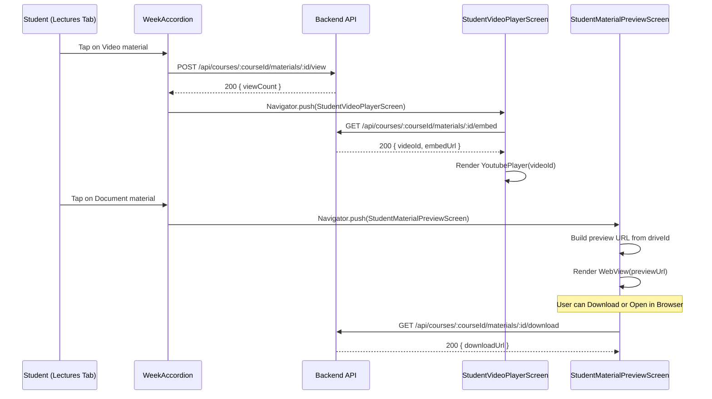
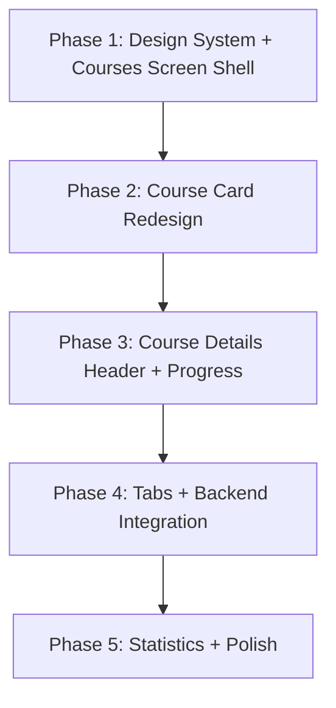

# Student Courses & Course Details UI Redesign — Spec-Kit Development Plan

> **Project**: EduVerse Flutter Mobile App  
> **Scope**: Redesign `CoursesScreen` and `CourseDetailsScreen` for the Student role  
> **Reference**: [Student_Courses_UI_Documentation.md](file:///D:/Graduation/EduVerse/edu_verse/Student_Courses_UI_Documentation.md)  
> **Methodology**: Each phase becomes a separate Spec-Kit specification (`/speckit.specify`)

---

## Executive Summary

This plan redesigns the Student Courses and Course Details screens to match the pixel-perfect UI specification documented in `Student_Courses_UI_Documentation.md`. The work is broken into **5 sequential phases**, each scoped to be a self-contained Spec-Kit specification. Each phase builds on the previous one and is designed to leave the app in a compilable, functional state.

### Backend Integration Strategy

| Data Source | Integration Type | Where Used |
|---|---|---|
| `CoursesBloc` + `EnrollmentService.getMyCourses()` | **Live backend** | Courses list, course cards, course details hero |
| `CourseEnrollmentModel` (enrollment, course, section, semester) | **Live backend** | All course metadata: name, code, credits, level, status, department, enrollment date |
| `CourseStructureViewer` + `CourseService.getCourseStructure()` | **Live backend** | Course Structure section in details screen |
| `AssignmentBloc` + `AssignmentService` | **Live backend** → embedded `AssignmentsScreen` | Assignments tab in course details |
| `LabsCubit` + `LabService` | **Live backend** → embedded `LabsScreen` | Labs tab in course details |
| `DiscussionBloc` + `DiscussionService` | **Live backend** → embedded `DiscussionScreen` | Discussion tab in course details |
| Statistics (GPA, grades, topic scores) | **Mockup data** | Statistics tab (no backend endpoint exists) |
| `CourseDetailBloc` + `CourseStructureModel` + `CourseMaterialModel` | **Live backend** | Lectures tab (week accordions, material cards, video/document viewing) |
| `MaterialViewerBloc` + `MaterialService` | **Live backend** | Video playback (`GET .../materials/:id/embed`) and document preview/download (`GET .../materials/:id/download`, `POST .../materials/:id/view`) |

---

## Phase 1: Design System Foundation & Courses Screen Shell

**Spec-Kit Feature Name**: `student-courses-screen-redesign`

### Objective
Establish the shared design system (colors, typography tokens) and rebuild the `CoursesScreen` shell — everything except the individual `CourseCard` widget (which is Phase 2).

### Files to Create/Modify

#### [NEW] `lib/common/utils/student_courses_theme.dart`
Extract all color constants, gradients, and typography tokens from the UI documentation into a centralized theme utility class. This prevents magic values scattered across widgets and ensures consistency.

**Contents**:
- `StudentCoursesColors` class with all Light Mode and Dark Mode color constants from the [Color Palette Reference](file:///D:/Graduation/EduVerse/edu_verse/Student_Courses_UI_Documentation.md) (§Color Palette Reference, lines 1795–1860):
  - Primary brand colors: `primaryBlue` (#155DFC), `primaryBlueLight` (#2B7FFF), `primaryBlueSoft` (#8EC5FF)
  - Status colors: `successGreen` (#10B981), `errorRed` (#EF4444), `warningAmber` (#F59E0B), etc.
  - Surface colors for both light and dark modes
  - Text colors for both modes
- `StudentCoursesGradients` class with reusable gradient definitions:
  - `primaryGradient`: `[Color(0xFF2B7FFF), Color(0xFF155DFC)]`
  - `darkHeaderGradient`: `[Color(0xFF1E293B), Color(0xFF0F172A)]`
  - `purpleGradient`: `[Color(0xFFAD5DFF), Color(0xFF9D3AFF)]`
- `StudentCoursesTypography` class with text style factories

#### [MODIFY] `lib/widgets/student/courses/courses_header.dart`
Rebuild the `CoursesHeader` widget to exactly match §1.4 spec:
- Gradient container: Light `[0xFF2B7FFF, 0xFF155DFC]`, Dark `[0xFF1E293B, 0xFF0F172A]`
- Border radius: `20`, padding: `EdgeInsets.all(20)`
- Box shadow: `Colors.black.withOpacity(0.1)`, blur `10`, offset `(0, 4)`
- Back button container with `borderRadius: 12`, icon `Icons.arrow_back_ios_rounded`, white, size `20`
- School icon `Icons.school_rounded`, white, size `24`
- Title: font size `22`, `FontWeight.bold`, letter spacing `0.5`, white
- Subtitle: font size `13`, `FontWeight.w400`, `Colors.white.withOpacity(0.9)`
- **Backend integration**: Receives `l10n.myCoursesHeader` / `l10n.allEnrolledCoursesThisSemester` (already done in existing code)

#### [MODIFY] `lib/widgets/student/courses/course_search_bar.dart`
Rebuild to match §1.5 spec:
- Container height `48`, background White/`0xFF16213E`, border radius `14`
- Border: Light `0xFFD1D5DC`, Dark `Colors.white10`, width `1`
- Box shadow: `Colors.black.withOpacity(0.08)`, blur `3`, offset `(0, 1)`
- TextField cursor color `0xFF155DFC`, text size `16`
- Prefix icon `Icons.search`, size `20`; suffix clear icon `Icons.clear`, size `20`
- **Backend integration**: `onSearchChanged` callback already wired to `_searchQuery` state in `CoursesScreen`

#### [MODIFY] `lib/widgets/student/courses/filter_button.dart`
Rebuild to match §1.6.1 spec:
- `Expanded` wrapping, height `48`, border radius `14`
- Default state: border `0xFFD1D5DC` / `Colors.white10`, width `1`
- Active state: border `0xFF155DFC`, width `1.5`
- Icon `Icons.tune`, size `20`, left margin `SizedBox(width: 12)`
- Label: font size `14`, weight `FontWeight.w500` (default) / `w600` (active)
- Bottom sheet: top border radius `20`, padding `EdgeInsets.all(20)`, title font size `18`
- Filter options: `all`, `active`, `completed`, `dropped` — with `Icons.check` trailing in `0xFF155DFC`
- **Backend integration**: `onFilterChanged` callback already wired to `_selectedFilter` in `CoursesScreen`

#### [MODIFY] `lib/widgets/student/courses/sort_button.dart`
Rebuild to match §1.6.2 spec (identical container structure to FilterButton):
- Icon `Icons.swap_vert`, size `20`, left padding `SizedBox(width: 6)`
- Sort options: `title_asc` ("Title A-Z"), `title_desc` ("Title Z-A"), `credits_desc` ("Most Credits"), `credits_asc` ("Least Credits"), `date` ("Enrollment Date")
- Active detection: `selectedSort != 'title_asc'`
- **Backend integration**: `onSortChanged` callback already wired to `_selectedSort` in `CoursesScreen`

#### [MODIFY] `lib/widgets/student/courses/course_filter_bar.dart`
Rebuild to match §1.7 spec:
- `SingleChildScrollView`(horizontal) → `Row` of `AnimatedContainer` chips
- Chip spacing: `SizedBox(width: 12)`, animation duration `200ms`
- Selected `'all'` chip: gradient `[0xFF2B7FFF, 0xFF155DFC]`, white text
- Selected non-`all` chip: bg `0xFFF0F4FF` / `0xFF2A3F5F`, border `0xFF155DFC`, text `0xFF155DFC`
- Unselected chip: bg White / `0xFF16213E`, border `0xFFD1D5DC` / `Colors.white10`
- Box shadow on selected: `Color(0xFF155DFC).withOpacity(0.3)`, blur `8`, offset `(0, 3)`
- **Backend integration**: `onFilterChanged` callback already wired

#### [MODIFY] `lib/widgets/student/courses/join_course_button.dart`
Rebuild to match §1.2 spec:
- `ScaleTransition` pulse: `AnimationController` 1500ms, scale `1.0→1.05`, `Curves.easeInOut`, reverse infinite
- Container gradient `[0xFF2B7FFF, 0xFF155DFC]`, border radius `28`
- Two box shadows: primary `0xFF155DFC@0.4`, blur `12`, offset `(0,4)`; secondary `black@0.1`, blur `8`, offset `(0,2)`
- `ElevatedButton.icon`: transparent bg, white fg, padding `h:28 v:14`, shape radius `28`
- Icon `Icons.add` size `20`, label `l10n.joinCourse` size `14` weight `w600`

#### [MODIFY] `lib/screens/student/courses_screen.dart`
Update the main screen to:
- Keep the exact body layout from §1.3: `CustomScrollView` → `SliverPadding(16)` → `SliverList`
- Maintain exact spacing values: `SizedBox(16)` between header & search, `SizedBox(12)` between search & filter/sort, `SizedBox(16)` between filter/sort & filter bar, `SizedBox(20)` between filter bar & content, bottom padding `SizedBox(32)` + `SizedBox(24)`
- Keep scaffold backgrounds: Light `0xFFFAFAFA`, Dark `0xFF1A1A2E`
- **Rebuild skeleton loader** to match §1.10: 3 cards, height `180`, border radius `24`, shimmer boxes
- **Rebuild empty state** to match §1.11: circle `80×80`, bg `0xFFF0F4FF`/`0xFF2A3F5F`, icon `school_outlined` size `40`
- **Rebuild no-filter-results state** to match §1.12: icon `filter_list_off` size `48`, "Clear Filters" TextButton
- **Rebuild error state** to match §1.13: circle `80×80`, icon `cloud_off_outlined` size `40`, "Try Again" `ElevatedButton.icon`
- **Rebuild snackbar notifications** to match §1.14: error snackbar (red `0xFFEF4444`), offline cache snackbar (amber `0xFFF59E0B`)
- **Backend integration**: All existing BLoC wiring (`CoursesBloc`, `StudentCoursesFetched`, `CoursesLoaded`, `CoursesError`, `CoursesLoading`) is preserved — this phase only changes visual styling, not data flow

### Data Flow (No Changes)
```
CoursesScreen → CoursesBloc.add(StudentCoursesFetched())
             → EnrollmentService.getMyCourses()
             → GET /api/enrollments/my-courses
             → List<CourseEnrollmentModel> → CoursesLoaded state
             → _applyFilters() (local search/filter/sort)
             → CoursesListView(enrollments: filteredList)
```

---

## Phase 2: Course Card Redesign

**Spec-Kit Feature Name**: `student-course-card-redesign`

### Objective
Rebuild the `CourseCard` widget and `CoursesListView` to match the UI specification, while preserving all backend data bindings.

### Files to Modify

#### [MODIFY] `lib/widgets/student/courses/courses_list_view.dart`
Rebuild to match §1.8:
- `ListView.separated`, `shrinkWrap: true`, `NeverScrollableScrollPhysics()`
- Separator: `SizedBox(height: 16)`
- **Staggered entry animation**: Per-card `AnimationController` duration `600ms`, stagger delay `120ms` per card
- Animation: `Tween<double>(0.0, 1.0)` with `Curves.easeOut`
- Empty list state: icon `Icons.school_outlined` size `64`, text `l10n.noData`
- **Backend integration**: Receives `List<CourseEnrollmentModel> enrollments` — no change to data contract

#### [MODIFY] `lib/widgets/student/courses/course_card.dart`
Complete rebuild to match §1.9. This is the most complex widget. All data comes from `CourseEnrollmentModel`:

**Entry Animations** (per card):
- `SlideTransition`: `Offset(0, 0.15)` → `Offset.zero`, `Curves.easeOutCubic`
- `FadeTransition`: `0.0` → `1.0`, `Curves.easeOut`

**Outer Container**:
- Light bg `Colors.white`, Dark `0xFF16213E`, border radius `24`
- Border: Light `0xFFD1D5DC`, Dark `white@0.1`, width `1`
- Shadow: `black@0.08`, blur `6`, offset `(0, 2)`, padding `EdgeInsets.all(24)`

**Course Header Row** — data from `CourseEnrollmentModel`:
- **Gradient Avatar** (`64×64`): Use existing `CourseUiUtils.gradientForCourseId()` with 12-palette system. Initials from `CourseUiUtils.initialsFromCourseName()`. Border radius `16`. **Data source**: `enrollment.course?.courseName` and `enrollment.course?.courseId`
- **Title Text**: `enrollment.course?.courseName ?? 'Untitled Course'` — size `16`, weight `w600`, line height `1.5`
- **Course Code Text**: `enrollment.course?.courseCode ?? ''` — size `14`, color `0xFF4A5565`/`white70`
- **Department Row**: icon `Icons.school_outlined` size `14`, text `enrollment.course?.departmentName ?? ''` — size `12`, line height `1.33`
- **Status Badge**: padding `h:10 v:5`, radius `20`, bg `statusColor@0.12`, text size `11` weight `w600`. **Data source**: `enrollment.status` → maps to:
  - `active`/`enrolled` → Blue `0xFF155DFC`
  - `completed` → Green `0xFF10B981`
  - `dropped` → Red `0xFFEF4444`
  - `waitlisted` → Amber `0xFFF59E0B`

**Info Section Row** (3 chips):
- Credits chip: icon `Icons.credit_card_outlined`, label `"${enrollment.course?.credits ?? 0} Credits"`
- Level chip: icon `Icons.layers_outlined`, label `enrollment.course?.level ?? 'N/A'`
- Role chip: icon `Icons.person_outline`, label `enrollment.role`
- Chip styling: bg `0xFFF5F7FA`/`white@0.05`, radius `10`, text size `11` weight `w500`

**Action Buttons Row**:
- "Continue" button: gradient `[0xFF2B7FFF, 0xFF155DFC]`, radius `14`, shadow, padding `v:12`
  - **Action**: `context.push('/course-details', extra: widget.enrollment)` — uses `CourseEnrollmentModel`
- "Materials" button: outline, border `0xFF155DFC`/`0xFF8EC5FF`, label font size `14` weight `w600`

### Data Mapping (Backend → UI)

| UI Element | Backend Field | Source |
|---|---|---|
| Avatar gradient | `enrollment.course?.courseId` | `CourseUiUtils.gradientForCourseId()` |
| Avatar initials | `enrollment.course?.courseName` | `CourseUiUtils.initialsFromCourseName()` |
| Title | `enrollment.course?.courseName` | `CourseEnrollmentModel.course` |
| Code | `enrollment.course?.courseCode` | `CourseEnrollmentModel.course` |
| Department | `enrollment.course?.departmentName` | `CourseEnrollmentModel.course` |
| Credits | `enrollment.course?.credits` | `CourseEnrollmentModel.course` |
| Level | `enrollment.course?.level` | `CourseEnrollmentModel.course` |
| Status | `enrollment.status` | `CourseEnrollmentModel.enrollmentStatus` |
| Role | `enrollment.role` | `CourseEnrollmentModel.role` |
| Navigation | entire `enrollment` object | Passed via `context.push` extra |

---

## Phase 3: Course Details Screen — Hero Header, Info Cards & Progress

**Spec-Kit Feature Name**: `student-course-details-header-redesign`

### Objective
Rebuild the top portion of `CourseDetailsScreen` — from the hero header down to the progress section — matching the UI documentation exactly while preserving all backend data bindings.

### Files to Modify

#### [MODIFY] `lib/widgets/student/course_details/course_details_header.dart`
Rebuild to match §2.3:
- Container: gradient `[0xFF2B7FFF, 0xFF155DFC]` / Dark `[0xFF1E293B, 0xFF0F172A]`
- Border radius `20`, shadow `black@0.1` blur `10` offset `(0,4)`, padding `EdgeInsets.all(20)`
- Layout: `Row` → back button (radius `12`, icon `arrow_back_ios_rounded` white size `20`) → `SizedBox(width: 4)` → `Expanded` → `Row` with icon `Icons.book_rounded` white size `24` + title
- Title: white, size `22`, bold, letter spacing `0.5`, maxLines `1`, ellipsis
- **Backend integration**: Title is `enrollment.course?.courseName` passed via safe accessor `_title`

#### [MODIFY] `lib/screens/student/course_details_screen.dart`
Rebuild to match §2.1–2.10:

**Scaffold & Background** (§2.1):
- Light bg `0xFFF5F7FA`, Dark `0xFF1A1A2E`
- `Stack` → `CustomScrollView` with scroll controller
- Header collapse animation: trigger at scroll offset `>100`, `AnimationController` duration `300ms`

**Hero Header Section** (§2.2):
- `SliverToBoxAdapter` → `Container` with gradient from `CourseUiUtils.gradientForCourseId()` (Light) or `[0xFF1E293B, 0xFF0F172A]` (Dark)
- Border radius `20`, padding `EdgeInsets.all(20)` inside `SafeArea(bottom: false)`
- **Backend data**: gradient derived from `enrollment.course?.courseId`

**Stats Cards Row** (§2.4):
- 3 `Expanded` cards with `SizedBox(width: 12)` separators, spacing above `SizedBox(height: 20)`
- Card: padding `v:12 h:8`, bg `white@0.15`, radius `12`, border `white@0.2` width `1`
- Icon size `22` white, value font size `16` bold white, label font size `11` `white@0.8`
- **Backend data**:
  - Credits: `enrollment.course?.credits ?? 0`
  - Level: `enrollment.course?.level ?? 'N/A'`
  - Status: derived from `enrollment.status`

**Content Card Container** (§2.5):
- `Transform.translate(Offset(0, -20))` overlapping the hero
- bg = scaffold bg, top radius `30`, padding `EdgeInsets.all(20)`

**Instructor Card** (§2.6):
- Container: bg White/`0xFF2D2D44`, radius `16`, shadow `black@0.05` blur `10` offset `(0,4)`, padding `16`
- Gradient circle avatar `56×56`, `BoxShape.circle`, icon `Icons.person` size `28` white
- Name text: size `16`, weight `w600`. **Backend data**: `enrollment.course?.departmentName ?? 'Unknown Instructor'`
- Subtitle: `'Course Instructor'`, size `13`
- Message `IconButton`: icon `Icons.message_outlined`, color `0xFF155DFC`, size `22`

**Course Code Badge** (§2.7):
- Visible when `courseCode.isNotEmpty`
- Padding `h:12 v:6`, bg `0xFFF0F4FF`/`white@0.08`, radius `8`
- Text color `0xFF155DFC`/`0xFF8EC5FF`, size `13`, weight `w600`
- **Backend data**: `enrollment.course?.courseCode`

**Course Description** (§2.8):
- Visible when `description != null && description.isNotEmpty`
- Color `0xFF4A5565`/`white70`, size `14`, line height `1.6`
- **Backend data**: `enrollment.course?.description`

**Action Buttons Row** (§2.9):
- `Row` with `Expanded(flex: 2)` + `SizedBox(width: 12)` + `Expanded`
- "Continue" button: height `50`, gradient, radius `14`, shadow, icon `Icons.play_circle_outline` size `20`
- "Chat" button: height `50`, bg White/`0xFF2D2D44`, border `0xFF155DFC` width `1.5`, icon `Icons.chat_bubble_outline`

**Progress Section** (§2.10):
- Container: bg White/`0xFF2D2D44`, radius `16`, shadow, padding `EdgeInsets.all(20)`
- Header: "Course Progress" text + status badge pill with gradient
- Progress bar: height `12`, track radius `10`, fill gradient from `_gradientColors`
- **Backend data for progress values**:
  - `completed` → `1.0`
  - `dropped` → `0.0`
  - `active`/`enrolled`/default → `0.5`
- Enrollment date text: `'Enrolled: ${enrollment.enrollmentDate.toString().substring(0, 10)}'`

**Course Structure Viewer** (§2.11 — existing, no changes needed):
- Already integrated via `CourseStructureViewer` widget using `CourseService.getCourseStructure()`
- Conditionally rendered when `enrollment != null`

---

## Phase 4: Course Details Tabs — Lectures (with Video & Material Screens), Labs, Assignments & Discussion

**Spec-Kit Feature Name**: `student-course-tabs-integration`

### Objective
Rebuild the `CourseTabs` widget, create new **full-screen student viewer screens** for videos and materials (modeled after the instructor's `InstructorVideoPlayerScreen` and `MaterialPreviewScreen`), update the Lectures tab module cards to show only "Video" and "Materials" action buttons with navigation to these new screens, and integrate the existing backend-connected standalone screens for other tabs.

### Critical Design Decision: Full-Screen Navigation (Not Bottom Sheets)

> [!IMPORTANT]
> **Current behavior**: The student Lectures tab opens materials in **bottom sheets** (`VideoPlayerWidget`, `DocumentPreviewWidget` via `_showMaterialBottomSheet()` in `course_tab_content.dart`).
>
> **New behavior**: Materials will open as **full-screen navigated screens**, matching the instructor's pattern:
> - **Video** → `StudentVideoPlayerScreen` (YouTube player, modeled after `InstructorVideoPlayerScreen`)
> - **Material file** → `StudentMaterialPreviewScreen` (WebView preview + download, modeled after `MaterialPreviewScreen`)

This follows the exact same routing pattern used in the instructor's `CourseManagementScreen._handleViewMaterial()`:
```dart
// Instructor pattern (to replicate for student):
if (material.type == 'video') {
  context.push('/instructor/courses/$courseId/video/$videoId');
} else {
  Navigator.push(context, MaterialPageRoute(
    builder: (_) => MaterialPreviewScreen(material: material),
  ));
}
```

### Existing Backend Integration in Lectures Tab (NOT Mockup)

> [!NOTE]
> The Lectures tab is **already fully backend-integrated** — it is NOT using mockup data.
> - `CourseTabContent` uses `CourseDetailBloc` → `CourseStructureModel` (from `GET /api/courses/:courseId/structure`)
> - Materials are loaded per week via `CourseDetailBloc.add(LoadMaterials(courseId, weekNumber))`
> - Each `WeekAccordion` displays `CourseMaterialModel` items from the backend
> - The `CourseModuleCard` (which uses the legacy `CourseModule` model) is a **separate, unused widget** in this context

### Files to Create/Modify

---

#### [NEW] `lib/screens/student/video/student_video_player_screen.dart`
Create a new full-screen YouTube video player for students, modeled after the instructor's `InstructorVideoPlayerScreen` at `lib/screens/instructor/video/instructor_video_player_screen.dart`.

**Behavior**:
- Receives `videoId` (YouTube ID), `courseName`, and `videoTitle` parameters
- Uses `youtube_player_flutter` package (`YoutubePlayerController` + `YoutubePlayer`)
- Auto-plays on mount, shows progress bar and captions
- Tracks video view via `MaterialViewerBloc` → `POST /api/courses/:courseId/materials/:id/view`
- Shows replay overlay when video ends (`PlayerState.ended`)

**UI Structure** (matching instructor pattern with student design tokens):
- `AppBar`: course name (title, `w700`, size `16`), video title (subtitle, `w500`, size `12`)
- Video player in rounded container (`borderRadius: 18`, border, box shadow)
- Replay overlay on ended: `Icons.replay_rounded` (size `48`, white) + "Tap to replay" text
- "Now playing from {courseName}" info card below player
- Uses student theme colors from `StudentCoursesColors` (Phase 1), NOT `CMColors`

**Backend Endpoints Used**:
- `GET /api/courses/:courseId/materials/:id/embed` → returns `{ videoId, embedUrl, iframeHtml }`
- `POST /api/courses/:courseId/materials/:id/view` → tracks view count

---

#### [NEW] `lib/screens/student/materials/student_material_preview_screen.dart`
Create a new full-screen material previewer for students, modeled after the instructor's `MaterialPreviewScreen` at `lib/screens/instructor/materials/material_preview_screen.dart`.

**Behavior**:
- Receives a `CourseMaterialModel` (or the existing `MaterialModel` from the instructor model — see compatibility note below)
- Detects file type from `materialType` field → routes to appropriate preview:
  - **Images** (jpg, png, gif, etc.) → `Image.network` with error fallback
  - **Documents** (pdf, ppt, doc, etc.) → `WebViewWidget` loading Google Drive preview URL
  - **Other** → Fallback card with "Download File" button
- Handles Google Drive URLs: extracts file ID from `/file/d/{ID}/...` format, builds preview URL (`/preview`) and download URL (`/uc?id={ID}&export=download`)
- "Open in Browser" and "Download" action buttons in `bottomNavigationBar`
- Uses `url_launcher` for external links

**UI Structure** (matching instructor pattern with student design tokens):
- `AppBar`: material title, background `StudentCoursesColors.surface`
- `_HeaderCard`: file icon badge (color-coded by type), title, type badge label, file size
  - PDF → red (`Icons.picture_as_pdf_rounded`)
  - PPT/Slides → orange (`Icons.slideshow_rounded`)
  - DOC → blue accent (`Icons.description_rounded`)
  - Image → teal (`Icons.image_rounded`)
  - Video → primary blue (`Icons.play_circle_rounded`)
  - Other → green (`Icons.insert_drive_file_rounded`)
- `_PreviewBody`: WebView or Image based on file type, with loading indicator
- Bottom bar: `OutlinedButton.icon("Open in Browser")` + `FilledButton.icon("Download")`
- Uses student theme colors from `StudentCoursesColors`, NOT `CMColors`

**Backend Endpoints Used**:
- `GET /api/courses/:courseId/materials/:id/download` → returns `{ material, file, downloadUrl }`
- `POST /api/courses/:courseId/materials/:id/view` → tracks view count

**Material Model Compatibility Note**:
The instructor uses `MaterialModel` (from `instructor_course_model.dart`), while the student side uses `CourseMaterialModel` (from `models/materials/course_material_model.dart`). The student screen will accept `CourseMaterialModel` and map the necessary fields:
- `CourseMaterialModel.materialType` → file type detection
- `CourseMaterialModel.title` → display title
- `CourseMaterialModel.externalUrl` / `CourseMaterialModel.drivePreviewUrl` → preview URL
- `CourseMaterialModel.file?.webViewLink` / `CourseMaterialModel.file?.driveId` → Google Drive IDs for preview/download
- `CourseMaterialModel.youtubeVideoId` → YouTube video ID (for video type redirect)

---

#### [MODIFY] `lib/widgets/student/course_details/course_tabs.dart`
Rebuild tab UI to match §2.12:
- Section title: "Course Content", size `18`, bold
- Tab buttons: `SingleChildScrollView`(horizontal) → `Row`, spacing `right: 10`
- 5 tabs: Lectures (`video_library_outlined`), Labs (`science_outlined`), Assignments (`assignment_outlined`), Statistics (`analytics_outlined`), Discussion (`forum_outlined`)
- Selected tab: gradient `[0xFF2B7FFF, 0xFF155DFC]`, radius `12`, shadow, padding `h:16 v:12`, icon white size `20`, label visible white size `14` weight `w600`
- Unselected tab: bg White/`0xFF2D2D44`, border `0xFFE5E7EB`/`white10`, icon only (no label)
- Animation: `AnimatedContainer` `250ms` `Curves.easeInOut`
- Tab content animation: Fade + Slide, `300ms`, `Curves.easeOut`, resets on tab change
- **Add `courseId` parameter** to pass resolved course ID for Labs/Assignments/Discussion tabs
- **Add `enrollment` parameter** to pass the `CourseEnrollmentModel` for context

#### [MODIFY] `lib/widgets/student/course_details/course_tab_content.dart`
Update the Lectures tab to use **full-screen navigation** instead of bottom sheets:

**Change `_openMaterial()` method**:
```dart
// BEFORE (bottom sheet):
Future<void> _openMaterial(CourseMaterialModel material) async {
  final type = material.materialType.toLowerCase();
  if (type == 'video' || type == 'lecture') {
    await _showMaterialBottomSheet(material, (courseId) => VideoPlayerWidget(...));
  } else {
    await _showMaterialBottomSheet(material, (courseId) => DocumentPreviewWidget(...));
  }
}

// AFTER (full-screen navigation):
Future<void> _openMaterial(CourseMaterialModel material) async {
  final type = material.materialType.toLowerCase();
  if (type == 'video' || type == 'lecture') {
    final videoId = material.youtubeVideoId;
    if (videoId == null || videoId.isEmpty) { /* show error snackbar */ return; }
    Navigator.push(context, MaterialPageRoute(
      builder: (_) => StudentVideoPlayerScreen(
        videoId: videoId,
        courseName: widget.course.title,
        videoTitle: material.title,
      ),
    ));
  } else {
    Navigator.push(context, MaterialPageRoute(
      builder: (_) => StudentMaterialPreviewScreen(material: material),
    ));
  }
}
```

- **Remove** `_showMaterialBottomSheet()` method entirely (no longer needed)
- **Keep** all existing backend integration (`CourseDetailBloc`, `LoadMaterials`, `WeekAccordion`, etc.) — this is live data, not mockup
- **Keep** `_openExternalMaterial()` as fallback for materials without preview URLs

#### [MODIFY] `lib/widgets/student/course_details/course_module_card.dart`
Update the expanded body content type badges:

**BEFORE** (3 badges: Video, PDF, Slides):
```dart
Row(children: [
  _buildContentBadge('Video', Icons.play_circle_outline),
  if (module.contents.any((c) => c.type == 'pdf'))
    _buildContentBadge('PDF', Icons.description_outlined),
  if (module.contents.any((c) => c.type == 'slides'))
    _buildContentBadge('Slides', Icons.slideshow),
]);
```

**AFTER** (2 tappable buttons: Video, Materials):
```dart
Row(children: [
  _buildTappableContentBadge(
    'Video',
    Icons.play_circle_outline,
    onTap: () => _navigateToVideo(module),  // → StudentVideoPlayerScreen
  ),
  _buildTappableContentBadge(
    'Materials',
    Icons.folder_outlined,
    onTap: () => _navigateToMaterials(module),  // → StudentMaterialPreviewScreen
  ),
]);
```

**New navigation methods**:
- `_navigateToVideo(module)`: Extracts `youtubeVideoId` from the module's associated `CourseMaterialModel` → navigates to `StudentVideoPlayerScreen`
- `_navigateToMaterials(module)`: Navigates to `StudentMaterialPreviewScreen` with the associated non-video material
- Both methods require `courseId` and `CourseMaterialModel` to be passed down (add these as widget parameters)

**Updated `_buildTappableContentBadge`**:
- Wraps the existing badge design in a `GestureDetector` / `InkWell`
- Badge styling: `0xFFF0F4FF` bg, `0xFF155DFC` text/icon, radius `10`, padding `h:12 v:6`
- Hover/tap feedback via `InkWell` ripple

#### [MODIFY] `lib/widgets/student/course_details/labs_tab_content.dart`
**Replace the mockup data** with an embedded version of the existing `LabsScreen` backend integration:
- Wrap the existing `LabsScreen` content (from `lib/screens/student/labs_screen.dart`) in a `SizedBox` with appropriate height
- The `LabsCubit` is already provided in the widget tree — use `BlocProvider.value` if needed
- Pass `courseId` to filter labs for the current course
- The `LabsScreen` uses `LabsCubit.loadEnrolledCourses()` → `LabService` for backend data
- Alternatively, create a lightweight embedded version that reuses `LabsCubit` and `LabCard` widgets from `lib/widgets/student/labs/lab_card.dart`

#### [MODIFY] `lib/widgets/student/course_details/assignments_tab_content.dart`
**Replace the mockup data** with an embedded version of the existing `AssignmentsScreen` backend integration:
- The `AssignmentBloc` is already provided in the widget tree
- Embed the `AssignmentsScreen` list content filtered for the current course
- Use `BlocProvider.value` to share the existing `AssignmentBloc`
- The `AssignmentBloc` uses `AssignmentService.getAssignments()` for backend data
- Reuse `AssignmentCard` from `lib/widgets/student/assignments/assignment_card.dart`

#### [MODIFY] `lib/widgets/student/course_details/discussion_tab_content.dart`
**Already integrated** — the existing `DiscussionTabContent` correctly:
- Validates `courseId` and shows error message if invalid
- Embeds `DiscussionScreen` with `courseId`, `accentColor: Color(0xFF3B82F6)`, `title: 'Course Discussions'`, `embedMode: true`
- Container height `680`
- **No functional changes needed** — only visual styling adjustments to match the documentation

### Material Interaction Flow (New)



### Tab-to-Backend-Screen Mapping

| Tab Index | Tab Label | Content Widget | Data Source | Integration Type |
|---|---|---|---|---|
| 0 | Lectures | `CourseTabContent` → `WeekAccordion` → `StudentVideoPlayerScreen` / `StudentMaterialPreviewScreen` | `CourseDetailBloc` → `CourseStructureModel` → `GET /api/courses/:courseId/structure` + `GET .../materials` | **Live backend** (full-screen nav) |
| 1 | Labs | `LabsTabContent` (redesigned) | `LabsCubit` → `LabService` → `GET /api/labs` | **Live backend** (embedded) |
| 2 | Assignments | `AssignmentsTabContent` (redesigned) | `AssignmentBloc` → `AssignmentService` → `GET /api/assignments` | **Live backend** (embedded) |
| 3 | Statistics | `StatisticsTabContent` | Hardcoded mockup | Static mockup data |
| 4 | Discussion | `DiscussionTabContent` | `DiscussionBloc` → `DiscussionService` → WebSocket | **Live backend** (embedded) |

---

## Phase 5: Statistics Tab (Mockup) & Final Polish

**Spec-Kit Feature Name**: `student-course-statistics-polish`

### Objective
Rebuild the Statistics tab with mockup data matching §2.16, finalize all animations across both screens, and perform a code cleanup audit.

### Files to Modify

#### [MODIFY] `lib/widgets/student/course_details/statistics_tab_content.dart`
Rebuild to match §2.16 with **mockup data** (no backend endpoint exists for student grades):

**Staggered Entry Animations**:
- GPA Card: `600ms`, `0ms` delay — Fade + Scale (`0.9→1.0`)
- Average Grade Card: `700ms`, `100ms` delay — Fade + Scale
- Scores by Topic: `800ms`, `200ms` delay — Fade + Slide (`y: 0.1→0`)
- Grade Breakdown: `900ms`, `300ms` delay — Fade + Slide

**GPA Card** (mockup data):
- Gradient `[0xFF2B7FFF, 0xFF155DFC]`, radius `16`, shadow `0xFF155DFC@0.3` blur `12` offset `(0,4)`
- Icon container `48×48`, bg `white@0.2`, radius `14`, icon `Icons.trending_up` size `24`
- Label `'Current GPA'`, color `0xFFB3D9FF`, size `14`, family `'Arimo'`
- Value `'3.8'`, white, size `32`, weight `w700`

**Average Grade Card** (mockup data):
- Gradient `[0xFFAD5DFF, 0xFF9D3AFF]`, icon `Icons.bar_chart`
- Label `'Average Grade'`, color `0xFFE5C9FF`
- Value `'87.6%'`

**Scores by Topic Card** (mockup data):
- Container: bg White/`0xFF2D2D44`, border, radius `16`, padding `20`
- Header: icon `Icons.assessment_outlined` `0xFF155DFC`, title `'Scores by Topic'`
- 5 topics: AI Foundations (92/100), Machine Learning (85/100), Neural Networks (88/100), Deep Learning (78/100), NLP Basics (95/100)
- Score bars: height `8`, gradient fill, radius `100`

**Grade Breakdown Card** (mockup data):
- Same container styling as Topics card
- Title: `'Grade Breakdown'`, size `18`, weight `w600`
- Items: Assignments (40%) → 89%, Labs (30%) → 92%, Quizzes (20%) → 85%, Participation (10%) → 95%
- Dividers between items (not after last)

> [!IMPORTANT]
> All statistics data is **hardcoded mockup** because there is no backend endpoint for student grade analytics. When a grades API is implemented in the future, this tab can be wired to live data with minimal UI changes.

#### [MODIFY] All widget files from Phases 1–4 — Animation Audit
Verify all animations match the [Animation Reference](file:///D:/Graduation/EduVerse/edu_verse/Student_Courses_UI_Documentation.md) table (§Animation Reference, lines 1907–1921):
- FAB pulse: Scale `1.0↔1.05`, `1500ms`, `easeInOut`, infinite reverse
- Course card entry: Slide + Fade, `600ms`, `easeOutCubic`/`easeOut`, staggered `120ms`
- Filter chip: `AnimatedContainer` `200ms`
- Tab button: `AnimatedContainer` `250ms`, `easeInOut`
- Tab content: Fade + Slide, `300ms`, `easeOut`, resets on tab change
- Module expand: 4-phase sequential, `800ms` total
- Module arrow: `AnimatedRotation` `300ms`, `0→180°`
- Header collapse: `AnimationController` `300ms`
- Assignment/Lab card: Scale + Fade + Slide, `600ms`/`400ms`, `easeOut`
- Statistics cards: Fade + Scale/Slide, `600–900ms`, `100ms` stagger

#### Cleanup Audit
- Remove any remaining references to the legacy `CourseModel` class in course details widgets that should use `CourseEnrollmentModel`
- Verify all `CourseUiUtils` utilities are used consistently
- Ensure no hardcoded strings that should use `AppLocalizations` (i18n)
- Verify dark mode rendering for all new/modified widgets
- Test offline cache behavior (cached data Snackbar + skeleton → live data flow)

---

## Phase Dependency Chain



Each phase is independently compilable and testable. After each phase, the app should build successfully and the redesigned portions should be functional.

---

## Verification Plan

### After Each Phase
1. `flutter analyze` — zero new warnings/errors
2. `flutter build apk --debug` — successful build
3. Visual comparison against [Student_Courses_UI_Documentation.md](file:///D:/Graduation/EduVerse/edu_verse/Student_Courses_UI_Documentation.md)
4. Dark mode toggle test (ThemeBloc)
5. Backend data flow test (login → courses load → navigate to details)

### Phase-Specific Tests
| Phase | Test |
|---|---|
| 1 | Courses screen loads with live data from backend, filter/sort/search all functional |
| 2 | Course cards display with correct enrollment data, navigation to details works |
| 3 | Course details hero shows correct course metadata, progress bar reflects status |
| 4 | Labs/Assignments/Discussion tabs load live backend data; Lectures tab: tap Video → `StudentVideoPlayerScreen` plays YouTube; tap Material → `StudentMaterialPreviewScreen` shows preview + download; module cards show only "Video" and "Materials" badges |
| 5 | Statistics tab renders all 4 cards with mockup data; all animations match spec timing |

---

## File Manifest

| Phase | File | Action | Data Source |
|---|---|---|---|
| 1 | `lib/common/utils/student_courses_theme.dart` | **NEW** | n/a |
| 1 | `lib/widgets/student/courses/courses_header.dart` | MODIFY | Backend (l10n) |
| 1 | `lib/widgets/student/courses/course_search_bar.dart` | MODIFY | Backend (callback) |
| 1 | `lib/widgets/student/courses/filter_button.dart` | MODIFY | Backend (callback) |
| 1 | `lib/widgets/student/courses/sort_button.dart` | MODIFY | Backend (callback) |
| 1 | `lib/widgets/student/courses/course_filter_bar.dart` | MODIFY | Backend (callback) |
| 1 | `lib/widgets/student/courses/join_course_button.dart` | MODIFY | Backend (l10n) |
| 1 | `lib/screens/student/courses_screen.dart` | MODIFY | Backend (CoursesBloc) |
| 2 | `lib/widgets/student/courses/courses_list_view.dart` | MODIFY | Backend (enrollments) |
| 2 | `lib/widgets/student/courses/course_card.dart` | MODIFY | Backend (enrollment) |
| 3 | `lib/widgets/student/course_details/course_details_header.dart` | MODIFY | Backend (enrollment) |
| 3 | `lib/screens/student/course_details_screen.dart` | MODIFY | Backend (enrollment) |
| 4 | `lib/screens/student/video/student_video_player_screen.dart` | **NEW** | **Backend** (`GET .../materials/:id/embed`, `POST .../materials/:id/view`) |
| 4 | `lib/screens/student/materials/student_material_preview_screen.dart` | **NEW** | **Backend** (`GET .../materials/:id/download`, `POST .../materials/:id/view`) |
| 4 | `lib/widgets/student/course_details/course_tabs.dart` | MODIFY | Backend (courseId) |
| 4 | `lib/widgets/student/course_details/course_tab_content.dart` | MODIFY | **Backend** (navigation change: bottom sheets → full-screen screens) |
| 4 | `lib/widgets/student/course_details/course_module_card.dart` | MODIFY | **Backend** (badges: Video/PDF/Slides → Video/Materials with navigation) |
| 4 | `lib/widgets/student/course_details/labs_tab_content.dart` | MODIFY | **Backend (LabsCubit)** |
| 4 | `lib/widgets/student/course_details/assignments_tab_content.dart` | MODIFY | **Backend (AssignmentBloc)** |
| 4 | `lib/widgets/student/course_details/discussion_tab_content.dart` | MODIFY (minor) | **Backend (DiscussionBloc)** |
| 5 | `lib/widgets/student/course_details/statistics_tab_content.dart` | MODIFY | **Mockup** |
