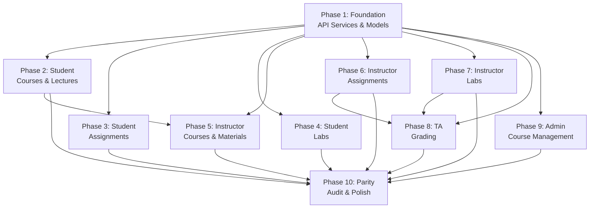

# 📋 EduVerse Mobile — Courses / Assignments / Labs Backend Integration Plan

> **Purpose**: Phased development plan for full backend integration of the Courses, Assignments, and Labs feature in the EduVerse Flutter mobile app.  
> **Reference Source**: Website frontend (`Courses_Assignments_Labs_Frontend_Documentation.md`) — the mobile app must achieve **full feature parity** with the website.  
> **Backend Reference**: `COURSES_ASSIGNMENTS_LABS_BACKEND_API_DOCS.md` — the single source of truth for all API contracts.  
> **Methodology**: Each phase = one `/speckit.specify` invocation.  
> **Date**: April 2026

---

## Executive Summary

The Flutter mobile app currently has **static/mock UI** for most Courses, Assignments, and Labs screens. Some API services exist (`CourseService`, `EnrollmentService`, `MaterialService`) but many are incomplete or unused. The website frontend is fully integrated with the backend across **5 roles** (Student, Instructor, TA, Admin, IT Admin). This plan replaces all static data with live backend data, adds missing screens to match the website, and removes screens not present on the website.

### Roles & Feature Ownership

| Role | Courses | Assignments | Labs | Materials/Lectures |
|---|:---:|:---:|:---:|:---:|
| **Student** | View enrolled | Submit, view grades | Submit, view grades | View (published), video player |
| **Instructor** | View teaching | CRUD, grade | CRUD, grade, attendance | Upload, manage, bundles |
| **TA** | View assigned | Grade only | Grade only | View (all) |
| **Admin (Dept Head)** | CRUD, staff assign | ❌ | ❌ | ❌ |
| **IT Admin** | ❌ | ❌ | ❌ | ❌ |

### Current State — What Exists in Flutter

| Layer | Files | Status |
|---|---|---|
| **API Services** | `CourseService`, `EnrollmentService`, `MaterialService` | ✅ Partially built |
| **API Services** | `AssignmentService`, `LabService`, `SectionService`, `ScheduleService` | ❌ Missing |
| **Models** | `CourseModel`, `CourseStructureModel`, `EnrollmentModel`, `CourseMaterialModel` | ✅ Exist |
| **Models** | `AssignmentModel` (2 copies), `LabModel` | ⚠️ Exist but may need parity updates |
| **Student Screens** | `courses_screen`, `assignments_screen`, `labs_screen`, `course_details_screen` | ⚠️ Mix of static/partial integration |
| **Instructor Screens** | `instructor_courses_screen`, `create_assignment_screen`, `grading_center_screen`, `upload_materials_screen` | ⚠️ Mostly static |
| **TA Screens** | `ta_courses_list_screen`, `ta_course_detail_screen`, `ta_labs_list_screen`, `ta_lab_detail_screen` | ⚠️ Mostly static |
| **Admin Screens** | `admin_course_management_screen`, `admin_add_course_screen` | ⚠️ Mostly static |

---

## Phase Overview

| # | Phase | Spec-Kit Short Name | Roles Affected | Core Deliverables |
|---|---|---|---|---|
| 1 | [Foundation: API Services & Domain Models](#phase-1) | `course-api-foundation` | All | Assignment/Lab/Section/Schedule services, unified domain models |
| 2 | [Student — Courses & Lecture Viewer](#phase-2) | `student-course-viewer` | Student | Enrolled courses list, CourseView video player, materials sidebar |
| 3 | [Student — Assignments](#phase-3) | `student-assignments` | Student | Assignment list, detail, submission (text/link/file), my submission view |
| 4 | [Student — Labs](#phase-4) | `student-labs` | Student | Lab list, detail, instructions, submission, my submission view |
| 5 | [Instructor — Courses & Materials Management](#phase-5) | `instructor-courses-materials` | Instructor | Teaching courses, upload materials (video/doc/bundle), course structure, materials library |
| 6 | [Instructor — Assignments CRUD & Grading](#phase-6) | `instructor-assignments` | Instructor | Create/edit/delete assignments, status transitions, submission list, grading panel |
| 7 | [Instructor — Labs CRUD & Grading](#phase-7) | `instructor-labs` | Instructor | Create/edit/delete labs, instructions, submissions, grading, attendance |
| 8 | [TA — Grading Integration](#phase-8) | `ta-grading-integration` | TA | Assignment grading, lab grading, read-only views |
| 9 | [Admin — Course Management](#phase-9) | `admin-course-management` | Admin (Dept Head) | 3-step course wizard, section/schedule, staff assignment |
| 10 | [Parity Audit & Polish](#phase-10) | `parity-audit-polish` | All | Remove orphan screens, final parity check with website, bug fixes |

---

<a id="phase-1"></a>
## Phase 1: Foundation — API Services & Domain Models

### Objective
Build the foundational service layer and domain models that all subsequent phases depend on. This phase produces **no visible UI changes** — it only creates the plumbing.

### Scope

#### New API Services to Create

| Service | File | Endpoints Covered |
|---|---|---|
| `AssignmentService` | `lib/services/api/assignment_service.dart` | `GET /assignments`, `GET /assignments/{id}`, `POST /assignments`, `PATCH /assignments/{id}`, `DELETE /assignments/{id}`, `PATCH /assignments/{id}/status`, `GET /assignments/{id}/submissions`, `POST /assignments/{id}/submit`, `GET /assignments/{id}/submissions/my`, `PATCH /assignments/{aId}/submissions/{sId}/grade`, `POST /assignments/{id}/instructions/upload`, `POST /assignments/{id}/submissions/upload` |
| `LabService` | `lib/services/api/lab_service.dart` | `GET /labs`, `GET /labs/{id}`, `POST /labs`, `PUT /labs/{id}`, `DELETE /labs/{id}`, `PATCH /labs/{id}/status`, `GET /labs/{id}/instructions`, `POST /labs/{id}/instructions`, `POST /labs/{id}/instructions/upload`, `GET /labs/{id}/submissions`, `POST /labs/{id}/submit`, `GET /labs/{id}/submissions/my`, `PATCH /labs/{id}/submissions/{subId}/grade`, `GET /labs/{id}/attendance`, `POST /labs/{id}/attendance`, `POST /labs/{id}/submissions/upload`, `POST /labs/{id}/ta-materials/upload` |
| `SectionService` | `lib/services/api/section_service.dart` | `GET /sections/course/{courseId}`, `GET /sections/{id}`, `POST /sections`, `PATCH /sections/{id}`, `PATCH /sections/{id}/enrollment` |
| `ScheduleService` | `lib/services/api/schedule_service.dart` | `GET /schedules/section/{sectionId}`, `GET /schedules/{id}`, `POST /schedules/section/{sectionId}`, `DELETE /schedules/{id}` |
| `SemesterService` | `lib/services/api/semester_service.dart` | `GET /semesters` |

#### Domain Models to Create/Update

| Model | File | Key Fields |
|---|---|---|
| `AssignmentModel` | `lib/models/assignments/assignment_model.dart` | Align with backend response: `id`, `courseId`, `title`, `description`, `instructions`, `maxScore`, `weight`, `dueDate`, `availableFrom`, `lateSubmissionAllowed`, `latePenaltyPercent`, `submissionType`, `maxFileSizeMb`, `allowedFileTypes`, `status`, `createdBy`, `course` |
| `AssignmentSubmissionModel` | `lib/models/assignments/assignment_submission_model.dart` | `id`, `assignmentId`, `userId`, `user`, `submissionText`, `submissionLink`, `fileId`, `file`, `driveFile`, `submissionStatus`, `score`, `feedback`, `gradedBy`, `gradedAt`, `isLate`, `attemptNumber`, `submittedAt` |
| `LabModel` | `lib/models/labs/lab_model.dart` | Align with backend: `id`, `courseId`, `title`, `description`, `labNumber`, `dueDate`, `availableFrom`, `maxScore`, `weight`, `status`, `createdBy`, `course`, `instructions` |
| `LabSubmissionModel` | `lib/models/labs/lab_submission_model.dart` | `id`, `labId`, `userId`, `user`, `submissionText`, `fileId`, `file`, `driveFile`, `submissionStatus` → `status`, `score`, `feedback`, `gradedBy`, `gradedAt`, `isLate`, `submittedAt` |
| `LabInstructionModel` | `lib/models/labs/lab_instruction_model.dart` | `id`, `labId`, `fileId`, `file`, `instructionText`, `orderIndex`, `createdAt` |
| `LabAttendanceModel` | `lib/models/labs/lab_attendance_model.dart` | `id`, `labId`, `userId`, `attendanceStatus`, `checkInTime`, `notes`, `markedBy`, `createdAt` |
| `SectionModel` | Update `lib/models/core/section_model.dart` | Ensure: `id`, `courseId`, `semesterId`, `sectionNumber`, `maxCapacity`, `currentEnrollment`, `location`, `status`, `course`, `semester`, `schedules` |
| `ScheduleModel` | `lib/models/core/schedule_model.dart` | `id`, `sectionId`, `dayOfWeek`, `startTime`, `endTime`, `room`, `building`, `scheduleType` |
| `DriveFileModel` | `lib/models/core/drive_file_model.dart` | `driveId`, `driveFileId`, `fileName`, `webViewLink`, `iframeUrl`/`webContentLink`, `downloadUrl` |
| `PaginatedResponse<T>` | `lib/models/core/paginated_response.dart` | `data`, `meta` (`total`, `page`, `limit`, `totalPages`), `hasNextPage`, `hasPreviousPage` |

#### Enums to Create

| Enum | Values |
|---|---|
| `CourseLevel` | `FRESHMAN`, `SOPHOMORE`, `JUNIOR`, `SENIOR`, `GRADUATE` |
| `CourseStatus` | `ACTIVE`, `INACTIVE`, `ARCHIVED` |
| `SectionStatus` | `OPEN`, `CLOSED`, `FULL`, `CANCELLED` |
| `ScheduleType` | `LECTURE`, `LAB`, `TUTORIAL`, `EXAM` |
| `DayOfWeek` | `MONDAY` … `SUNDAY` |
| `AssignmentStatus` | `draft`, `published`, `closed`, `archived` |
| `SubmissionType` | `file`, `text`, `link`, `multiple` |
| `SubmissionStatus` | `submitted`, `graded`, `returned`, `resubmit` |
| `LabStatus` | `draft`, `published`, `closed`, `archived` |
| `LabAttendanceStatus` | `present`, `absent`, `excused`, `late` |
| `MaterialType` | `lecture`, `slide`, `video`, `reading`, `link`, `document`, `other` |

### Dependencies
- Existing `CoreApiClient` (Dio-based HTTP wrapper with auth interceptor)
- Existing `StorageService` (token management)

### Acceptance Criteria
- [ ] All 5 new services compile and are registered in the app's DI/service locator
- [ ] All models correctly parse sample backend JSON responses
- [ ] `PaginatedResponse` helper works with generic types
- [ ] Enums have `fromString()` and `toJson()` utilities
- [ ] Unit tests for model deserialization with edge cases (`null` fields, `isLate` as `int` vs `bool`)

---

<a id="phase-2"></a>
## Phase 2: Student — Courses & Lecture Viewer

### Objective
Replace all static course data on the student dashboard with live API data. Build the full CourseView lecture player matching the website's `CourseViewPage`.

### Scope

#### Screens to Integrate

| Screen | Current State | Target State |
|---|---|---|
| `courses_screen.dart` (enrolled courses list) | ⚠️ Partially integrated | ✅ Full integration with `EnrollmentService.getMyCourses()` |
| `course_details_screen.dart` (course detail / lecture viewer) | ⚠️ Partial, no video player | ✅ Full CourseView with video player, materials sidebar, week accordion |

#### Website Feature Parity — CourseView Player

The website's student `CourseViewPage` (1070+ lines) has these sections that the mobile app must replicate:

| Section | Website Implementation | Mobile Equivalent |
|---|---|---|
| **Header** | Course name, meta badges (code, credits, level, section, semester, status), stats row | AppBar + info chips |
| **Preview Viewer** | Large iframe area for video/document preview | `WebView` widget or `youtube_player_flutter` |
| **Bundle Viewer** | Video + companion documents grouped by title convention | Bundle detection + tabbed doc viewer |
| **Course Content Sidebar** | Week-based accordion or flat material list | Bottom sheet or side drawer |
| **Tabs (below preview)** | Overview, Notes, Announcements, Reviews | TabBar below player |
| **Progress Card** | `X / Y materials` with progress bar | Card widget |

#### API Endpoints Used

| Action | Endpoint |
|---|---|
| Load enrolled courses | `GET /enrollments/my-courses` |
| Load course structure | `GET /courses/{courseId}/structure` |
| Load all materials | `GET /courses/{courseId}/materials?page=1&limit=200` |
| Track material view | `POST /courses/{courseId}/materials/{materialId}/view` |
| Get video embed | `GET /courses/{courseId}/materials/{materialId}/embed` |
| Download material | `GET /courses/{courseId}/materials/{materialId}/download` |

#### Key Implementation Notes

- **Material Bundling**: Port the website's `groupMaterialsIntoBundles()` logic to Dart — groups materials by shared base title and `weekNumber`
- **Preview URL Resolution**: Port `getCourseMaterialPreviewUrl()` logic for Google Drive URLs
- **YouTube Player**: Use `youtube_player_flutter` package or `WebView` with embed URL
- **Published-only filter**: Students only see materials where `isPublished == 1`

#### Items to Remove (Not in Website)

- Any student course features that exist in the Flutter app but NOT in the website frontend documentation should be removed to maintain parity

### Dependencies
- Phase 1 (services & models)

### Acceptance Criteria
- [ ] Student sees their enrolled courses from backend (no mock data)
- [ ] Tapping a course opens the CourseView with working video player
- [ ] Materials sidebar shows week-based accordion when structure exists
- [ ] Bundle detection groups related materials correctly
- [ ] Material view tracking fires on tap
- [ ] Documents open in preview (WebView with Google Drive preview URL)

---

<a id="phase-3"></a>
## Phase 3: Student — Assignments

### Objective
Fully integrate the student assignment workflow: list → detail → submit → view grade. Must match the website's Student Assignment screens exactly.

### Scope

#### Screens to Integrate

| Screen | Current State | Target State |
|---|---|---|
| `assignments_screen.dart` | ⚠️ Has UI but likely static | ✅ Full integration |

#### Website Feature Parity

| Component | Website Feature | API |
|---|---|---|
| **AssignmentList** | Search bar, status filter (`All`, `Submitted`, `Pending`, `Overdue`), stats cards, assignment cards | `GET /assignments?courseId={id}` |
| **AssignmentView** | Title, metadata (due date, max score, type, status), instructions (Markdown), instruction files (iframe preview), my submission section | `GET /assignments/{id}`, `GET /assignments/{id}/my-submission` |
| **SubmissionForm** | Text textarea, link URL input, file upload, conditional rendering by `submissionType` | `POST /assignments/{id}/submit` (JSON or FormData) |
| **MySubmission** | Submission content display, score/maxScore, feedback, late badge, graded date | From `getMySubmission()` |
| **File submission upload** | File picker → FormData upload to Google Drive | `POST /assignments/{id}/submissions/upload` |

#### Key Implementation Notes

- `submissionType` determines which input to show: `text` → textarea, `link` → URL input, `file` → file picker, `any`/`multiple` → all options
- `isLate` from assignments API comes as `0`/`1` (number), not boolean — parse accordingly
- `allowedFileTypes` is a **JSON string** — parse with `jsonDecode()`
- Show instruction files with **Google Drive preview** (iframe via WebView) + Open + Download actions
- Stats cards: compute Total, Submitted, Pending, Overdue from the assignments list

### Dependencies
- Phase 1 (AssignmentService, models)

### Acceptance Criteria
- [ ] Assignments load from backend filtered by enrolled course
- [ ] Status filter and search work correctly
- [ ] Stats cards show accurate counts
- [ ] Text/link/file submission works
- [ ] Student can view their submission and grade
- [ ] Instruction file preview works via WebView

---

<a id="phase-4"></a>
## Phase 4: Student — Labs

### Objective
Fully integrate the student lab workflow: list → detail → instructions → submit → view grade.

### Scope

#### Screens to Integrate

| Screen | Current State | Target State |
|---|---|---|
| `labs_screen.dart` | ⚠️ Has UI but static | ✅ Full integration |

#### Website Feature Parity

| Component | Website Feature | API |
|---|---|---|
| **Course Selector** | Dropdown of enrolled courses | `GET /enrollments/my-courses` |
| **LabList** | Filtered by selected course, status badges | `GET /labs?courseId={id}` |
| **LabView** | Title, lab number, due date, max score, status | `GET /labs/{id}` |
| **Instructions Tab** | Ordered instruction text + file previews | `GET /labs/{id}/instructions` |
| **Submission Form** | Text area and/or file upload | `POST /labs/{id}/submit` or `POST /labs/{id}/submissions/upload` |
| **My Submission** | Existing submission, score, feedback display | `GET /labs/{id}/submissions/my` |

#### Key Implementation Notes

- Labs `isLate` comes as `boolean` (unlike assignments which use `0`/`1`)
- Lab submissions return an **array** (not single latest) — show all attempts
- Lab instructions are ordered by `orderIndex` — render in order
- File submission via `POST /labs/{id}/submissions/upload` (FormData)

### Dependencies
- Phase 1 (LabService, models)

### Acceptance Criteria
- [ ] Course selector shows enrolled courses from API
- [ ] Labs load for selected course
- [ ] Lab detail shows instructions (text + files)
- [ ] Student can submit text or file
- [ ] All submission attempts visible with scores/feedback

---

<a id="phase-5"></a>
## Phase 5: Instructor — Courses & Materials Management

### Objective
Integrate the instructor's course management and full materials upload system matching the website's `UploadMaterialsPage` and `CourseDetail` Lectures tab.

### Scope

#### Screens to Integrate

| Screen | Current State | Target State |
|---|---|---|
| `instructor_courses_screen.dart` (77KB) | ⚠️ Mostly static | ✅ Live data from `getTeachingCourses()` |
| `upload_materials_screen.dart` (43KB) | ⚠️ Mostly static | ✅ Full upload system |

#### Website Feature Parity — Materials Upload

| Feature | Website Component | API |
|---|---|---|
| **Course Selector** | Dropdown from `getTeachingCourses()` | `GET /enrollments/teaching` |
| **Upload Types** | Text/Link (metadata only), File (Google Drive), Video (YouTube), Bundle (video + docs) | `POST .../materials`, `POST .../materials/document`, `POST .../materials/video` |
| **Materials Library** | Week-grouped sections, bundle cards, single material cards | `GET /courses/{id}/materials` |
| **Material Actions** | Toggle visibility, edit, delete, download | `PATCH .../visibility`, `PUT .../materials/{id}`, `DELETE .../materials/{id}` |
| **Bundle Management** | Toggle all visibility, edit all titles, delete all | Multiple parallel API calls |
| **Course Structure** | Create/edit/delete/reorder structure items | `POST/PUT/DELETE/PATCH .../structure` |
| **YouTube Thumbnail** | `https://img.youtube.com/vi/{videoId}/mqdefault.jpg` | N/A (computed URL) |

#### Key Implementation Notes

- **Video upload** requires progress tracking — use `Dio.post` with `onSendProgress`
- **Bundle naming convention**: `"{Title} - Video"`, `"{Title} - Slides"` etc.
- **File validation**: Documents max 50MB, Images max 10MB (client-side)
- **YouTube OAuth**: If upload fails with auth error, show "Contact admin" message
- Port `groupMaterialsIntoBundles()` for the library view (reuse from Phase 2)

### Dependencies
- Phase 1 (services), Phase 2 (bundle logic can be shared)

### Acceptance Criteria
- [ ] Instructor sees their teaching courses from API
- [ ] All 4 upload types work (text, file, video, bundle)
- [ ] Video upload shows progress bar
- [ ] Materials library groups by week with bundles
- [ ] Toggle visibility, edit, delete all work
- [ ] Course structure CRUD works

---

<a id="phase-6"></a>
## Phase 6: Instructor — Assignments CRUD & Grading

### Objective
Full assignment management for instructors: create, edit, delete, change status, view submissions, and grade.

### Scope

#### Website Feature Parity

| Component | Website Feature | API |
|---|---|---|
| **Section Selector** | Dropdown from teaching courses | `GET /enrollments/teaching` |
| **AssignmentListPage** | Search, status filter, type filter, create button, assignment cards with actions | `GET /assignments?courseId={id}` |
| **AssignmentCreateEdit** | Form: title, description, instructions (Markdown), dueDate, maxScore, weight, submissionType, maxFileSize, allowedFileTypes, latePenalty, status | `POST /assignments`, `PATCH /assignments/{id}` |
| **Instruction File Upload** | File picker → upload to Google Drive | `POST /assignments/{id}/instructions/upload` |
| **Status Transitions** | `draft → published → closed → archived` (one-way) | `PATCH /assignments/{id}/status` |
| **SubmissionListView** | Search, status/late filters, sortable table, view/grade actions | `GET /assignments/{id}/submissions` |
| **GradingPanel** | Student info, submission content (text/link/file preview), score input (0-max, step 0.5), late penalty calc, feedback textarea | `PATCH /assignments/{aId}/submissions/{sId}/grade` |

#### Create/Edit Form Fields (from Website)

| Field | Type | Required | Default |
|---|---|---|---|
| `title` | text input | ✅ | `""` |
| `description` | textarea (3 rows) | ❌ | `""` |
| `instructions` | textarea (6 rows, Markdown) | ❌ | `""` |
| `dueDate` | datetime picker | ✅ | — |
| `maxScore` | number input | ✅ | `100` |
| `weight` | number input (%) | ❌ | `10` |
| `submissionType` | button group: text/file/link/any | ✅ | `file` |
| `maxFileSize` | number (MB) | ❌ | `10` |
| `allowedFileTypes` | comma-separated text | ❌ | `[]` |
| `latePenalty` | number (0-100) | ❌ | `0` |
| `status` | button group | ✅ | `draft` |

### Dependencies
- Phase 1 (AssignmentService)

### Acceptance Criteria
- [ ] Instructor can create assignments with all fields
- [ ] Edit mode pre-populates all fields
- [ ] Status transitions follow `draft → published → closed → archived`
- [ ] Instruction file upload works
- [ ] Submissions list with filters and sorting
- [ ] Grading panel with late penalty calculation
- [ ] Delete with confirmation

---

<a id="phase-7"></a>
## Phase 7: Instructor — Labs CRUD & Grading

### Objective
Full lab management for instructors: create, edit, delete, manage instructions, view submissions, grade, and manage attendance.

### Scope

#### Website Feature Parity

| Component | Website Feature | API |
|---|---|---|
| **Lab List Table** | Filters (search, status), lab cards/rows, actions | `GET /labs` |
| **LabCreate Modal** | courseId, title, description, availableFrom, dueDate, maxScore, weight, status | `POST /labs` |
| **LabEdit Modal** | Same fields, pre-populated | `PUT /labs/{id}` |
| **InstructionManager** | Add text instructions, upload instruction files | `POST /labs/{id}/instructions`, `POST /labs/{id}/instructions/upload` |
| **SubmissionList** | View all submissions per lab | `GET /labs/{id}/submissions` |
| **GradingModal** | Score + feedback + status change | `PATCH /labs/{id}/submissions/{subId}/grade` |
| **Attendance** | Mark attendance per student (present/absent/excused/late) | `GET /labs/{id}/attendance`, `POST /labs/{id}/attendance` |

#### Create Form Fields (from Website)

| Field | Type | Required | Default |
|---|---|---|---|
| `courseId` | select dropdown | ✅ | `""` |
| `title` | text input | ✅ | `""` |
| `description` | textarea (3 rows) | ❌ | `""` |
| `availableFrom` | datetime picker | ❌ | — |
| `dueDate` | datetime picker | ❌ | — |
| `maxScore` | number | ❌ | `100` |
| `weight` | number | ❌ | `10` |
| `status` | select (draft/published/closed) | ❌ | `draft` |

### Dependencies
- Phase 1 (LabService)

### Acceptance Criteria
- [ ] Instructor can CRUD labs with all fields
- [ ] Instructions management (text + file upload) works
- [ ] Submissions list shows all student submissions
- [ ] Grading works with score, feedback, and status
- [ ] Attendance marking works for all statuses
- [ ] Lab deletion with confirmation

---

<a id="phase-8"></a>
## Phase 8: TA — Grading Integration

### Objective
Integrate the TA dashboard's assignment and lab grading workflows. TAs have **read-only** access to assignments/labs and **grade-only** permission.

### Scope

#### Screens to Integrate

| Screen | Current State | Target State |
|---|---|---|
| `ta_courses_list_screen.dart` | ⚠️ Static | ✅ Live from `getTeachingCourses()` |
| `ta_course_detail_screen.dart` | ⚠️ Static sub-tabs | ✅ Live API data for all sub-tabs |
| `ta_labs_list_screen.dart` | ⚠️ Static | ✅ Live from `LabService.getAll()` |
| `ta_lab_detail_screen.dart` | ⚠️ Static | ✅ Live submissions + grading |

#### Website Feature Parity

| Component | Website Feature | TA Permissions |
|---|---|---|
| **AssignmentGradingPage** | Split-panel: submissions list (left) + grading form (right) | View submissions, grade only. No CRUD. |
| **LabsPage** | Table with labs, Eye button only (no Edit/Delete) | View submissions, grade only. No CRUD/Delete. |
| **CoursesPage sub-tabs** | Overview, Sections & Labs, Lectures, Materials, Assignments, Grading, Attendance, Students, Announcements | Read-only for most. TA creates nothing except grades. |

#### Key Permission Rules

- TA **cannot** create, edit, or delete assignments
- TA **cannot** delete labs (can create/update per backend, but website restricts this)
- TA **can** grade assignment and lab submissions
- TA sees **only** the `Eye` (View Submissions) button on labs — no Edit/Delete
- Component must verify `user.roles.includes('teaching_assistant')` on mount

### Dependencies
- Phase 1 (services), Phase 6 (reuse grading panel), Phase 7 (reuse grading modal)

### Acceptance Criteria
- [ ] TA sees assigned courses from API
- [ ] Assignment grading panel works (score + feedback)
- [ ] Lab grading modal works
- [ ] No CRUD buttons visible for assignments
- [ ] No Delete button visible for labs
- [ ] Course detail sub-tabs show live data (especially Materials, Attendance)

---

<a id="phase-9"></a>
## Phase 9: Admin — Course Management

### Objective
Full course lifecycle management for the Admin (Department Head): 3-step course wizard, section/schedule management, and staff assignment.

### Scope

#### Screens to Integrate

| Screen | Current State | Target State |
|---|---|---|
| `admin_course_management_screen.dart` | ⚠️ Static | ✅ Full CRUD with live data |
| `admin_add_course_screen.dart` | ⚠️ Static | ✅ 3-step wizard with API |

#### Website Feature Parity

| Component | Website Feature | API |
|---|---|---|
| **Course List** | Search, department filter, status filter, add button | `GET /courses` |
| **Sub-Tabs** | Courses, Staff, Schedule, Exams | Various |
| **Add Course Wizard — Step 1** | Course details: code, name, department, credits, level, status | `POST /courses` |
| **Add Course Wizard — Step 2** | Section & schedule: sectionNumber, maxCapacity, location, semesterId, day, time | `POST /sections`, `POST /schedules/section/{id}` |
| **Add Course Wizard — Step 3** | Staff assignment: instructor, TAs | `POST /enrollments/sections/{id}/instructors`, `POST /enrollments/sections/{id}/tas` |
| **Edit Course** | Same 3 steps, pre-populated | `PATCH /courses/{id}`, `PATCH /sections/{id}`, schedule re-create, staff sync |
| **Staff Assignment Modal** | Assign/unassign instructors and TAs | `GET/POST/DELETE /enrollments/sections/{id}/instructors`, `GET/POST/DELETE /enrollments/sections/{id}/tas` |
| **Delete Course** | Confirmation → soft delete | `DELETE /courses/{id}` |

#### Additional API Endpoints

| Action | Endpoint |
|---|---|
| Load semesters | `GET /semesters` |
| Load sections for course | `GET /sections/course/{courseId}` |
| Load schedules | `GET /schedules/section/{sectionId}` |
| Get section instructors | `GET /enrollments/sections/{id}/instructors` |
| Get section TAs | `GET /enrollments/sections/{id}/tas` |

> **Note**: Admin does NOT manage assignments or labs. The Admin focuses on course lifecycle, sections, schedules, and staff assignment.

### Dependencies
- Phase 1 (SectionService, ScheduleService, SemesterService)

### Acceptance Criteria
- [ ] Admin can list all courses with filters
- [ ] 3-step course creation wizard works end-to-end
- [ ] Section and schedule creation works
- [ ] Staff assignment (instructor + TAs) works
- [ ] Edit course updates all 3 steps
- [ ] Delete course with confirmation (soft delete)
- [ ] Course list refreshes after changes

---

<a id="phase-10"></a>
## Phase 10: Parity Audit & Polish

### Objective
Final pass to ensure the mobile app has **exact feature parity** with the website, remove any screens/features that exist only in the mobile app, and polish all integration points.

### Scope

#### Parity Audit Checklist

- [ ] **Student**: Compare every field, button, and data point in assignments/labs/courses with the website documentation
- [ ] **Instructor**: Verify all CRUD operations, grading panels, material upload types match website
- [ ] **TA**: Confirm read-only restrictions match website (no Edit/Delete buttons)
- [ ] **Admin**: Confirm 3-step wizard, staff assignment match website
- [ ] **IT Admin**: Confirm NO courses/assignments/labs features exist (IT Admin focuses on system admin)

#### Remove Non-Parity Features

> Any feature that exists in the mobile app but is **NOT** documented in the website frontend documentation (`Courses_Assignments_Labs_Frontend_Documentation.md`) must be removed.

#### Add Missing Parity Features

> Any feature documented in the website but **missing** from the mobile app must be added.

#### Polish Items

- [ ] Error handling: All API errors show user-friendly messages
- [ ] Loading states: Proper shimmer/skeleton loaders on all lists
- [ ] Empty states: Informative messages when lists are empty
- [ ] Pull-to-refresh on all list screens
- [ ] Pagination support for large lists (assignments, labs, materials)
- [ ] Offline indicator when network is unavailable
- [ ] File upload progress indicators
- [ ] Confirm dialogs before all delete operations
- [ ] Toast notifications for success/error actions (matching `sonner` pattern from web)

### Dependencies
- All previous phases (1–9)

### Acceptance Criteria
- [ ] Zero mock data remaining in any courses/assignments/labs screen
- [ ] Feature set exactly matches website frontend documentation
- [ ] All error states handled gracefully
- [ ] All delete operations have confirmation dialogs
- [ ] All list screens support pull-to-refresh
- [ ] File uploads show progress

---

## Dependency Graph



> **Parallelism**: After Phase 1, Phases 2–4 (Student) can be done in parallel. Phases 5–7 (Instructor) can be done in parallel after Phase 1 (but Phase 5 benefits from Phase 2's bundle logic). Phase 8 (TA) depends on 6+7 for reusable grading components. Phase 9 (Admin) only depends on Phase 1. Phase 10 is the final pass after everything.

---

## Spec-Kit Usage Guide

For each phase, run:

```
/speckit.specify <phase description>
```

### Example for Phase 1:

```
/speckit.specify Build the foundational API service layer and domain models for the Courses/Assignments/Labs backend integration. Create AssignmentService, LabService, SectionService, ScheduleService, and SemesterService. Create/update all domain models including AssignmentModel, AssignmentSubmissionModel, LabModel, LabSubmissionModel, LabInstructionModel, LabAttendanceModel, DriveFileModel, PaginatedResponse. Create all enums (CourseLevel, CourseStatus, SectionStatus, AssignmentStatus, SubmissionType, LabStatus, etc). No UI changes in this phase. Reference: COURSES_ASSIGNMENTS_LABS_BACKEND_API_DOCS.md
```

Then follow with `/speckit.plan`, `/speckit.tasks`, and `/speckit.implement` for each phase.

---

> **End of Plan**
