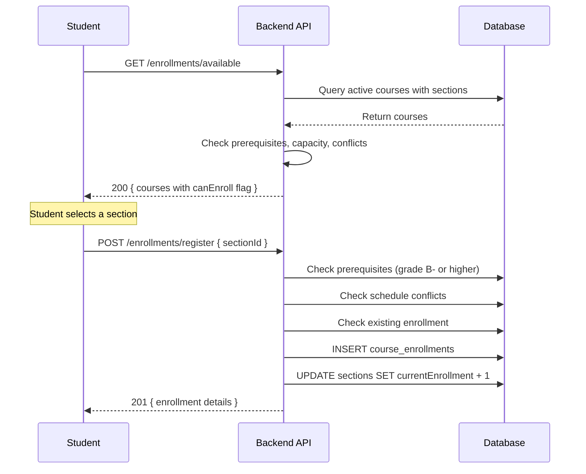
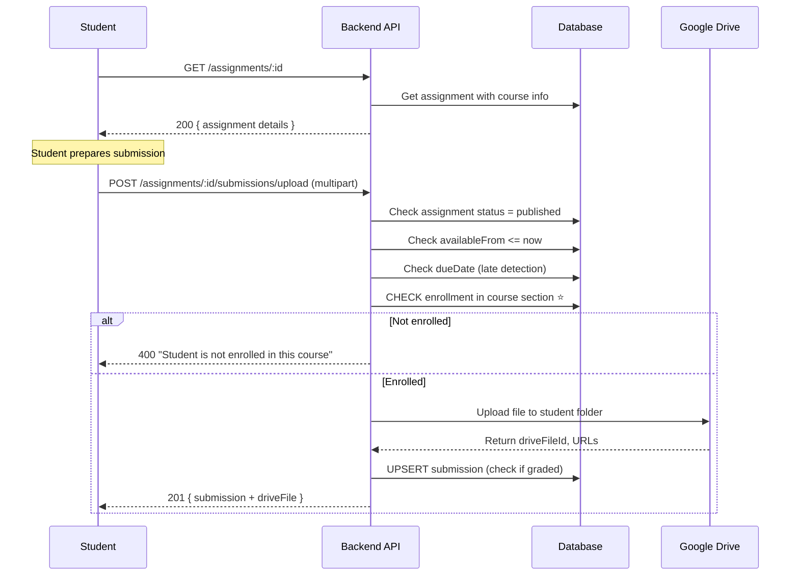
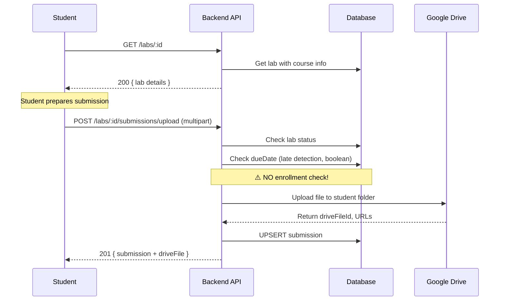
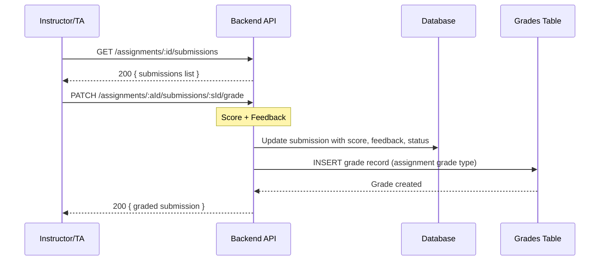
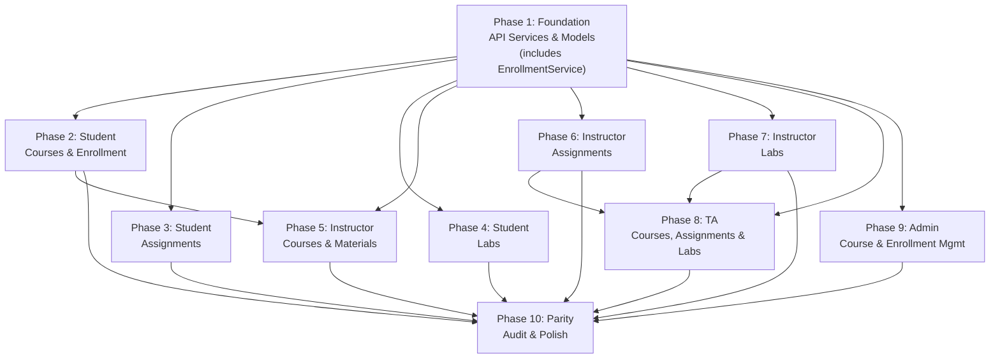

# 📋 EduVerse Mobile — Courses / Assignments / Labs Backend Integration Plan

> **Purpose**: Phased development plan for full backend integration of the Courses, Assignments, and Labs feature in the EduVerse Flutter mobile app.
> **Reference Source**: Website frontend (`Courses_Assignments_Labs_Frontend_Documentation.md`) — the mobile app must achieve **full feature parity** with the website.
> **Backend Reference**: `COURSES_ASSIGNMENTS_LABS_BACKEND_API_DOCS.md` — the single source of truth for all API contracts.
> **Methodology**: Each phase = one `/speckit.specify` invocation.
> **Date**: April 2026

---

## ⚠️ CRITICAL REQUIREMENT: Responsive Design for ALL UI

> **[!IMPORTANT]**
> **Every screen, component, and layout in this integration plan MUST be fully responsive** for mobile phones and tablet users. This is a **non-negotiable requirement** that applies to all phases.

### Responsive Breakpoint Requirements

| Device Type | Screen Width | Layout Requirements |
|---|---|---|
| **Mobile Phone** | `< 600px` | Single-column layouts, full-width cards, stacked navigation, collapsible side panels |
| **Tablet** | `600px - 1024px` | 2-column grids where applicable, adaptive card layouts, responsive tables with horizontal scroll or card conversion |
| **Desktop** | `> 1024px` | Multi-column grids (3+ columns), side-by-side panels, full data tables with all columns visible |

### Responsive Implementation Rules

1. **All Grid Layouts**: Use `SliverGrid` or `GridView` with responsive `crossAxisCount` based on screen width
2. **Data Tables**: On mobile/tablet, convert tables to card-based list views with key information prioritized
3. **Navigation**: Use bottom navigation bar on mobile, navigation rail on tablet, sidebar on desktop
4. **Modals/Dialogs**: Full-screen on mobile, centered dialogs on tablet/desktop
5. **Forms**: Single-column on all devices, adjust padding/margins based on screen size
6. **Media Queries**: Use `LayoutBuilder` or `MediaQuery` to detect screen size and adapt layouts
7. **Touch Targets**: Minimum 48x48px for all interactive elements (buttons, icons, cards)
8. **Text Scaling**: Support dynamic text scaling (1.0x - 1.3x) without layout breakage
9. **Orientation**: Support both portrait and landscape orientations on tablets
10. **Testing**: Every acceptance criteria in every phase **must include responsive testing**

### Responsive Acceptance Criteria (Applies to ALL Phases)

- [ ] All screens tested and functional at 375px width (mobile portrait)
- [ ] All screens tested and functional at 768px width (tablet portrait)
- [ ] All screens tested and functional at 1024px+ width (desktop)
- [ ] Data tables convert to card lists on mobile/tablet
- [ ] All interactive elements maintain minimum 48x48px touch targets
- [ ] No horizontal scrolling required on mobile viewports
- [ ] Text remains readable at all screen sizes without zoom

---

## ⚠️ CRITICAL REQUIREMENT: UI Consistency & Visual Preservation

> **[!IMPORTANT]**
> **The UI layout, colors, structure, and visual design of all screens MUST remain at least 85% identical to the existing UI after each phase.** This is a **non-negotiable requirement** that applies to **ALL phases from Phase 2 to Phase 9**.

### UI Preservation Rules

1. **No Visual Overhauls**: Do NOT redesign, restructure, or significantly alter the visual appearance of existing screens
2. **Colors Must Match**: All existing color schemes, gradients, backgrounds, and theme colors MUST remain unchanged
3. **Layout Structure Preserved**: Card layouts, list structures, navigation patterns, and component hierarchies MUST stay consistent
4. **Mock Data Removal Only**: Only remove static/mock data and replace with live API data — **the UI space where that data was displayed MUST remain** (show empty states when no data)
5. **Minimum 85% Visual Similarity**: After each phase, modified screens must maintain at least 85% visual similarity to their previous state
6. **Follow Existing App Patterns**: New screens must follow the existing app's UI patterns, component styles, and design language
7. **No Breaking Changes**: Users should not experience jarring visual differences between versions
8. **Component Structure Locked**: Widget trees, nesting order, and layout widgets (Rows, Columns, Stacks, Flex) MUST not be reorganized unless absolutely necessary for API integration

### UI Consistency Acceptance Criteria (Applies to ALL Phases 2-9)

- [ ] Modified screens maintain consistent visual structure with previous version
- [ ] No wholesale redesigns or layout reorganizations
- [ ] Colors, spacing, and typography match existing app theme
- [ ] Mock data removed but UI space preserved (empty states shown when no data)
- [ ] New components follow existing design patterns and conventions
- [ ] Overall screen layout is ≥85% visually identical to pre-integration state

---

## Executive Summary

The Flutter mobile app currently has **static/mock UI** for most Courses, Assignments, and Labs screens. Some API services exist (`CourseService`, `EnrollmentService`, `MaterialService`) but many are incomplete or unused. The website frontend is fully integrated with the backend across **5 roles** (Student, Instructor, TA, Admin, IT Admin). This plan replaces all static data with live backend data, adds missing screens to match the website, and removes screens not present on the website.

### Roles & Feature Ownership

> **[!CORRECTED]** TA permissions updated to match backend code: TAs **CAN** create/edit/delete assignments and labs (backend uses `@Roles(INSTRUCTOR, TA, ADMIN)`).

| Role | Courses | Assignments | Labs | Materials/Lectures | Enrollment Management |
|---|:---:|:---:|:---:|:---:|:---:|
| **Student** | View enrolled, browse catalog | Submit, view grades | Submit, view grades | View (published), video player | Enroll/drop courses |
| **Instructor** | View teaching, create/update | CRUD, grade, view submissions | CRUD, grade, attendance | Upload, manage, bundles | View section students |
| **TA** | View assigned | **CRUD**, grade, view submissions | **CRUD** (no delete), grade, attendance | Upload, view all | View section students |
| **Admin (Dept Head)** | CRUD, staff assign | ❌ | ❌ | ❌ | Full enrollment mgmt |
| **IT Admin** | ❌ | ❌ | ❌ | ❌ | ❌ |

> **[!NOTE]** Department Head role currently has **NO access** to courses/assignments/labs endpoints. Only has access to schedule templates and campus events.

### Current State — What Exists in Flutter

| Layer | Files | Status |
|---|---|---|
| **API Services** | `CourseService`, `EnrollmentService`, `MaterialService` | ✅ Partially built |
| **API Services** | `AssignmentService`, `LabService`, `SectionService`, `ScheduleService` | ❌ Missing |
| **Models** | `CourseModel`, `CourseStructureModel`, `EnrollmentModel`, `CourseMaterialModel` | ✅ Exist |
| **Models** | `AssignmentModel` (2 copies), `LabModel` | ⚠️ Exist but may need parity updates |
| **Student Screens** | `courses_screen`, `assignments_screen`, `labs_screen`, `course_details_screen` | ⚠️ Mix of static/partial integration |
| **Instructor Screens** | `instructor_courses_screen`, `create_assignment_screen`, `grading_center_screen`, `upload_materials_screen` | ⚠️ Mostly static |
| **TA Screens** | `ta_courses_list_screen`, `ta_course_detail_screen`, `ta_labs_list_screen`, `ta_lab_detail_screen` | ⚠️ Mostly static |
| **Admin Screens** | `admin_course_management_screen`, `admin_add_course_screen` | ⚠️ Mostly static |

---

## 🚨 Website Features Missing from Flutter Mobile App

> **[!IMPORTANT]** This section documents **ALL features** that exist in the website frontend but are **NOT currently implemented** in the Flutter mobile app. This serves as the definitive gap analysis for achieving full feature parity.

### Summary Statistics

| Priority | Count | Description |
|---|---|---|
| **HIGH** | **24 features** | Core functionality breakers — mobile app cannot perform essential academic tasks |
| **Medium** | **22 features** | Important UX — significantly impacts usability and workflow efficiency |
| **Low** | **14 features** | Nice to have — polish, accessibility, advanced UI patterns |
| **Total** | **60 features** | Across all 4 roles (Student, Instructor, TA, Admin) |

---

### 1. Student Role — Missing Features

#### 1.1 Courses — Course Detail / Video Player (7 HIGH, 5 Medium, 3 Low)

| # | Feature | Priority | Website Implementation | Current Flutter State | Why Critical |
|---|---|---|---|---|---|
| 1 | **Live API-driven course content** | 🔴 HIGH | Fetches real `CourseStructure` and `CourseMaterial` via `GET /courses/{id}/structure` and `GET /courses/{id}/materials` | Uses **hardcoded mock modules** (Week 1-4 with static titles like "Foundations of AI") | Students see fake content instead of real course materials |
| 2 | **Week-based accordion with dynamic structure** | 🔴 HIGH | Renders week sections dynamically from `structureResponse.byWeek` | Shows flat, static list of 4 modules with no real week grouping | No dynamic content organization |
| 3 | **Bundle Viewer (video + companion documents)** | 🔴 HIGH | Groups materials with shared base titles into `MaterialBundle` with video player and selectable companion documents | **No bundle concept** exists | Cannot view related materials as cohesive units |
| 4 | **Embedded YouTube video player** | 🔴 HIGH | Renders `<iframe src="{externalUrl}">` for YouTube embeds | **No video player** — shows content type icons but no playback | **Cannot watch lecture videos** |
| 5 | **Google Drive document preview (iframe)** | 🔴 HIGH | Renders `<iframe src="{driveViewUrl/preview}">` for inline document viewing | **No document preview** — files shown as icons with no inline viewing | **Cannot read course documents** |
| 6 | **View tracking (POST /materials/{id}/view)** | 🟡 Medium | Auto-tracks views when student clicks material | `MaterialService.recordView` exists but **not called** from any UI component | No engagement analytics for instructors |
| 7 | **Download count / view count stats** | 🟡 Medium | Shows `{viewCount} views, {downloadCount} downloads` on materials | Displays neither count | No material popularity metrics |
| 8 | **Material type badges and YouTube thumbnails** | 🟡 Medium | Shows YouTube thumbnails (`img.youtube.com/vi/{videoId}/mqdefault.jpg`) and color-coded type badges | Only shows generic icons | Poor visual identification of content |
| 9 | **Right sidebar with progress card** | 🟡 Medium | Two-column layout: large preview (70-76vh) + 384px sidebar with progress bar and week accordion | Single-column tab-based layout with no progress tracking | No visual progress indication |
| 10 | **"Generate AI Notes" button** | 🟡 Medium | Overlays AI notes generation button on preview viewer | No equivalent | Missing AI-powered study aid |
| 11 | **Auto-select first week/lesson on load** | 🟢 Low | Auto-expands first week section | Shows all modules collapsed | Minor UX inconvenience |
| 12 | **Bundle deduplication in sidebar** | 🟢 Low | Shows only first structure item when multiple items link to same bundle | No deduplication | Potential duplicate display |

**Source file (website):** `src/pages/student-dashboard/pages/CourseView.tsx` (1070 lines)
**Source file (Flutter):** `lib/widgets/student/course_details/course_tab_content.dart` (mock data)

---

#### 1.2 Courses — Course List / My Classes (0 HIGH, 2 Medium, 1 Low)

| # | Feature | Priority | Website Implementation | Current Flutter State | Why Important |
|---|---|---|---|---|---|
| 1 | **Live schedule/next class info from enrollment** | 🟡 Medium | Maps enrolled courses to show schedule text ("Mon, Wed, Fri - 08:30 AM"), next class, room | Shows some info but detail screen falls back to mock data | Incomplete schedule visibility |
| 2 | **More Options dropdown (course card)** | 🟢 Low | Has `MoreVertical` dropdown with additional actions per course | No equivalent | Missing quick actions |

**Source file (website):** `src/pages/student-dashboard/components/ClassTab.tsx` (382 lines)

---

#### 1.3 Assignments — Submission (7 HIGH, 2 Medium, 1 Low)

| # | Feature | Priority | Website Implementation | Current Flutter State | Why Critical |
|---|---|---|---|---|---|
| 1 | **Actual submission form (text, file, link, Google Drive)** | 🔴 HIGH | Renders `SubmissionForm` with 4 submission types: `TextSubmission`, `LinkSubmission`, `FileUpload`, `DriveFileSelector` | Shows placeholder dialog: *"Assignment submission feature will be available soon"* | **Students cannot submit assignments on mobile** |
| 2 | **Submission type routing** | 🔴 HIGH | Conditionally renders submission components based on `assignment.submissionType` | No submission type handling | Cannot respect assignment constraints |
| 3 | **Instruction files preview (iframe + open/download)** | 🔴 HIGH | Renders `instructionFiles[]` with preview iframes, "Open in Drive" links, download links | Shows attachments as simple list with download icon but no preview | Cannot preview instruction files |
| 4 | **Markdown rendering of assignment instructions** | 🔴 HIGH | Renders `assignment.instructions` as markdown | Shows instructions as simple `List<String>` without markdown | Poor instruction formatting |
| 5 | **Google Drive file selector integration** | 🟡 Medium | Has `DriveFileSelector` component for picking files from Google Drive | No Drive integration | Cannot submit files from Drive |
| 6 | **Late submission warning with penalty display** | 🟡 Medium | Shows late warning and calculates penalty | Shows "Submit Late" button but no penalty info | No transparency on late penalties |
| 7 | **Resubmission support** | 🟡 Medium | Shows `MySubmission` component with option to resubmit when allowed | Only shows single submit button | Cannot improve grades through resubmission |
| 8 | **Submission stats (due date, time left, points)** | 🟢 Low | Shows stats row with due date, time remaining, max points | Shows basic info in card | Less context for students |

**Source file (website):** `src/pages/student-dashboard/components/assignments/SubmissionForm.tsx`, `MySubmission.tsx`, `AssignmentView.tsx`
**Source file (Flutter):** `lib/screens/student/assignments_screen.dart` (lines 747-810 — placeholder dialog)

---

#### 1.4 Labs — Submission & Instructions (3 HIGH, 3 Medium, 2 Low)

| # | Feature | Priority | Website Implementation | Current Flutter State | Why Critical |
|---|---|---|---|---|---|
| 1 | **Actual lab report submission (text + file)** | 🔴 HIGH | Full `SubmissionForm` for labs with text and file upload | Shows placeholder: *"Report submission will be available soon"* | **Students cannot submit lab work on mobile** |
| 2 | **Lab instructions with markdown rendering** | 🔴 HIGH | Uses `InstructionViewer` component to render `lab.instructions` as markdown | Shows simple text display | Poor instruction formatting |
| 3 | **Attached materials grid with Open/Download** | 🔴 HIGH | Renders grid of `instructionFiles` from Google Drive with "Open" and "Download" buttons | No equivalent materials grid | Cannot access lab materials |
| 4 | **Attendance badge display** | 🟡 Medium | Shows `AttendanceBadge` if student is marked present | No attendance integration in lab detail | No attendance visibility |
| 5 | **Tabbed interface (Instructions / Submit Work)** | 🟢 Low | Uses tabs to separate instructions from submission | Uses bottom sheet with all content at once | Minor UX difference |

**Source file (website):** `src/pages/student-dashboard/components/labs/LabView.tsx` (400+ lines)
**Source file (Flutter):** `lib/widgets/student/labs/lab_details_sheet.dart` (line 602 — placeholder dialog)

---

### 2. Instructor Role — Missing Features

#### 2.1 Assignments — CRUD & Management (5 HIGH, 2 Medium)

| # | Feature | Priority | Website Implementation | Current Flutter State | Why Critical |
|---|---|---|---|---|---|
| 1 | **Full assignment create/edit with all field types** | 🔴 HIGH | 13+ fields: title, description, instructions (markdown), due date, max score, weight, submission type (button group), max file size, allowed file types, late penalty, status | Basic fields only, **not connected to live API** | Cannot create complete assignments |
| 2 | **Instruction file upload with Google Drive preview** | 🔴 HIGH | `InstructionUpload` component uploads to `POST /assignments/{id}/instructions/upload` and shows Drive preview iframes | **No instruction file upload feature** | Cannot attach instruction documents |
| 3 | **Assignment status workflow (draft → published → closed → archived)** | 🟡 Medium | Has status transition buttons with proper flow | Model has different status enums (`pending/submitted/graded/late/overdue`) — **student-view statuses, not instructor management statuses** | Wrong status model for instructor workflow |
| 4 | **Bulk status change (Publish/Close/Archive)** | 🟡 Medium | One-click status transitions | No equivalent | Inefficient workflow |
| 5 | **Assignment type filter + status filter dropdowns** | 🟡 Medium | `CustomDropdown` for status and type filtering | Tab-based filtering (5 tabs) | Less flexible filtering |

**Source file (website):** `src/pages/instructor-dashboard/components/instructor-assignments/AssignmentCreateEdit.tsx`
**Source file (Flutter):** `lib/widgets/instructor/create_assignment/create_assignment.dart`

---

#### 2.2 Assignments — Submissions & Grading (4 HIGH, 2 Medium, 1 Low)

| # | Feature | Priority | Website Implementation | Current Flutter State | Why Critical |
|---|---|---|---|---|---|
| 1 | **Submission list with search, status filter, late filter, sortable columns** | 🔴 HIGH | Search by student name/email, status filter (All/Graded/Ungraded), late filter (All/Late/On Time), sortable columns (Student, Date, Score, Status) | Basic `GradingCenter` with no filtering | Cannot efficiently find specific submissions |
| 2 | **Grading panel (slide-over) with full submission preview** | 🔴 HIGH | Slide-over panel with: student info, submission content (text formatted, link clickable, file iframe preview + Open in Drive + Download), score input (0 to maxScore, step 0.5), late penalty auto-calculation, feedback textarea, previously graded info | Simple `GradeDialog` with score input only | **Cannot properly grade submissions** |
| 3 | **Late penalty auto-calculation display** | 🟡 Medium | Shows: "Original Score X, Late Penalty Y%, Final Score Z" | No penalty calculation | No transparency on grading |
| 4 | **File submission preview (iframe for Drive files)** | 🟡 Medium | Renders `<iframe>` for Drive file preview inline in grading panel | No file preview | Cannot view student submissions inline |
| 5 | **Grading progress summary (graded/total)** | 🟢 Low | Shows summary footer in submission list | Basic stat chips | Less workflow context |

**Source file (website):** `src/pages/instructor-dashboard/components/instructor-assignments/GradingPanel.tsx`, `SubmissionListView.tsx`
**Source file (Flutter):** `lib/widgets/instructor/grading/grade_dialog.dart`

---

#### 2.3 Labs — Full CRUD & Management (7 HIGH, 3 Medium, 2 Low)

| # | Feature | Priority | Website Implementation | Current Flutter State | Why Critical |
|---|---|---|---|---|---|
| 1 | **Lab Create/Edit modals with all fields** | 🔴 HIGH | `LabCreate` has: courseId (select), title, description, availableFrom, dueDate, maxScore, weight, status (select) | **No lab creation UI** for instructors | Cannot create labs on mobile |
| 2 | **Lab Detail modal with info grid, instructions preview, quick actions** | 🔴 HIGH | Large modal with 2-column info grid, full description, first 3 instructions previewed, quick actions grid (Edit, View Submissions, Upload TA Materials, View Attendance, Manage Instructions) | No equivalent | Cannot view lab details properly |
| 3 | **Instruction Editor (add/edit markdown instructions)** | 🔴 HIGH | Cascading `InstructionEditor` modal opened from LabDetail | **No instruction editor** | Cannot add lab instructions |
| 4 | **Submission List for labs** | 🔴 HIGH | Shows all lab submissions with grading capability | **No instructor lab submission list** | Cannot view/grade lab submissions |
| 5 | **Lab Grading Panel** | 🔴 HIGH | `GradingPanel` for labs with score input and feedback | **No lab grading** | Cannot grade labs on mobile |
| 6 | **Attendance Sheet (view/manage lab attendance)** | 🟡 Medium | `AttendanceSheet` modal for marking attendance | **No lab attendance feature** | Cannot track lab attendance |
| 7 | **TA Material Upload** | 🟡 Medium | `TaMaterialUpload` modal for uploading materials specifically for TAs | **No equivalent** | Cannot provide TA-only materials |
| 8 | **Stats cards (Total Labs, Active Labs, Draft Labs)** | 🟢 Low | 3-column stats grid | No stats for labs | No lab overview metrics |
| 9 | **Client-side filtering (by course, status, search)** | 🟢 Low | Uses `useMemo` for filtering | Basic filtering | Less flexible navigation |

**Source file (website):** `src/pages/instructor-dashboard/components/labs/LabsDashboard.tsx`, `LabCreate.tsx`, `LabEdit.tsx`, `LabDetail.tsx`
**Source file (Flutter):** No instructor lab management screens exist

---

#### 2.4 Materials — Upload & Management (6 HIGH, 4 Medium, 2 Low)

| # | Feature | Priority | Website Implementation | Current Flutter State | Why Critical |
|---|---|---|---|---|---|
| 1 | **4 upload types (Text/Link, File, Video, Bundle)** | 🔴 HIGH | Create modal with 4 distinct upload types | Has file upload but **no video upload to YouTube**, **no bundle upload**, **no text/link-only creation** | Cannot upload lecture videos |
| 2 | **Video upload to YouTube with progress bar** | 🔴 HIGH | Raw `axios` with `onUploadProgress` for real-time progress bar. Backend uploads to YouTube | **No YouTube upload** | Cannot add video lectures |
| 3 | **Bundle upload (video + multiple documents)** | 🔴 HIGH | Sequentially uploads video then documents, with step-by-step progress labels | **No bundle upload** | Cannot upload cohesive material sets |
| 4 | **Material Library view with week-grouped bundles** | 🟡 Medium | Materials grouped by week, with expandable bundle cards showing video preview + document list | Flat list of materials | Poor material organization |
| 5 | **YouTube thumbnail previews on material cards** | 🟡 Medium | Renders `img.youtube.com/vi/{videoId}/mqdefault.jpg` | Generic icons | Poor visual identification |
| 6 | **Inline video/document preview in library cards** | 🟡 Medium | Embedded iframes (315px for video, 380px for documents) directly in cards | No inline previews | Cannot preview materials |
| 7 | **Toggle visibility (publish/unpublish) per material** | 🟡 Medium | Eye icon to toggle `isPublished` | Model supports it but UI does not expose it | Cannot control material visibility |
| 8 | **Bundle naming convention auto-generation** | 🟢 Low | Auto-names: `"{Title} - Video"`, `"{Title} - {fileBaseName}"` | No bundle logic | Manual naming overhead |
| 9 | **Activity Log (recent upload history)** | 🟢 Low | Shows recent upload history | No activity log | No upload history |

**Source file (website):** `src/pages/instructor-dashboard/components/UploadMaterialsPage.tsx` (1892 lines)
**Source file (Flutter):** `lib/screens/instructor/upload_materials/upload_materials_screen.dart`

---

#### 2.5 Course Detail (Drill-down) (3 HIGH, 4 Medium)

| # | Feature | Priority | Website Implementation | Current Flutter State | Why Important |
|---|---|---|---|---|---|
| 1 | **5 sub-tabs: Overview, Lectures, Assignments, Grading, Students** | 🔴 HIGH | Rich content in each tab with live API data | Has tabs but they use **mock/static data** | Cannot manage courses with real data |
| 2 | **Overview tab: 3-column grid (Course Details, Upcoming Deadlines, AI Insights)** | 🟡 Medium | Student count, avg grade %, engagement %, section schedules (up to 3), upcoming assignments (up to 3), AI insights with "Generate Teaching Plan" button | Simpler overview | Less comprehensive course snapshot |
| 3 | **Lectures tab: week-organized materials with upload button** | 🟡 Medium | Week cards with lecture entries and materials list, inline upload modal | Flat list | Poor material organization |
| 4 | **Grading tab: Manual + Auto-Graded Results sub-tabs** | 🟡 Medium | `AutoGradingSystem` component from shared components | `GradingCenter` but no AI auto-grading | Missing AI grading assistance |
| 5 | **Students tab: RosterTable with grades (Assignments, Quizzes, Midterm, Final, Total)** | 🟡 Medium | Full roster table with grade breakdowns | Basic students tab | Incomplete grade visibility |
| 6 | **Assignment card actions: Upload Instructions, AI Auto-Grading, Publish** | 🟡 Medium | Per-assignment actions for quick management | No per-assignment actions | Inefficient workflow |
| 7 | **Section schedules display (up to 3 schedules)** | 🔴 HIGH | Shows day, time, location, building, schedule type badge for each schedule | No schedule display | Cannot see section schedules |

**Source file (website):** `src/pages/instructor-dashboard/components/CourseDetail.tsx` (1198 lines)
**Source file (Flutter):** `lib/widgets/instructor/course_management/` (various tabs)

---

### 3. Teaching Assistant (TA) Role — Missing Features

#### 3.1 Assignment Grading (2 HIGH, 2 Medium, 1 Low)

| # | Feature | Priority | Website Implementation | Current Flutter State | Why Critical |
|---|---|---|---|---|---|
| 1 | **Unified grading page (all assignments + submissions)** | 🔴 HIGH | Fetches all assignments, then submissions for each, aggregating into single list. Two-panel layout: left = scrollable submissions list, right = grading form | **No unified TA grading page** | Cannot efficiently grade across courses |
| 2 | **Permission check on mount** | 🟡 Medium | Checks `user.roles.includes('teaching_assistant')` and shows "Access Denied" if not TA | No permission check | No access control |
| 3 | **Status summary (Pending count, Graded count)** | 🟢 Low | Shows summary badges | No summary | No grading progress visibility |

**Source file (website):** `src/pages/ta-dashboard/components/AssignmentGradingPage.tsx`
**Source file (Flutter):** No equivalent unified grading page

---

#### 3.2 Lab Management (2 Medium, 2 Low)

| # | Feature | Priority | Website Implementation | Current Flutter State | Why Important |
|---|---|---|---|---|---|
| 1 | **Table view with search, status toggle (All/Active/Completed)** | 🟡 Medium | Data table with search and filter toggles | Card-based layout with basic filtering | Less efficient lab browsing |
| 2 | **Create Lab button (disabled for TAs with tooltip)** | 🟢 Low | Shows button but disables with `disableCreateReason` tooltip | Does not show button at all | Less transparent about permissions |
| 3 | **Mobile-responsive table (hides Due Date and Submissions columns on mobile)** | 🟢 Low | Responsive column visibility | Already mobile-first | N/A for Flutter |

**Source file (website):** `src/pages/ta-dashboard/components/LabsPage.tsx`

---

#### 3.3 Courses Detail — 9 Sub-Tabs (4 Medium, 2 Low)

| # | Feature | Priority | Website Implementation | Current Flutter State | Why Important |
|---|---|---|---|---|---|
| 1 | **9 sub-tabs: Overview, Sections & Labs, Lectures, Materials, Assignments, Grading, Attendance, Students, Announcements** | 🟡 Medium | Website has 9 sub-tabs (though most use mock data currently) | Has 4 tabs: Overview, Labs, Grading, Discussions | Missing 5 sub-tabs |
| 2 | **Performance metrics (avg grade %, attendance %)** | 🟡 Medium | Shows in course cards and overview | Basic stats | Less comprehensive metrics |
| 3 | **Pending submissions alert banner** | 🟢 Low | Orange alert banner with count | No alert | Missing urgency indicator |
| 4 | **Create Lab inline form (within Sections & Labs tab)** | 🟢 Low | Inline lab creation form | No inline creation | Less convenient workflow |

> **[!WARNING]** Most TA course detail sub-tabs (lectures, materials, assignments, grading, attendance, students, announcements) use **mock data** in the website itself. Only Overview uses live API data.

**Source file (website):** `src/pages/ta-dashboard/components/CoursesPage.tsx` (1317 lines)
**Source file (Flutter):** `lib/screens/ta/courses/ta_course_detail_screen.dart`

---

### 4. Admin Role — Missing Features

#### 4.1 Course Management — 3-Step Wizard (3 HIGH, 3 Medium, 2 Low)

| # | Feature | Priority | Website Implementation | Current Flutter State | Why Critical |
|---|---|---|---|---|---|
| 1 | **3-step Add Course wizard (Course Details → Section & Schedule → Staff Assignment)** | 🔴 HIGH | Multi-step modal wizard with validation, progress indicators, sequential API calls (POST /courses, POST /sections, POST /schedules, POST /enrollments/...) | `AddCourseBottomBar` and `CourseDetailsForm` exist but **not connected as wizard** — separate components without step sequencing | Cannot create complete courses with sections and staff |
| 2 | **Section creation with schedule (day, time, location)** | 🔴 HIGH | Step 2 creates sections and schedules inline | **No section/schedule creation** | Cannot add sections to courses |
| 3 | **Staff assignment (instructor dropdown + TA multi-select)** | 🔴 HIGH | Step 3 assigns staff via API calls | `CourseStaffAssignment` widget exists but not integrated with create flow | Cannot assign instructors/TAs |
| 4 | **Edit Course with diff-based staff sync** | 🟡 Medium | Diffs current vs desired staff assignments and syncs | No edit wizard | Cannot edit existing courses |
| 5 | **4 sub-tabs: Courses, Staff, Schedule, Exams** | 🟡 Medium | Staff assignment table, weekly schedule view, exam schedule view | Only courses list | Incomplete course management view |
| 6 | **Department + Status filter dropdowns** | 🟢 Low | Dropdowns from unique departments | `CourseFilters` widget exists | Minor filtering gap |
| 7 | **Export button** | 🟢 Low | Export function | No export | Missing data export |

**Source file (website):** `src/pages/admin-dashboard/components/CourseManagementPage.tsx`
**Source file (Flutter):** `lib/widgets/admin/courses/` (various components, not wired as wizard)

---

### 5. Cross-Cutting / Integration Features

#### 5.1 File Upload & Google Drive Integration (1 HIGH, 3 Medium, 1 Low)

| # | Feature | Priority | Website Implementation | Current Flutter State | Why Critical |
|---|---|---|---|---|---|
| 1 | **Google Drive file preview (iframe)** | 🔴 HIGH | Renders `<iframe src="{iframeUrl}">` for all Drive files | **No Drive preview capability** | **Cannot view documents inline** |
| 2 | **Google Drive file selector (DriveFileSelector)** | 🟡 Medium | Drive file picker for selecting existing Drive files | No Drive picker | Cannot select from existing Drive files |
| 3 | **Upload with progress tracking** | 🟡 Medium | Real-time progress bars for video and bundle uploads | Basic file upload without progress | No upload progress visibility |
| 4 | **File type validation (documents, images, videos)** | 🟢 Low | Validates MIME types and extensions with size limits (50MB docs, 10MB images) | Basic validation | Less strict validation |

---

#### 5.2 YouTube Integration (2 HIGH, 1 Low)

| # | Feature | Priority | Website Implementation | Current Flutter State | Why Critical |
|---|---|---|---|---|---|
| 1 | **Video upload to YouTube (backend processing)** | 🔴 HIGH | Uploads videos via `POST /courses/{courseId}/materials/video` | **No video upload endpoint** | **Cannot upload lecture videos** |
| 2 | **YouTube embed playback** | 🔴 HIGH | Renders `<iframe src="{externalUrl}">` for YouTube videos | **No YouTube embed player** | **Cannot watch lecture videos** |
| 3 | **YouTube auth status check** | 🟢 Low | Checks `GET /youtube/auth` before upload | No YouTube integration | No auth status visibility |

---

#### 5.3 Advanced UI Patterns (6 Low Priority)

| # | Feature | Priority | Website Implementation | Current Flutter State | Impact |
|---|---|---|---|---|---|
| 1 | **Slide-over panels (GradingPanel)** | 🟢 Low | Slide-over panel for grading | Modal bottom sheets and dialogs | Different UX pattern |
| 2 | **Cascading modals (LabDetail → InstructionEditor)** | 🟢 Low | Auto-closes parent modal when opening child | Simple dialogs | Less sophisticated modal management |
| 3 | **Skeleton loading states** | 🟢 Low | Animated skeleton placeholders for labs table | Some skeleton loaders but not comprehensive | Less polished loading UX |
| 4 | **ConfirmDialog for destructive actions** | 🟢 Low | `ConfirmDialog` component for delete confirmations | Basic `showDialog` alerts | Less consistent confirmations |
| 5 | **Sonner toast notifications** | 🟢 Low | `sonner` library for toast notifications | `SnackBar` | Different notification style |
| 6 | **Focus trap in modals (accessibility)** | 🟢 Low | Focus trap, Escape key close, focus restoration | No explicit focus management | Accessibility gap |

---

### Priority Summary & Implementation Recommendations

#### 🔴 HIGH Priority (24 Core Functionality Breakers)

**Must implement for mobile app to be functional:**

1. Student: Live API-driven course content (currently all mock data)
2. Student: YouTube video player (no video playback)
3. Student: Google Drive document preview (no inline viewing)
4. Student: Assignment submission form (placeholder only)
5. Student: Lab report submission (placeholder only)
6. Student: Bundle viewer for related materials
7. Student: Week-based accordion for course content
8. Student: Instruction files preview with open/download
9. Student: Markdown rendering for assignment/lab instructions
10. Instructor: Assignment CRUD with full 13+ fields
11. Instructor: Instruction file upload with Google Drive
12. Instructor: Submission list with search/filter/sort
13. Instructor: Grading panel with full submission preview
14. Instructor: Lab full CRUD (create, edit, detail modals)
15. Instructor: Lab instruction editor
16. Instructor: Lab submission list and grading
17. Instructor: Video upload to YouTube
18. Instructor: Bundle upload (video + documents)
19. Instructor: 5 sub-tabs in course detail with live data
20. TA: Unified assignment grading page
21. Admin: 3-step course creation wizard
22. Admin: Section creation with schedule
23. Admin: Staff assignment (instructor + TAs)
24. Cross-cutting: Google Drive file preview (iframe)

#### 🟡 Medium Priority (22 Important UX Features)

**Should implement for good user experience:**

1. Late penalty auto-calculation
2. Material library with week-grouped bundles
3. View/download tracking on materials
4. YouTube thumbnail previews
5. Inline video/document preview in library cards
6. TA course detail sub-tabs (7 of 9 use mock data, but structure should exist)
7. Course overview stats and AI insights
8. Google Drive file selector
9. Upload with progress bars
10. Section schedules display in course detail
11. Grading progress summary
12. File submission preview in grading panel
13. Late submission warning with penalty display
14. Resubmission support
15. Live schedule/next class info from enrollment
16. Material type badges
17. Right sidebar with progress card (desktop/tablet)
18. Assignment status workflow management
19. Bulk status change actions
20. Attendance sheet for lab attendance
21. TA material upload
22. Permission checks on mount

#### 🟢 Low Priority (14 Nice-to-Have Features)

**Implement for polish and accessibility:**

1. Bundle deduplication
2. Auto-select first week/lesson on load
3. More options dropdowns on course cards
4. Export functionality
5. Focus trap/accessibility in modals
6. Sonner toast notifications (vs SnackBar)
7. Cascading modal patterns
8. Mobile-responsive table column hiding
9. Skeleton loading states (comprehensive)
10. ConfirmDialog consistency
11. YouTube auth status check
12. File type validation (strict)
13. Activity log for uploads
14. Bundle naming auto-generation

---

### Implementation Priority Recommendation

Based on this analysis, the recommended order to address missing features:

#### Phase 0 (Urgent — Core Academic Functions)
- Student video playback (YouTube embed)
- Student document preview (Google Drive iframe)
- Student assignment submission (all 4 types)
- Student lab submission (text + file)
- Live API-driven course content (no mock data)

#### Phase 1 (Critical — Instructor Workflows)
- Instructor assignment CRUD with full fields
- Instructor instruction file upload
- Instructor submission list with filters
- Instructor grading panel with preview
- Instructor lab full CRUD
- Instructor video/bundle upload to YouTube

#### Phase 2 (Important — Advanced Features)
- Bundle viewer for students
- Material library with week-grouped bundles
- Late penalty calculations
- Course detail 5 sub-tabs with live data
- TA unified grading page
- Admin 3-step course wizard

#### Phase 3 (Polish — UX & Accessibility)
- Advanced UI patterns (slide-over panels, cascading modals)
- Accessibility (focus traps, keyboard navigation)
- Notifications (toast consistency)
- Loading states (skeletons)
- Performance optimizations

---

> **[!NOTE]** This gap analysis should be reviewed after each phase implementation to track progress toward full website parity.

---

## Phase Overview

| # | Phase | Spec-Kit Short Name | Roles Affected | Core Deliverables |
|---|---|---|---|---|
| 1 | [Foundation: API Services & Domain Models](#phase-1) | `course-api-foundation` | All | Assignment/Lab/Section/Schedule services, unified domain models |
| 2 | [Student — Courses & Lecture Viewer](#phase-2) | `student-course-viewer` | Student | Enrolled courses list, CourseView video player, materials sidebar |
| 3 | [Student — Assignments](#phase-3) | `student-assignments` | Student | Assignment list, detail, submission (text/link/file), my submission view |
| 4 | [Student — Labs](#phase-4) | `student-labs` | Student | Lab list, detail, instructions, submission, my submission view |
| 5 | [Instructor — Courses & Materials Management](#phase-5) | `instructor-courses-materials` | Instructor | Teaching courses, upload materials (video/doc/bundle), course structure, materials library |
| 6 | [Instructor — Assignments CRUD & Grading](#phase-6) | `instructor-assignments` | Instructor | Create/edit/delete assignments, status transitions, submission list, grading panel |
| 7 | [Instructor — Labs CRUD & Grading](#phase-7) | `instructor-labs` | Instructor | Create/edit/delete labs, instructions, submissions, grading, attendance |
| 8 | [TA — Grading Integration](#phase-8) | `ta-grading-integration` | TA | Assignment grading, lab grading, read-only views |
| 9 | [Admin — Course Management](#phase-9) | `admin-course-management` | Admin (Dept Head) | 3-step course wizard, section/schedule, staff assignment |
| 10 | [Parity Audit & Polish](#phase-10) | `parity-audit-polish` | All | Remove orphan screens, final parity check with website, bug fixes |

---

<a id="phase-1"></a>
## Phase 1: Foundation — API Services & Domain Models

### Objective
Build the foundational service layer and domain models that all subsequent phases depend on. This phase produces **no visible UI changes** — it only creates the plumbing.

### Scope

#### New API Services to Create

| Service | File | Endpoints Covered |
|---|---|---|
| `EnrollmentService` | `lib/services/api/enrollment_service.dart` | `GET /enrollments/my-courses`, `GET /enrollments/available`, `POST /enrollments/register`, `DELETE /enrollments/:id`, `GET /enrollments/teaching`, `GET /sections/:sectionId/students`, `GET /sections/:sectionId/waitlist`, `POST/DELETE/GET /enrollments/sections/:sectionId/instructors`, `POST/DELETE/GET /enrollments/sections/:sectionId/tas` |
| `AssignmentService` | `lib/services/api/assignment_service.dart` | `GET /assignments`, `GET /assignments/{id}`, `POST /assignments`, `PATCH /assignments/{id}`, `DELETE /assignments/{id}`, `PATCH /assignments/{id}/status`, `GET /assignments/{id}/submissions`, `POST /assignments/{id}/submit`, `GET /assignments/{id}/submissions/my`, `PATCH /assignments/{aId}/submissions/{sId}/grade`, `POST /assignments/{id}/instructions/upload`, `POST /assignments/{id}/submissions/upload` |
| `LabService` | `lib/services/api/lab_service.dart` | `GET /labs`, `GET /labs/{id}`, `POST /labs`, `PUT /labs/{id}`, `DELETE /labs/{id}`, `PATCH /labs/{id}/status`, `GET /labs/{id}/instructions`, `POST /labs/{id}/instructions`, `POST /labs/{id}/instructions/upload`, `GET /labs/{id}/submissions`, `POST /labs/{id}/submit`, `GET /labs/{id}/submissions/my`, `PATCH /labs/{id}/submissions/{subId}/grade`, `GET /labs/{id}/attendance`, `POST /labs/{id}/attendance`, `POST /labs/{id}/submissions/upload`, `POST /labs/{id}/ta-materials/upload` |
| `SectionService` | `lib/services/api/section_service.dart` | `GET /sections/course/{courseId}`, `GET /sections/{id}`, `POST /sections`, `PATCH /sections/{id}`, `PATCH /sections/{id}/enrollment` |
| `ScheduleService` | `lib/services/api/schedule_service.dart` | `GET /schedules/section/{sectionId}`, `GET /schedules/{id}`, `POST /schedules/section/{sectionId}`, `DELETE /schedules/{id}` |
| `SemesterService` | `lib/services/api/semester_service.dart` | `GET /semesters` |

#### Domain Models to Create/Update

| Model | File | Key Fields |
|---|---|---|
| `CourseModel` | Update `lib/models/core/course_model.dart` | Add missing fields: `instructorId` (number), `taIds` (JSON array), ensure all fields from backend response |
| `EnrollmentModel` | `lib/models/core/enrollment_model.dart` | `id`, `userId`, `sectionId`, `status` (EnrollmentStatus), `grade`, `finalScore`, `enrollmentDate`, `droppedAt`, `completedAt`, `canDrop`, `dropDeadline`, `course`, `section`, `semester`, `instructor`, `prerequisites` |
| `CourseEnrollmentModel` | `lib/models/core/course_enrollment_model.dart` | Extended enrollment with full course/section/semester/prerequisites objects for available courses endpoint |
| `AssignmentModel` | `lib/models/assignments/assignment_model.dart` | Align with backend response: `id`, `courseId`, `title`, `description`, `instructions`, `maxScore`, `weight`, `dueDate`, `availableFrom`, `lateSubmissionAllowed`, `latePenaltyPercent`, `submissionType`, `maxFileSizeMb`, `allowedFileTypes`, `status`, `createdBy`, `course`, `instructionFiles` (DriveFile array) |
| `AssignmentSubmissionModel` | `lib/models/assignments/assignment_submission_model.dart` | `id`, `assignmentId`, `userId`, `user`, `submissionText`, `submissionLink`, `fileId`, `file`, `driveFile`, `submissionStatus`, `score`, `feedback`, `gradedBy`, `gradedAt`, `isLate` (**number 0/1**), `attemptNumber`, `submittedAt` |
| `LabModel` | `lib/models/labs/lab_model.dart` | Align with backend: `id`, `courseId`, `title`, `description`, `labNumber`, `dueDate`, `availableFrom`, `maxScore`, `weight`, `status`, `createdBy`, `course`, `instructions`, `instructionFiles` (DriveFile array) |
| `LabSubmissionModel` | `lib/models/labs/lab_submission_model.dart` | `id`, `labId`, `userId`, `user`, `submissionText`, `fileId`, `file`, `driveFile`, `submissionStatus` → `status`, `score`, `feedback`, `gradedBy`, `gradedAt`, `isLate` (**boolean true/false**), `submittedAt` |
| `LabInstructionModel` | `lib/models/labs/lab_instruction_model.dart` | `id`, `labId`, `fileId`, `file`, `instructionText`, `orderIndex`, `createdAt` |
| `LabAttendanceModel` | `lib/models/labs/lab_attendance_model.dart` | `id`, `labId`, `userId`, `attendanceStatus`, `checkInTime`, `notes`, `markedBy`, `createdAt` |
| `SectionModel` | Update `lib/models/core/section_model.dart` | Ensure: `id`, `courseId`, `semesterId`, `sectionNumber`, `maxCapacity`, `currentEnrollment`, `location`, `status`, `course`, `semester`, `schedules` |
| `ScheduleModel` | `lib/models/core/schedule_model.dart` | `id`, `sectionId`, `dayOfWeek`, `startTime`, `endTime`, `room`, `building`, `scheduleType` |
| `DriveFileModel` | `lib/models/core/drive_file_model.dart` | `driveId`, `driveFileId`, `fileName`, `webViewLink`, `iframeUrl`/`webContentLink`, `downloadUrl`, `entityType` |
| `PaginatedResponse<T>` | `lib/models/core/paginated_response.dart` | `data`, `meta` (`total`, `page`, `limit`, `totalPages`), `hasNextPage`, `hasPreviousPage` |

#### Enums to Create

| Enum | Values |
|---|---|
| `CourseLevel` | `FRESHMAN`, `SOPHOMORE`, `JUNIOR`, `SENIOR`, `GRADUATE` |
| `CourseStatus` | `ACTIVE`, `INACTIVE`, `ARCHIVED` |
| `SectionStatus` | `OPEN`, `CLOSED`, `FULL`, `CANCELLED` |
| `ScheduleType` | `LECTURE`, `LAB`, `TUTORIAL`, `EXAM` |
| `DayOfWeek` | `MONDAY` … `SUNDAY` |
| `AssignmentStatus` | `draft`, `published`, `closed`, `archived` |
| `SubmissionType` | `file`, `text`, `link`, `multiple` |
| `SubmissionStatus` | `submitted`, `graded`, `returned`, `resubmit` |
| `LabStatus` | `draft`, `published`, `closed`, `archived` |
| `LabAttendanceStatus` | `present`, `absent`, `excused`, `late` |
| `EnrollmentStatus` | `enrolled`, `waitlisted`, `dropped`, `completed`, `failed` |
| `DropReason` | `student_request`, `administrative`, `academic`, `schedule_conflict` |
| `MaterialType` | `lecture`, `slide`, `video`, `reading`, `link`, `document`, `other` |
| `InstructorRole` | `primary`, `co_instructor`, `guest` |

### Dependencies
- Existing `CoreApiClient` (Dio-based HTTP wrapper with auth interceptor)
- Existing `StorageService` (token management)

### Acceptance Criteria
- [ ] All 5 new services compile and are registered in the app's DI/service locator
- [ ] All models correctly parse sample backend JSON responses
- [ ] `PaginatedResponse` helper works with generic types
- [ ] Enums have `fromString()` and `toJson()` utilities
- [ ] Unit tests for model deserialization with edge cases (`null` fields, `isLate` as `int` vs `bool`)

---

<a id="phase-2"></a>
## Phase 2: Student — Courses & Lecture Viewer

> **[!UI CONSISTENCY]** This phase MUST preserve the existing UI structure with ≥85% visual similarity. Only mock data is removed — layout, colors, and component structure remain unchanged. See "UI Consistency & Visual Preservation" section above.

### Objective
Replace all static course data on the student dashboard with live API data. Build the full CourseView lecture player matching the website's `CourseViewPage`.

### Scope

#### Screens to Integrate

| Screen | Current State | Target State |
|---|---|---|
| `courses_screen.dart` (enrolled courses list) | ⚠️ Partially integrated | ✅ Full integration with `EnrollmentService.getMyCourses()` |
| `course_details_screen.dart` (course detail / lecture viewer) | ⚠️ Partial, no video player | ✅ Full CourseView with video player, materials sidebar, week accordion |
| **NEW**: `course_catalog_screen.dart` | ❌ Not exists | ✅ Browse available courses, enroll |

#### Website Feature Parity — CourseView Player

The website's student `CourseViewPage` (1070+ lines) has these sections that the mobile app must replicate:

| Section | Website Implementation | Mobile Equivalent |
|---|---|---|
| **Header** | Course name, meta badges (code, credits, level, section, semester, status), stats row | AppBar + info chips |
| **Preview Viewer** | Large iframe area for video/document preview | `WebView` widget or `youtube_player_flutter` |
| **Bundle Viewer** | Video + companion documents grouped by title convention | Bundle detection + tabbed doc viewer |
| **Course Content Sidebar** | Week-based accordion or flat material list | Bottom sheet or side drawer |
| **Tabs (below preview)** | Overview, Notes, Announcements, Reviews | TabBar below player |
| **Progress Card** | `X / Y materials` with progress bar | Card widget |

#### API Endpoints Used

| Action | Endpoint |
|---|---|
| Load enrolled courses | `GET /enrollments/my-courses` |
| Load available courses | `GET /enrollments/available` |
| Enroll in course | `POST /enrollments/register` |
| Drop course | `DELETE /enrollments/:id` |
| Load course structure | `GET /courses/{courseId}/structure` |
| Load all materials | `GET /courses/{courseId}/materials?page=1&limit=200` |
| Track material view | `POST /courses/{courseId}/materials/{materialId}/view` |
| Get video embed | `GET /courses/{courseId}/materials/{materialId}/embed` |
| Download material | `GET /courses/{courseId}/materials/{materialId}/download` |

#### Enrollment Flow Integration

> **[!NEW]** Student course enrollment is a **critical new feature** that must be added:

1. **Course Catalog Browsing**: Students can browse all active courses via `GET /enrollments/available`
   - Shows courses with `canEnroll: true` flag (prerequisites met, seats available, no conflicts)
   - Displays prerequisites, available sections with seats
   - Responsive card grid: 1 column (mobile), 2 columns (tablet), 3 columns (desktop)

2. **Enrollment Registration**: 
   - Student selects a section → taps "Enroll" button
   - Validates prerequisites (grade B- or higher required)
   - Checks schedule conflicts with current enrollments
   - Checks capacity (enrolls even if full - waitlist not implemented)
   - Handles retake logic: failed = free retake, passed with B-+ = requires admin approval
   - Responsive: Full-screen modal on mobile, centered dialog on tablet

3. **Drop Course**:
   - "Drop Course" button in enrolled course detail
   - Shows deadline warning (can only drop before 50% of semester elapsed)
   - Confirmation dialog with reason selection (from `DropReason` enum)
   - Responsive: Bottom sheet on mobile, dialog on tablet

#### Key Implementation Notes

- **Material Bundling**: Port the website's `groupMaterialsIntoBundles()` logic to Dart — groups materials by shared base title and `weekNumber`
- **Preview URL Resolution**: Port `getCourseMaterialPreviewUrl()` logic for Google Drive URLs
- **YouTube Player**: Use `youtube_player_flutter` package or `WebView` with embed URL
- **Published-only filter**: Students only see materials where `isPublished == 1`
- **Enrollment Response Parsing**: Parse complex nested response with course, section, semester, instructor, prerequisites objects
- **canDrop Flag**: Use `canDrop` and `dropDeadline` from enrollment response to enable/disable drop button

#### Items to Remove (Not in Website)

- Any student course features that exist in the Flutter app but NOT in the website frontend documentation should be removed to maintain parity

### Dependencies
- Phase 1 (services & models)

### Acceptance Criteria
- [ ] Student sees their enrolled courses from backend (no mock data)
- [ ] Tapping a course opens the CourseView with working video player
- [ ] Materials sidebar shows week-based accordion when structure exists
- [ ] Bundle detection groups related materials correctly
- [ ] Material view tracking fires on tap
- [ ] Documents open in preview (WebView with Google Drive preview URL)

---

<a id="phase-3"></a>
## Phase 3: Student — Assignments

> **[!UI CONSISTENCY]** This phase MUST preserve the existing UI structure with ≥85% visual similarity. Only mock data is removed — layout, colors, and component structure remain unchanged. See "UI Consistency & Visual Preservation" section above.

### Objective
Fully integrate the student assignment workflow: list → detail → submit → view grade. Must match the website's Student Assignment screens exactly.

### Scope

#### Screens to Integrate

| Screen | Current State | Target State |
|---|---|---|
| `assignments_screen.dart` | ⚠️ Has UI but likely static | ✅ Full integration |

#### Website Feature Parity

| Component | Website Feature | API |
|---|---|---|
| **AssignmentList** | Search bar, status filter (`All`, `Submitted`, `Pending`, `Overdue`), stats cards, assignment cards | `GET /assignments?courseId={id}` |
| **AssignmentView** | Title, metadata (due date, max score, type, status), instructions (Markdown), instruction files (iframe preview), my submission section | `GET /assignments/{id}`, `GET /assignments/{id}/my-submission` |
| **SubmissionForm** | Text textarea, link URL input, file upload, conditional rendering by `submissionType` | `POST /assignments/{id}/submit` (JSON or FormData) |
| **MySubmission** | Submission content display, score/maxScore, feedback, late badge, graded date | From `getMySubmission()` |
| **File submission upload** | File picker → FormData upload to Google Drive | `POST /assignments/{id}/submissions/upload` |

#### Key Implementation Notes

> **[!CRITICAL]** **Enrollment Check Required**: Assignment submission **requires** the student to be enrolled in the assignment's course section.

```dart
// Before submission, backend validates:
// - Student has active enrollment (status = 'enrolled') in course section
// - If not enrolled: throws 400 "Student is not enrolled in this course"
```

- `submissionType` determines which input to show: `text` → textarea, `link` → URL input, `file` → file picker, `any`/`multiple` → all options
- `isLate` from assignments API comes as `0`/`1` (number), not boolean — parse accordingly
- `allowedFileTypes` is a **JSON string** — parse with `jsonDecode()`
- Show instruction files with **Google Drive preview** (iframe via WebView) + Open + Download actions
- Stats cards: compute Total, Submitted, Pending, Overdue from the assignments list
- **Instruction Files**: Assignment can have `instructionFiles` array (Google Drive files with `entityType = 'assignment_instruction'`)
- **File Submission Upload**: Uses `POST /assignments/{id}/submissions/upload` with FormData → uploads to Google Drive
- **Late Submission Logic**:
  - If `lateSubmissionAllowed = false` and past due date: throws `SubmissionDeadlinePassedException`
  - If `lateSubmissionAllowed = true` and past due date: allows submission with `isLate = 1`
- **UPSERT Behavior**: 
  - If latest submission is `graded`: Creates new attempt (increments `attemptNumber`)
  - If latest submission is not graded: Updates existing submission

### Dependencies
- Phase 1 (AssignmentService, models)

### Acceptance Criteria
- [ ] Assignments load from backend filtered by enrolled course
- [ ] Status filter and search work correctly
- [ ] Stats cards show accurate counts
- [ ] Text/link/file submission works
- [ ] Student can view their submission and grade
- [ ] Instruction file preview works via WebView

---

<a id="phase-4"></a>
## Phase 4: Student — Labs

> **[!UI CONSISTENCY]** This phase MUST preserve the existing UI structure with ≥85% visual similarity. Only mock data is removed — layout, colors, and component structure remain unchanged. See "UI Consistency & Visual Preservation" section above.

### Objective
Fully integrate the student lab workflow: list → detail → instructions → submit → view grade.

### Scope

#### Screens to Integrate

| Screen | Current State | Target State |
|---|---|---|
| `labs_screen.dart` | ⚠️ Has UI but static | ✅ Full integration |

#### Website Feature Parity

| Component | Website Feature | API |
|---|---|---|
| **Course Selector** | Dropdown of enrolled courses | `GET /enrollments/my-courses` |
| **LabList** | Filtered by selected course, status badges | `GET /labs?courseId={id}` |
| **LabView** | Title, lab number, due date, max score, status | `GET /labs/{id}` |
| **Instructions Tab** | Ordered instruction text + file previews | `GET /labs/{id}/instructions` |
| **Submission Form** | Text area and/or file upload | `POST /labs/{id}/submit` or `POST /labs/{id}/submissions/upload` |
| **My Submission** | Existing submission, score, feedback display | `GET /labs/{id}/submissions/my` |

#### Key Implementation Notes

> **[!WARNING]** **Missing Enrollment Check**: Lab submission currently **does NOT validate** if the student is enrolled in the course (backend bug).

```dart
// ⚠️ Backend does NOT check enrollment for lab submissions
// Recommendation: Add frontend validation to check enrollment before allowing submission
// This is inconsistent with assignment behavior and should be flagged
```

> **[!IMPORTANT]** **Critical Differences from Assignments**:

| Feature | Assignments | Labs |
|---|---|---|
| **Late Detection** | `isLate: number` (0 or 1) | `isLate: boolean` (true/false) |
| **Attempt Tracking** | `attemptNumber` auto-incremented | **No attempt tracking** |
| **Get My Submission** | Returns **single latest** submission | Returns **array** of all submissions |
| **Submission Types** | `file`, `text`, `link`, `multiple` | `text`, `file` **only** |
| **Enrollment Check** | ✅ **Required** | ❌ **Missing** (should be added) |
| **UPSERT Behavior** | Updates if not graded, new attempt if graded | Updates existing or creates new |
| **Grade Integration** | Creates central grade record | Creates central grade record (**only if status=`graded`**) |

- Lab instructions are ordered by `orderIndex` — render in order
- File submission via `POST /labs/{id}/submissions/upload` (FormData)
- **Instruction Files**: Lab can have `instructionFiles` array (Google Drive files with `entityType = 'lab_instruction'`)
- **All Submissions Visible**: Since GET returns array, show all submission attempts with scores/feedback

### Dependencies
- Phase 1 (LabService, models)

### Acceptance Criteria
- [ ] Course selector shows enrolled courses from API
- [ ] Labs load for selected course
- [ ] Lab detail shows instructions (text + files)
- [ ] Student can submit text or file
- [ ] All submission attempts visible with scores/feedback

---

<a id="phase-5"></a>
## Phase 5: Instructor — Courses & Materials Management

> **[!UI CONSISTENCY]** This phase MUST preserve the existing UI structure with ≥85% visual similarity. Only mock data is removed — layout, colors, and component structure remain unchanged. See "UI Consistency & Visual Preservation" section above.

### Objective
Integrate the instructor's course management and full materials upload system matching the website's `UploadMaterialsPage` and `CourseDetail` Lectures tab.

### Scope

#### Screens to Integrate

| Screen | Current State | Target State |
|---|---|---|
| `instructor_courses_screen.dart` (77KB) | ⚠️ Mostly static | ✅ Live data from `getTeachingCourses()` |
| `upload_materials_screen.dart` (43KB) | ⚠️ Mostly static | ✅ Full upload system |

#### Website Feature Parity — Materials Upload

| Feature | Website Component | API |
|---|---|---|
| **Course Selector** | Dropdown from `getTeachingCourses()` | `GET /enrollments/teaching` |
| **Upload Types** | Text/Link (metadata only), File (Google Drive), Video (YouTube), Bundle (video + docs) | `POST .../materials`, `POST .../materials/document`, `POST .../materials/video` |
| **Materials Library** | Week-grouped sections, bundle cards, single material cards | `GET /courses/{id}/materials` |
| **Material Actions** | Toggle visibility, edit, delete, download | `PATCH .../visibility`, `PUT .../materials/{id}`, `DELETE .../materials/{id}` |
| **Bundle Management** | Toggle all visibility, edit all titles, delete all | Multiple parallel API calls |
| **Course Structure** | Create/edit/delete/reorder structure items | `POST/PUT/DELETE/PATCH .../structure` |
| **YouTube Thumbnail** | `https://img.youtube.com/vi/{videoId}/mqdefault.jpg` | N/A (computed URL) |
| **Section Students** | Load enrolled students per section | `GET /sections/:sectionId/students` |
| **Section Schedules** | Load schedules for section | `GET /schedules/section/:sectionId` |

#### Teaching Courses Integration

> **[!NEW]** Instructor course list comes from `GET /enrollments/teaching` endpoint:

```dart
// Returns all course sections where user is assigned as instructor
// Response includes: sectionId, courseId, course object, section object, semester object
// Use this to populate course selector dropdowns and teaching courses list
```

#### Key Implementation Notes

- **Video upload** requires progress tracking — use `Dio.post` with `onSendProgress`
- **Bundle naming convention**: `"{Title} - Video"`, `"{Title} - Slides"` etc.
- **File validation**: Documents max 50MB, Images max 10MB (client-side)
- **YouTube OAuth**: If upload fails with auth error, show "Contact admin" message
- Port `groupMaterialsIntoBundles()` for the library view (reuse from Phase 2)
- **Instructor Permissions**: Instructors **CAN** create courses (`POST /courses`) per backend access matrix
- **Section Student List**: Use `GET /sections/:sectionId/students` to show enrolled students in course detail Overview tab
- **Section Schedules**: Use `GET /schedules/section/:sectionId` to show schedule info in course detail

### Dependencies
- Phase 1 (services), Phase 2 (bundle logic can be shared)

### Acceptance Criteria
- [ ] Instructor sees their teaching courses from API
- [ ] All 4 upload types work (text, file, video, bundle)
- [ ] Video upload shows progress bar
- [ ] Materials library groups by week with bundles
- [ ] Toggle visibility, edit, delete all work
- [ ] Course structure CRUD works

---

<a id="phase-6"></a>
## Phase 6: Instructor — Assignments CRUD & Grading

> **[!UI CONSISTENCY]** This phase MUST preserve the existing UI structure with ≥85% visual similarity. Only mock data is removed — layout, colors, and component structure remain unchanged. See "UI Consistency & Visual Preservation" section above.

### Objective
Full assignment management for instructors: create, edit, delete, change status, view submissions, and grade.

### Scope

#### Website Feature Parity

| Component | Website Feature | API |
|---|---|---|
| **Section Selector** | Dropdown from teaching courses | `GET /enrollments/teaching` |
| **AssignmentListPage** | Search, status filter, type filter, create button, assignment cards with actions | `GET /assignments?courseId={id}` |
| **AssignmentCreateEdit** | Form: title, description, instructions (Markdown), dueDate, maxScore, weight, submissionType, maxFileSize, allowedFileTypes, latePenalty, status | `POST /assignments`, `PATCH /assignments/{id}` |
| **Instruction File Upload** | File picker → upload to Google Drive | `POST /assignments/{id}/instructions/upload` |
| **Status Transitions** | `draft → published → closed → archived` (one-way) | `PATCH /assignments/{id}/status` |
| **SubmissionListView** | Search, status/late filters, sortable table, view/grade actions | `GET /assignments/{id}/submissions` |
| **GradingPanel** | Student info, submission content (text/link/file preview), score input (0-max, step 0.5), late penalty calc, feedback textarea | `PATCH /assignments/{aId}/submissions/{sId}/grade` |

#### Create/Edit Form Fields (from Website)

| Field | Type | Required | Default |
|---|---|---|---|
| `title` | text input | ✅ | `""` |
| `description` | textarea (3 rows) | ❌ | `""` |
| `instructions` | textarea (6 rows, Markdown) | ❌ | `""` |
| `dueDate` | datetime picker | ✅ | — |
| `maxScore` | number input | ✅ | `100` |
| `weight` | number input (%) | ❌ | `10` |
| `submissionType` | button group: text/file/link/any | ✅ | `file` |
| `maxFileSize` | number (MB) | ❌ | `10` |
| `allowedFileTypes` | comma-separated text | ❌ | `[]` |
| `latePenalty` | number (0-100) | ❌ | `0` |
| `status` | button group | ✅ | `draft` |

#### Instruction File Upload with Google Drive

> **[!NEW]** Assignments support uploading instruction files to Google Drive:

- **Endpoint**: `POST /assignments/{id}/instructions/upload` (FormData)
- **Folder Structure**: `EduVerse/Courses/{CourseCode}/Assignments/Assignment_{ID}/Instructions/`
- **File Naming**: `{Title}_v1.{ext}`
- **Entity Type**: Files stored with `entityType = 'assignment_instruction'` in `drive_files` table
- **Response**: Returns `instructionFiles` array added to assignment object
- **UI**: File picker → upload to Drive → show preview with Open/Download buttons
- **Multiple Files**: Can upload multiple instruction files per assignment

### Dependencies
- Phase 1 (AssignmentService)

### Acceptance Criteria
- [ ] Instructor can create assignments with all fields
- [ ] Edit mode pre-populates all fields
- [ ] Status transitions follow `draft → published → closed → archived`
- [ ] Instruction file upload works
- [ ] Submissions list with filters and sorting
- [ ] Grading panel with late penalty calculation
- [ ] Delete with confirmation

---

<a id="phase-7"></a>
## Phase 7: Instructor — Labs CRUD & Grading

> **[!UI CONSISTENCY]** This phase MUST preserve the existing UI structure with ≥85% visual similarity. Only mock data is removed — layout, colors, and component structure remain unchanged. See "UI Consistency & Visual Preservation" section above.

### Objective
Full lab management for instructors: create, edit, delete, manage instructions, view submissions, grade, and manage attendance.

### Scope

#### Website Feature Parity

| Component | Website Feature | API |
|---|---|---|
| **Lab List Table** | Filters (search, status), lab cards/rows, actions | `GET /labs` |
| **LabCreate Modal** | courseId, title, description, availableFrom, dueDate, maxScore, weight, status | `POST /labs` |
| **LabEdit Modal** | Same fields, pre-populated | `PUT /labs/{id}` |
| **InstructionManager** | Add text instructions, upload instruction files | `POST /labs/{id}/instructions`, `POST /labs/{id}/instructions/upload` |
| **SubmissionList** | View all submissions per lab | `GET /labs/{id}/submissions` |
| **GradingModal** | Score + feedback + status change | `PATCH /labs/{id}/submissions/{subId}/grade` |
| **Attendance** | Mark attendance per student (present/absent/excused/late) | `GET /labs/{id}/attendance`, `POST /labs/{id}/attendance` |

#### Create Form Fields (from Website)

| Field | Type | Required | Default |
|---|---|---|---|
| `courseId` | select dropdown | ✅ | `""` |
| `title` | text input | ✅ | `""` |
| `description` | textarea (3 rows) | ❌ | `""` |
| `availableFrom` | datetime picker | ❌ | — |
| `dueDate` | datetime picker | ❌ | — |
| `maxScore` | number | ❌ | `100` |
| `weight` | number | ❌ | `10` |
| `status` | select (draft/published/closed) | ❌ | `draft` |

#### Instruction File Upload & TA Materials

> **[!NEW]** Labs support instruction files and TA-specific materials:

**Lab Instructions:**
- **Endpoint**: `POST /labs/{id}/instructions` (text) or `POST /labs/{id}/instructions/upload` (file)
- **Folder Structure**: `EduVerse/Courses/{CourseCode}/Labs/Lab_{LabNumber}/Instructions/`
- **File Naming**: `{Title}_v1.{ext}`
- **Entity Type**: `entityType = 'lab_instruction'`
- **UI**: Add text instructions (markdown) + upload instruction files

**TA Materials:**
- **Endpoint**: `POST /labs/{id}/ta-materials/upload` (FormData)
- **Folder Structure**: `EduVerse/Courses/{CourseCode}/Labs/Lab_{LabNumber}/TA_Materials/`
- **File Naming**: `{Type}_{Title}.{ext}` (e.g., `solution_Lab_1_Answer_Key.pdf`)
- **Purpose**: Upload answer keys, grading rubrics, solutions — visible only to instructors and TAs
- **UI**: Separate "Upload TA Materials" button in lab detail view

#### Attendance Management

> **[!NEW]** Instructors can mark lab attendance:

- **GET**: `GET /labs/{id}/attendance` — returns all student attendance records
- **POST**: `POST /labs/{id}/attendance` — mark attendance for students
- **Status Values**: `present`, `absent`, `excused`, `late` (from `LabAttendanceStatus` enum)
- **UI**: Attendance sheet with student list, status toggle buttons per student
- **Responsive**: Table on desktop/tablet, card list on mobile

### Dependencies
- Phase 1 (LabService)

### Acceptance Criteria
- [ ] Instructor can CRUD labs with all fields
- [ ] Instructions management (text + file upload) works
- [ ] Submissions list shows all student submissions
- [ ] Grading works with score, feedback, and status
- [ ] Attendance marking works for all statuses
- [ ] Lab deletion with confirmation

---

<a id="phase-8"></a>
## Phase 8: TA — Courses, Assignments & Labs Integration

> **[!UI CONSISTENCY]** This phase MUST preserve the existing UI structure with ≥85% visual similarity. Only mock data is removed — layout, colors, and component structure remain unchanged. See "UI Consistency & Visual Preservation" section above.

### Objective
Integrate the TA dashboard's full workflow: view assigned courses, **create/edit/delete assignments and labs**, grade submissions, mark attendance, and upload materials. 

> **[!CRITICAL CORRECTION]** Backend confirms TAs **CAN** create/edit/delete assignments and labs (`@Roles(INSTRUCTOR, TA, ADMIN)`). This phase must include full CRUD, not just grading.

### Scope

#### Screens to Integrate

| Screen | Current State | Target State |
|---|---|---|
| `ta_courses_list_screen.dart` | ⚠️ Static | ✅ Live from `EnrollmentService.getTeachingCourses()` |
| `ta_course_detail_screen.dart` | ⚠️ Static sub-tabs (mostly mock) | ✅ Live API data for all sub-tabs |
| `ta_labs_list_screen.dart` | ⚠️ Static | ✅ Live from `LabService.getAll()` |
| `ta_lab_detail_screen.dart` | ⚠️ Static | ✅ Live submissions + grading |
| **NEW**: `ta_assignment_create_screen.dart` | ❌ Not exists | ✅ Assignment creation form |
| **NEW**: `ta_lab_create_screen.dart` | ❌ Not exists | ✅ Lab creation form |

#### TA Permissions — Corrected (from Backend Code)

> **[!IMPORTANT]** The backend code shows TAs have **more permissions** than previously documented:

| Action | TA Permission | Backend Confirms |
|---|---|---|
| **Create Assignments** | ✅ **YES** | `@Roles(INSTRUCTOR, TA, ADMIN)` on POST /assignments |
| **Edit Assignments** | ✅ **YES** | `@Roles(INSTRUCTOR, TA, ADMIN)` on PATCH /assignments |
| **Delete Assignments** | ✅ **YES** | `@Roles(INSTRUCTOR, TA, ADMIN)` on DELETE /assignments |
| **View Submissions** | ✅ **YES** | GET /assignments/:id/submissions |
| **Grade Submissions** | ✅ **YES** | PATCH /assignments/:id/submissions/:subId/grade |
| **Create Labs** | ✅ **YES** | `@Roles(INSTRUCTOR, TA, ADMIN)` on POST /labs |
| **Edit Labs** | ✅ **YES** | `@Roles(INSTRUCTOR, TA, ADMIN)` on PUT /labs |
| **Delete Labs** | ⚠️ **Backend allows, website restricts** | Backend allows, but website UI blocks this |
| **View Lab Submissions** | ✅ **YES** | GET /labs/:id/submissions |
| **Grade Lab Submissions** | ✅ **YES** | PATCH /labs/:id/submissions/:subId/grade |
| **Mark Lab Attendance** | ✅ **YES** | POST /labs/:id/attendance |
| **Upload Instructions** | ✅ **YES** | POST /labs/:id/instructions |
| **Upload TA Materials** | ✅ **YES** | POST /labs/:id/ta-materials/upload |
| **Manage Course Structure** | ❌ **NO** | Cannot create/edit weeks, lectures organization |
| **Delete Labs** | ❌ **NO (UI restriction)** | Website restricts even though backend allows |

#### Website Feature Parity

| Component | Website Feature | TA Permissions |
|---|---|---|
| **CoursesPage** | 9 sub-tabs: Overview, Sections & Labs, Lectures, Materials, Assignments, Grading, Attendance, Students, Announcements | Overview uses live API. **Most sub-tabs use mock data** currently. |
| **AssignmentGradingPage** | Split-panel: submissions list (left) + grading form (right) | **Full CRUD + grading** |
| **LabsPage** | Table with labs, actions (Eye, Edit, Delete) | **Full CRUD + grading** (but delete disabled per website) |
| **CoursesPage sub-tabs** | Overview, Sections & Labs, Lectures, Materials, Assignments, Grading, Attendance, Students, Announcements | Read-only for most. TA creates nothing except grades, assignments, labs. |

#### TA Course Detail — 9 Sub-Tabs (from Frontend)

> **[!WARNING]** From frontend docs: Most TA course detail sub-tabs currently use **mock data** — lectures, materials, assignments, grading, attendance, students, announcements. Only Overview uses live API data.

| Sub-Tab | Icon | Data Source | Notes |
|---|---|---|---|
| **1. Overview** | `LayoutGrid` | **Live API** | 4 stat cards (Students, Labs, Avg Grade, Attendance), pending submissions alert |
| **2. Sections & Labs** | `FlaskConical` | **Mock data** | Sections list, labs list, "Create Lab" button |
| **3. Lectures** | `Video` | **Mock data** | Mock lecture list |
| **4. Materials** | `Upload` | **Mock data** | Grouped by lecture, mock materials |
| **5. Assignments** | `FileText` | **Mock data** | Mock assignments, "Create New Assignment" form |
| **6. Grading** | `CheckCircle` | **Mock data** | Grade Lab, Grade Section Quiz, Grade Attendance |
| **7. Attendance** | `Calendar` | **Mock data** | Attendance sessions with present/total count |
| **8. Students** | `Users` | **Mock data** | Read-only table of assigned students |
| **9. Announcements** | `Bell` | **Mock data** | Mock announcements |

> **[!TODO]** During implementation: Convert mock data sub-tabs to live API calls where backend endpoints exist.

#### Key Implementation Notes

- **Teaching Courses**: Use `GET /enrollments/teaching` to load assigned courses
- **Section Students**: Use `GET /sections/:sectionId/students` for student lists
- **Assignment/Lab CRUD**: Reuse same components as instructor but with role-aware UI
- **Grading Panels**: Reuse instructor grading panels (score input 0-maxScore, step 0.5, feedback textarea)
- **Role Verification**: Check `user.roles.contains('teaching_assistant')` on mount
- **Lab Delete Restriction**: Even though backend allows, UI should disable delete button for TAs (match website behavior)
- **Responsive**: All tables convert to card lists on mobile/tablet

### Dependencies
- Phase 1 (services), Phase 6 (reuse grading panel), Phase 7 (reuse grading modal)

### Acceptance Criteria
- [ ] TA sees assigned courses from API
- [ ] Assignment grading panel works (score + feedback)
- [ ] Lab grading modal works
- [ ] No CRUD buttons visible for assignments
- [ ] No Delete button visible for labs
- [ ] Course detail sub-tabs show live data (especially Materials, Attendance)

---

<a id="phase-9"></a>
## Phase 9: Admin — Course Management

> **[!UI CONSISTENCY]** This phase MUST preserve the existing UI structure with ≥85% visual similarity. Only mock data is removed — layout, colors, and component structure remain unchanged. See "UI Consistency & Visual Preservation" section above.

### Objective
Full course lifecycle management for the Admin (Department Head): 3-step course wizard, section/schedule management, and staff assignment.

### Scope

#### Screens to Integrate

| Screen | Current State | Target State |
|---|---|---|
| `admin_course_management_screen.dart` | ⚠️ Static | ✅ Full CRUD with live data |
| `admin_add_course_screen.dart` | ⚠️ Static | ✅ 3-step wizard with API |

#### Website Feature Parity

| Component | Website Feature | API |
|---|---|---|
| **Course List** | Search, department filter, status filter, add button | `GET /courses` |
| **Sub-Tabs** | Courses, Staff, Schedule, Exams | Various |
| **Add Course Wizard — Step 1** | Course details: code, name, department, credits, level, status | `POST /courses` |
| **Add Course Wizard — Step 2** | Section & schedule: sectionNumber, maxCapacity, location, semesterId, day, time | `POST /sections`, `POST /schedules/section/{id}` |
| **Add Course Wizard — Step 3** | Staff assignment: instructor, TAs | `POST /enrollments/sections/{id}/instructors`, `POST /enrollments/sections/{id}/tas` |
| **Edit Course** | Same 3 steps, pre-populated | `PATCH /courses/{id}`, `PATCH /sections/{id}`, schedule re-create, staff sync |
| **Staff Assignment Modal** | Assign/unassign instructors and TAs | `GET/POST/DELETE /enrollments/sections/{id}/instructors`, `GET/POST/DELETE /enrollments/sections/{id}/tas` |
| **Delete Course** | Confirmation → soft delete | `DELETE /courses/{id}` |

#### Enrollment Management (Admin-Specific)

> **[!NEW]** Admins have full control over student enrollments:

**Manual Enrollment/Drop:**
- Can enroll any student in any course section
- Can drop any student's enrollment (even after deadline)
- Can override drop deadlines
- Can approve retake requests (for students who passed and want to improve grade)

**Section Student Management:**
- View all enrolled students per section: `GET /sections/:sectionId/students`
- View section waitlist: `GET /sections/:sectionId/waitlist` (currently returns empty array)
- Manually add/remove students from sections

**Instructor/TA Assignment:**
- Assign instructors to sections with role types: `POST /enrollments/sections/:sectionId/instructors`
  - Role options: `primary`, `co_instructor`, `guest` (from `InstructorRole` enum)
  - Request body: `{ userId, role, responsibilities }`
- Assign TAs to sections: `POST /enrollments/sections/:sectionId/tas`
- View assigned instructors/TAs: `GET /enrollments/sections/:sectionId/instructors`, `GET /enrollments/sections/:sectionId/tas`
- Remove instructors/TAs: `DELETE /enrollments/sections/:sectionId/instructors/:id`, `DELETE /enrollments/sections/:sectionId/tas/:id`

#### Additional API Endpoints

| Action | Endpoint |
|---|---|
| Load semesters | `GET /semesters` |
| Load sections for course | `GET /sections/course/{courseId}` |
| Load schedules | `GET /schedules/section/{sectionId}` |
| Get section instructors | `GET /enrollments/sections/{id}/instructors` |
| Get section TAs | `GET /enrollments/sections/{id}/tas` |

> **Note**: Admin does NOT manage assignments or labs. The Admin focuses on course lifecycle, sections, schedules, and staff assignment.

### Dependencies
- Phase 1 (SectionService, ScheduleService, SemesterService)

### Acceptance Criteria
- [ ] Admin can list all courses with filters
- [ ] 3-step course creation wizard works end-to-end
- [ ] Section and schedule creation works
- [ ] Staff assignment (instructor + TAs) works
- [ ] Edit course updates all 3 steps
- [ ] Delete course with confirmation (soft delete)
- [ ] Course list refreshes after changes

---

<a id="business-logic"></a>
## Business Logic Details

> **[!IMPORTANT]** This section documents critical business logic from the backend that affects Flutter implementation.

### 1. Assignment Submission — Enrollment Check

**Critical**: Assignment submission (`POST /assignments/:id/submit` and `POST /assignments/:id/submissions/upload`) **requires** the student to be enrolled in the assignment's course.

```dart
// Backend validates:
final enrollment = await enrollmentRepo
  .innerJoin('course_sections', 'section', 'section.section_id = enrollment.section_id')
  .where('enrollment.user_id = :userId', { userId })
  .andWhere('section.course_id = :courseId', { courseId: assignment.courseId })
  .andWhere('enrollment.enrollment_status = :status', { status: 'enrolled' })
  .getOne();

if (!enrollment) {
  throw new BadRequestException('Student is not enrolled in this course');
}
```

**Business Rules**:
1. Assignment must be in `published` status
2. If `availableFrom` is set, current time must be after it
3. If past `dueDate`:
   - If `lateSubmissionAllowed = false`: Throws `SubmissionDeadlinePassedException`
   - If `lateSubmissionAllowed = true`: Sets `isLate = 1`
4. **Student must be enrolled** in the course's section with status `enrolled`
5. **UPSERT Logic**:
   - If latest submission is `graded`: Creates new attempt (increment `attemptNumber`)
   - If latest submission is not graded: Updates existing submission

### 2. Lab Submission — Missing Enrollment Check

**Important**: Lab submission (`POST /labs/:id/submit` and `POST /labs/:id/submissions/upload`) currently **does NOT check** if the student is enrolled in the course.

```dart
// ⚠️ NO enrollment validation in labs.service.ts submit() method
// Recommendation: Add frontend validation to check enrollment before allowing submission
```

**Recommendation**: Add enrollment check similar to assignments for consistency.

### 3. Assignment vs Lab Submission Differences

| Feature | Assignments | Labs |
|---|---|---|
| **Late Detection** | `isLate: number` (0 or 1) | `isLate: boolean` (true/false) |
| **Attempt Tracking** | `attemptNumber` auto-incremented | No attempt tracking |
| **UPSERT Behavior** | Updates if not graded, new attempt if graded | Updates existing or creates new |
| **Enrollment Check** | ✅ Required | ❌ Missing (should be added) |
| **Get My Submission** | Returns single latest submission | Returns **array** of all submissions |
| **Submission Types** | `file`, `text`, `link`, `multiple` | `text`, `file` only |
| **Grade Integration** | Creates central grade record | Creates central grade record (only if status=`graded`) |

### 4. Grade Integration

Both assignments and labs automatically create records in the central `grades` table when graded:

**Assignment Grading** (`PATCH /assignments/:aId/submissions/:sId/grade`):
```dart
// Always creates grade record
await gradesService.createGrade({
  userId: submission.userId,
  courseId: assignment.courseId,
  gradeType: GradeType.ASSIGNMENT,
  assignmentId: assignmentId,
  score: dto.score,
  maxScore: Number(assignment.maxScore),
  feedback: dto.feedback,
  isPublished: true,  // Immediately visible
}, graderId);
```

**Lab Grading** (`PATCH /labs/:id/submissions/:subId/grade`):
```dart
// Only creates grade if status is 'graded' and score provided
if (dto.score !== undefined && dto.status === 'graded') {
  await gradesService.createGrade({
    userId: submission.userId,
    courseId: lab.courseId,
    gradeType: GradeType.LAB,
    labId: labId,
    score: dto.score,
    maxScore: Number(lab.maxScore),
    feedback: dto.feedback,
    isPublished: true,
  }, graderId);
}
```

### 5. Google Drive File Organization

**Assignment Instructions**:
- Folder: `EduVerse/Courses/{CourseCode}/Assignments/Assignment_{ID}/Instructions/`
- File naming: `{Title}_v1.{ext}`
- Entity type: `assignment_instruction`

**Assignment Submissions**:
- Folder: `EduVerse/Courses/{CourseCode}/Assignments/Assignment_{ID}/Submissions/User_{UserID}/`
- File naming: `Assignment_{ID}_Submission_{YYYYMMDD}.{ext}`

**Lab Instructions**:
- Folder: `EduVerse/Courses/{CourseCode}/Labs/Lab_{LabNumber}/Instructions/`
- File naming: `{Title}_v1.{ext}`
- Entity type: `lab_instruction`

**Lab TA Materials**:
- Folder: `EduVerse/Courses/{CourseCode}/Labs/Lab_{LabNumber}/TA_Materials/`
- File naming: `{Type}_{Title}.{ext}` (e.g., `solution_Lab_1_Answer_Key.pdf`)

**Lab Submissions**:
- Folder: `EduVerse/Courses/{CourseCode}/Labs/Lab_{LabNumber}/Submissions/User_{UserID}/`

### 6. Course Section Status Auto-Calculation

Section status is automatically calculated based on enrollment:

```dart
SectionStatus calculateSectionStatus(int maxCapacity, int currentEnrollment) {
  if (currentEnrollment >= maxCapacity) {
    return SectionStatus.FULL;
  }
  return SectionStatus.OPEN;
}
```

- `OPEN`: Enrollment < Capacity
- `FULL`: Enrollment >= Capacity
- `CLOSED`: Manually set by instructor/admin
- `CANCELLED`: Manually set by instructor/admin

### 7. Course Enrollment Business Rules

**Enrollment Registration**:
1. Already Enrolled: Cannot enroll if already enrolled in same section (throws 409)
2. Prerequisites: All prerequisites must be completed with grade **B- or higher**
3. Schedule Conflicts: No time overlap with current enrollments in same semester
4. Capacity: If section is full, student is still enrolled (waitlist not implemented)
5. Retake Logic:
   - If previously **failed** (grade F): Can retake freely
   - If previously **passed** with B- or better and wants to improve: Requires **admin approval** (throws 400)

**Drop Course**:
1. Permission: Students can only drop own enrollments; admins can drop any
2. Drop Deadline: Students can only drop before **50% of semester has elapsed** (admins can override)
3. Status Changes: Enrollment status changes from `enrolled` → `dropped`
4. Section Count: Section's `currentEnrollment` is decremented

---

<a id="flow-diagrams"></a>
## End-to-End Flow Diagrams

### 1. Student Course Enrollment Flow



### 2. Assignment Submission Flow (with Enrollment Check)



### 3. Lab Submission Flow (without Enrollment Check)



### 4. Grading Flow (Creates Central Grade Records)



---

<a id="phase-10"></a>
## Phase 10: Parity Audit & Polish

### Objective
Final pass to ensure the mobile app has **exact feature parity** with the website, remove any screens/features that exist only in the mobile app, and polish all integration points.

### Scope

#### Parity Audit Checklist

- [ ] **Student**: Compare every field, button, and data point in assignments/labs/courses with the website documentation
- [ ] **Instructor**: Verify all CRUD operations, grading panels, material upload types match website
- [ ] **TA**: Confirm permissions match backend (CRUD for assignments/labs) with website restrictions (no lab delete)
- [ ] **Admin**: Confirm 3-step wizard, staff assignment, enrollment management match website
- [ ] **IT Admin**: Confirm NO courses/assignments/labs features exist (IT Admin focuses on system admin)
- [ ] **Department Head**: Confirm currently has NO access to courses/assignments/labs (only schedule templates + campus events)

#### Department Head UI — Current Limitations

> **[!IMPORTANT]** From backend docs: Department Head role currently has **minimal access** to courses/assignments/labs.

**Currently Available**:
- Schedule templates (create/manage templates)
- Campus events (create/manage events)

**Currently NOT Available**:
- ❌ View department courses overview
- ❌ View instructor assignments per course
- ❌ View enrollment statistics
- ❌ Access to courses/assignments/labs endpoints (backend returns 403)

**Recommended Enhancements** (not yet implemented in backend):
- Department courses overview with stats
- Instructor assignments per course view
- Enrollment statistics by course
- Department-level analytics dashboard

> **[!TODO]** If Department Head needs course management features, they must **switch to Admin role** or request backend enhancement.

#### Remove Non-Parity Features

> Any feature that exists in the mobile app but is **NOT** documented in the website frontend documentation (`Courses_Assignments_Labs_Frontend_Documentation.md`) must be removed.

#### Add Missing Parity Features

> Any feature documented in the website but **missing** from the mobile app must be added.

#### Future Enhancements (from Backend Docs)

> These are missing endpoints and recommended improvements documented in the backend:

**Currently Missing Endpoints**:
1. Lab Submission Enrollment Check (should validate like assignments)
2. Department Head Course Access (endpoints for department heads to view/manage department courses)
3. Waitlist Management (full waitlist table and enrollment logic)
4. Course Copy/Duplicate (clone a course with all materials, assignments, labs)
5. Bulk Enrollment (admin enroll multiple students at once)
6. Grade Export (export grades to CSV/Excel)
7. Assignment/Lab Cloning (duplicate for reuse in future semesters)
8. Discussion Forums (per-course discussion boards)
9. Announcements (course-wide announcements)
10. Notifications (push/email notifications for deadlines, grades)

**Recommended Improvements**:
1. Add enrollment check to lab submission endpoints for consistency
2. Implement department_head role permissions for course oversight
3. Add soft delete to labs (currently hard delete)
4. Add attempt tracking to lab submissions (like assignments)
5. Implement waitlist with auto-enrollment when seats open
6. Add grade curves and grading policies
7. Add plagiarism detection integration
8. Implement real-time notifications (WebSockets)
9. Add course templates for quick setup
10. Add analytics dashboard for instructors (engagement, grade distribution)

#### Polish Items

- [ ] Error handling: All API errors show user-friendly messages
- [ ] Loading states: Proper shimmer/skeleton loaders on all lists
- [ ] Empty states: Informative messages when lists are empty
- [ ] Pull-to-refresh on all list screens
- [ ] Pagination support for large lists (assignments, labs, materials)
- [ ] Offline indicator when network is unavailable
- [ ] File upload progress indicators
- [ ] Confirm dialogs before all delete operations
- [ ] Toast notifications for success/error actions (matching `sonner` pattern from web)

### Dependencies
- All previous phases (1–9)

### Acceptance Criteria
- [ ] Zero mock data remaining in any courses/assignments/labs screen
- [ ] Feature set exactly matches website frontend documentation
- [ ] All error states handled gracefully
- [ ] All delete operations have confirmation dialogs
- [ ] All list screens support pull-to-refresh
- [ ] File uploads show progress

---

## Dependency Graph



> **[!NOTE] Parallelism**: After Phase 1, Phases 2–4 (Student) can be done in parallel. Phases 5–7 (Instructor) can be done in parallel after Phase 1 (but Phase 5 benefits from Phase 2's bundle logic). Phase 8 (TA) depends on 6+7 for reusable grading components. Phase 9 (Admin) only depends on Phase 1. Phase 10 is the final pass after everything.

> **[!NOTE] EnrollmentService Impact**: Phase 2 now includes enrollment features (course catalog, register, drop). This affects Phase 5 (instructor teaching courses), Phase 8 (TA assigned courses), and Phase 9 (admin enrollment management). All phases that use teaching courses depend on `EnrollmentService.getTeachingCourses()`.

---

## Spec-Kit Usage Guide

For each phase, run:

```
/speckit.specify <phase description>
```

### Example for Phase 1:

```
/speckit.specify Build the foundational API service layer and domain models for the Courses/Assignments/Labs backend integration. Create AssignmentService, LabService, SectionService, ScheduleService, and SemesterService. Create/update all domain models including AssignmentModel, AssignmentSubmissionModel, LabModel, LabSubmissionModel, LabInstructionModel, LabAttendanceModel, DriveFileModel, PaginatedResponse. Create all enums (CourseLevel, CourseStatus, SectionStatus, AssignmentStatus, SubmissionType, LabStatus, etc). No UI changes in this phase. Reference: COURSES_ASSIGNMENTS_LABS_BACKEND_API_DOCS.md
```

Then follow with `/speckit.plan`, `/speckit.tasks`, and `/speckit.implement` for each phase.

---

> **End of Plan**
