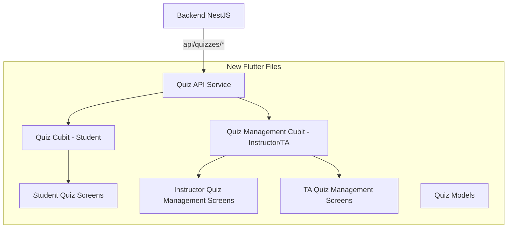

# Quiz Feature — Full API-Parity Migration

Migrate the Flutter Quiz feature for **Student**, **Instructor**, and **TA** roles from mock/AI-only data to production-ready API calls against the NestJS backend, achieving 1:1 feature parity with the React web frontend.

## Resolved Design Decisions

> [!NOTE]
> **Instructor drawer**: "AI Quiz" item REMOVED from AI TOOLS. New "Quiz Management" item added to MAIN MENU. Student AI Quiz screen remains untouched. ✅ Confirmed.

> [!NOTE]
> **TA drawer**: New "Quiz Management" item with **full CRUD capabilities identical to Instructor** — create, edit, delete, publish, grade, view statistics. Both roles use real API data only (no mocks). ✅ Confirmed.

> [!NOTE]
> **Student drawer**: New "Quizzes" item as a separate screen accessed from the drawer, showing instructor-created quizzes from the API. Existing "AI Quiz" remains as-is. ✅ Confirmed.

---

## Architecture Overview



---

## Proposed Changes

### Phase 1 — Data Models

#### [NEW] [quiz_api_models.dart](file:///D:/Graduation/EduVerse/edu_verse/lib/models/quiz/quiz_api_models.dart)

New immutable models aligned 1:1 with the backend DTOs and web frontend types:

| Model | Maps To | Key Fields |
|-------|---------|------------|
| `QuizModel` | Backend `Quiz` entity | `id`, `courseId`, `title`, `description`, `instructions`, `quizType`, `timeLimitMinutes`, `maxAttempts`, `passingScore`, `randomizeQuestions`, `showCorrectAnswers`, `showAnswersAfter`, `availableFrom`, `availableUntil`, `weight`, `course`, `creator`, `questions`, `questionCount`, `maxScore` |
| `QuizQuestionModel` | Backend `QuizQuestion` entity | `id`, `quizId`, `questionType`, `questionText`, `options`, `correctAnswer`, `explanation`, `points`, `difficultyLevelId`, `orderIndex` |
| `QuizAttemptModel` | Backend `QuizAttempt` entity | `id`, `quizId`, `userId`, `attemptNumber`, `startedAt`, `submittedAt`, `score`, `timeTakenMinutes`, `status`, `answers`, `questions`, `quiz`, `user`, `questionCount`, `maxScore`, `scoreObtained`, `scorePercentage` |
| `AttemptAnswerModel` | Backend `AttemptAnswer` | `id`, `attemptId`, `questionId`, `selectedOption`, `answerText`, `isCorrect`, `pointsEarned` |
| `AttemptResultModel` | Backend submit response | `attemptId`, `quizId`, `quizTitle`, `score`, `maxScore`, `percentage`, `passed`, `timeTakenMinutes`, `correctCount`, `wrongCount`, `skippedCount`, `questions` |
| `QuizStatisticsModel` | Backend statistics | `totalAttempts`, `averageScore`, `highestScore`, `lowestScore`, `passRate`, `questionStats` |
| `CourseProgressModel` | Backend progress | `totalQuizzes`, `completedQuizzes`, `averageScore`, `passingRate` |

All models will have `fromJson` / `toJson` / `copyWith` methods. Enums: `QuizTypeEnum`, `QuestionTypeEnum`, `AttemptStatusEnum`, `ShowAnswersAfterEnum`.

---

### Phase 2 — API Service

#### [NEW] [quiz_api_service.dart](file:///D:/Graduation/EduVerse/edu_verse/lib/services/api/quiz_api_service.dart)

Follows the established `AssignmentService` pattern using `CoreApiClient`, `RetryHelper`, and `ServiceResult`:

| Method | HTTP | Endpoint | Returns |
|--------|------|----------|---------|
| `getAll({courseId})` | GET | `/quizzes` | `ServiceResult<List<QuizModel>>` |
| `getById(id)` | GET | `/quizzes/:id` | `ServiceResult<QuizModel>` |
| `create(data)` | POST | `/quizzes` | `ServiceResult<QuizModel>` |
| `update(id, data)` | PUT | `/quizzes/:id` | `ServiceResult<QuizModel>` |
| `delete(id)` | DELETE | `/quizzes/:id` | `ServiceResult<void>` |
| `addQuestion(quizId, data)` | POST | `/quizzes/:quizId/questions` | `ServiceResult<QuizQuestionModel>` |
| `updateQuestion(quizId, qId, data)` | PUT | `/quizzes/:quizId/questions/:qId` | `ServiceResult<QuizQuestionModel>` |
| `deleteQuestion(quizId, qId)` | DELETE | `/quizzes/:quizId/questions/:qId` | `ServiceResult<void>` |
| `reorderQuestions(quizId, ids)` | PUT | `/quizzes/:quizId/questions/reorder` | `ServiceResult<void>` |
| `startAttempt(quizId)` | POST | `/quizzes/:quizId/attempts/start` | `ServiceResult<QuizAttemptModel>` |
| `submitAttempt(attemptId, answers)` | POST | `/quizzes/attempts/:attemptId/submit` | `ServiceResult<AttemptResultModel>` |
| `getAttempt(attemptId)` | GET | `/quizzes/attempts/:attemptId` | `ServiceResult<QuizAttemptModel>` |
| `getMyAttempts({quizId})` | GET | `/quizzes/my-attempts` | `ServiceResult<List<QuizAttemptModel>>` |
| `getInProgressAttempt(quizId)` | GET | `/quizzes/my-attempts?quizId&status=in_progress` | `ServiceResult<QuizAttemptModel?>` |
| `getAllAttempts({quizId})` | GET | `/quizzes/attempts` | `ServiceResult<List<QuizAttemptModel>>` |
| `gradeAttempt(attemptId, grades)` | POST | `/quizzes/attempts/:attemptId/grade` | `ServiceResult<QuizAttemptModel>` |
| `getPendingGrading(attemptId)` | GET | `/quizzes/attempts/:attemptId/pending-grading` | `ServiceResult<Map>` |
| `saveProgress(quizId, attemptId, answers)` | PATCH | `/quizzes/:quizId/attempts/:attemptId/progress` | `ServiceResult<QuizAttemptModel>` |
| `getStatistics(quizId)` | GET | `/quizzes/:quizId/statistics` | `ServiceResult<QuizStatisticsModel>` |
| `getCourseProgress(courseId)` | GET | `/quizzes/progress/course/:courseId` | `ServiceResult<CourseProgressModel>` |

---

### Phase 3 — State Management (BLoC/Cubit)

#### [NEW] [student_quiz_cubit.dart](file:///D:/Graduation/EduVerse/edu_verse/lib/bloc/quiz/student_quiz_cubit.dart)
#### [NEW] [student_quiz_state.dart](file:///D:/Graduation/EduVerse/edu_verse/lib/bloc/quiz/student_quiz_state.dart)

Manages the student quiz-taking lifecycle:
- **States**: `QuizInitial`, `QuizzesLoading`, `QuizzesLoaded`, `QuizStarting`, `QuizActive`, `QuizSubmitting`, `QuizResultLoaded`, `QuizError`
- **Methods**: `loadQuizzes()`, `startQuiz(quizId)`, `submitQuiz(attemptId, answers)`, `saveProgress()`, `loadAttemptHistory()`, `viewAttemptResult(attemptId)`
- Handles auto-save timer (30-second interval), expired attempt detection, and remaining attempt calculation

#### [NEW] [quiz_management_cubit.dart](file:///D:/Graduation/EduVerse/edu_verse/lib/bloc/quiz/quiz_management_cubit.dart)
#### [NEW] [quiz_management_state.dart](file:///D:/Graduation/EduVerse/edu_verse/lib/bloc/quiz/quiz_management_state.dart)

Shared by Instructor and TA — **both have identical full CRUD capabilities**:
- **States**: `QuizMgmtInitial`, `QuizMgmtLoading`, `QuizMgmtLoaded`, `QuizMgmtError`
- **All methods** (available to both Instructor and TA): `loadQuizzes()`, `createQuiz()`, `updateQuiz()`, `deleteQuiz()`, `publishQuiz()`, `closeQuiz()`, `addQuestion()`, `updateQuestion()`, `deleteQuestion()`, `loadAttempts(quizId)`, `gradeAttempt()`, `loadStatistics(quizId)`
- Course/status/search filtering built into state
- No role-based restrictions — both roles get the same interface

---

### Phase 4 — Student UI Screens

#### [NEW] [student_quizzes_screen.dart](file:///D:/Graduation/EduVerse/edu_verse/lib/screens/student/quizzes/student_quizzes_screen.dart)

Main student quiz dashboard. Follows the web `QuizzesTab` flow with three views:
1. **List view**: Grid of quiz cards (similar to web `QuizCard`) + recent attempt history
2. **Active view**: Quiz-taking screen with timer, question navigator, auto-save
3. **Results view**: Score breakdown, question review, retake option

UI Style: Matches the existing Flutter AI Quiz aesthetic (gradient headers, glassmorphic cards, modern colors `#2B7FFF`/`#155DFC`, rounded corners, animations).

#### [NEW] [student_quiz_card.dart](file:///D:/Graduation/EduVerse/edu_verse/lib/widgets/student/quizzes/student_quiz_card.dart)

Card widget showing: title, course badge, question count, duration, difficulty, remaining attempts, Start button. Based on web `QuizCard.tsx` visual design, adapted to Flutter with the app's color palette.

#### [NEW] [student_quiz_taker_screen.dart](file:///D:/Graduation/EduVerse/edu_verse/lib/screens/student/quizzes/student_quiz_taker_screen.dart)

Reuses existing quiz widget components from `widgets/student/ai_quiz/quiz_widgets/` (QuizHeader, ModernQuestionCard, ModernActionButtons, QuizSubmitDialog, QuizExitDialog, etc.) but wired to the API via `StudentQuizCubit` instead of local `QuizSession`. Key additions:
- **Timer**: Countdown timer with auto-submit on expiry
- **Auto-save**: Periodic progress save via `saveProgress()`
- **Submit**: Calls `submitAttempt()` and navigates to results

#### [NEW] [student_quiz_result_screen.dart](file:///D:/Graduation/EduVerse/edu_verse/lib/screens/student/quizzes/student_quiz_result_screen.dart)

Score display, grade calculation, question review (when `showCorrectAnswers` is enabled), retake button.

#### [NEW] [student_attempt_history.dart](file:///D:/Graduation/EduVerse/edu_verse/lib/widgets/student/quizzes/student_attempt_history.dart)

List of past attempts with score, date, status badges. Tap to view results.

---

### Phase 5 — Instructor UI Screens

#### [NEW] [instructor_quiz_management_screen.dart](file:///D:/Graduation/EduVerse/edu_verse/lib/screens/instructor/quiz_management/instructor_quiz_management_screen.dart)

Main quiz management dashboard following web `QuizzesDashboard` flow:
- Header with title, search bar, course/status filters, "Create Quiz" button
- Quiz list with status badges (draft/published/closed), action buttons (Edit, Delete, Publish, View Attempts, Statistics)
- Inline panels for attempts list and statistics (expandable under each quiz card)

#### [NEW] [instructor_quiz_create_screen.dart](file:///D:/Graduation/EduVerse/edu_verse/lib/screens/instructor/quiz_management/instructor_quiz_create_screen.dart)

Full-screen quiz creation form:
- **Step 1 — Details**: Title, description, course selector, time limit, max attempts, passing score, randomize toggle, answer visibility settings, availability dates
- **Step 2 — Questions**: Add/edit/delete questions with type selector (MCQ, True/False, Short Answer, Essay, Matching), option editor, correct answer selector, points, explanation
- Uses web `QuizCreate.tsx` + `QuestionEditor` as reference

#### [NEW] [instructor_quiz_edit_screen.dart](file:///D:/Graduation/EduVerse/edu_verse/lib/screens/instructor/quiz_management/instructor_quiz_edit_screen.dart)

Pre-populated edit form using `fetchQuizDetails()`. Same layout as create, with save/update buttons.

#### [NEW] [instructor_quiz_attempts_screen.dart](file:///D:/Graduation/EduVerse/edu_verse/lib/screens/instructor/quiz_management/instructor_quiz_attempts_screen.dart)

List of student attempts with user info, score, status, grading actions. Based on web `AttemptsList.tsx`.

#### [NEW] [instructor_quiz_grading_screen.dart](file:///D:/Graduation/EduVerse/edu_verse/lib/screens/instructor/quiz_management/instructor_quiz_grading_screen.dart)

Manual grading panel for essay/short-answer questions. Displays student answer, max points, input for points earned. Based on web `GradingPanel.tsx`.

#### [NEW] [instructor_quiz_statistics_screen.dart](file:///D:/Graduation/EduVerse/edu_verse/lib/screens/instructor/quiz_management/instructor_quiz_statistics_screen.dart)

Quiz analytics: total attempts, average/highest/lowest scores, pass rate, per-question stats. Based on web `QuizStatistics.tsx`.

---

### Phase 6 — TA UI Screens (Full CRUD — Identical to Instructor)

The TA quiz management is **identical** to the Instructor quiz management. Both roles get the exact same screens with full capabilities:

#### [NEW] [ta_quiz_management_screen.dart](file:///D:/Graduation/EduVerse/edu_verse/lib/screens/ta/quiz_management/ta_quiz_management_screen.dart)

Full quiz management dashboard — **same as Instructor**, with all capabilities:
- ✅ Create, Edit, Delete quizzes
- ✅ Publish/Close quizzes
- ✅ Add/Edit/Delete questions
- ✅ View attempts, Grade essays
- ✅ View statistics
- All using real API data (no mock fallback)

Implementation: Thin wrapper that reuses the same `QuizManagementCubit` and renders the same widget structure as the Instructor screen, but with TA-specific drawer/navigation context and TA color scheme (`TAColors`).

#### [NEW] [ta_quiz_create_screen.dart](file:///D:/Graduation/EduVerse/edu_verse/lib/screens/ta/quiz_management/ta_quiz_create_screen.dart)

Same full quiz creation form as instructor.

#### [NEW] [ta_quiz_edit_screen.dart](file:///D:/Graduation/EduVerse/edu_verse/lib/screens/ta/quiz_management/ta_quiz_edit_screen.dart)

Same pre-populated edit form as instructor.

#### [NEW] [ta_quiz_attempts_screen.dart](file:///D:/Graduation/EduVerse/edu_verse/lib/screens/ta/quiz_management/ta_quiz_attempts_screen.dart)

Same attempts list as instructor.

#### [NEW] [ta_quiz_grading_screen.dart](file:///D:/Graduation/EduVerse/edu_verse/lib/screens/ta/quiz_management/ta_quiz_grading_screen.dart)

Same grading panel as instructor.

#### [NEW] [ta_quiz_statistics_screen.dart](file:///D:/Graduation/EduVerse/edu_verse/lib/screens/ta/quiz_management/ta_quiz_statistics_screen.dart)

Same statistics view as instructor.

---

### Phase 7 — Navigation & Routing

#### [MODIFY] [instructor_drawer.dart](file:///D:/Graduation/EduVerse/edu_verse/lib/widgets/instructor/dashboard/instructor_drawer.dart)

- **Remove** the "AI Quiz" (`/ai-quiz-generator`) item from the AI TOOLS category
- **Add** "Quiz Management" item to the MAIN MENU category, right after "Create Assignment":
  ```dart
  _MenuItem(
    icon: Icons.quiz_outlined,
    activeIcon: Icons.quiz,
    title: 'Quiz Management',
    route: '/instructor/quiz-management',
    category: 'main',
  ),
  ```

#### [MODIFY] [ta_drawer.dart](file:///D:/Graduation/EduVerse/edu_verse/lib/widgets/ta/dashboard/ta_drawer.dart)

- **Add** "Quiz Management" item to the MAIN MENU category, after "Student Roster":
  ```dart
  _MenuItem(
    icon: Icons.quiz_outlined,
    activeIcon: Icons.quiz,
    title: 'Quiz Management',
    route: '/ta/quiz-management',
    category: 'main',
  ),
  ```

#### [MODIFY] [student_drawer.dart](file:///D:/Graduation/EduVerse/edu_verse/lib/widgets/student/dashboard/student_drawer.dart)

- **Add** "Quizzes" item to the MAIN MENU:
  ```dart
  _MenuItem(
    icon: Icons.quiz_outlined,
    activeIcon: Icons.quiz,
    title: 'Quizzes',
    route: '/student/quizzes',
    category: 'main',
  ),
  ```

#### [MODIFY] [app_router.dart](file:///D:/Graduation/EduVerse/edu_verse/lib/config/app_router.dart)

Add new routes:
| Route | Screen | BLoC Provider |
|-------|--------|---------------|
| `/student/quizzes` | `StudentQuizzesScreen` | `StudentQuizCubit` |
| `/student/quiz-take` | `StudentQuizTakerScreen` | via parent |
| `/student/quiz-result` | `StudentQuizResultScreen` | via parent |
| `/instructor/quiz-management` | `InstructorQuizManagementScreen` | `QuizManagementCubit` |
| `/instructor/quiz-create` | `InstructorQuizCreateScreen` | via parent |
| `/instructor/quiz-edit` | `InstructorQuizEditScreen` | via parent |
| `/instructor/quiz-attempts` | `InstructorQuizAttemptsScreen` | via parent |
| `/instructor/quiz-grading` | `InstructorQuizGradingScreen` | via parent |
| `/instructor/quiz-statistics` | `InstructorQuizStatisticsScreen` | via parent |
| `/ta/quiz-management` | `TAQuizManagementScreen` | `QuizManagementCubit` |
| `/ta/quiz-create` | `TAQuizCreateScreen` | via parent |
| `/ta/quiz-edit` | `TAQuizEditScreen` | via parent |
| `/ta/quiz-attempts` | `TAQuizAttemptsScreen` | via parent |
| `/ta/quiz-grading` | `TAQuizGradingScreen` | via parent |
| `/ta/quiz-statistics` | `TAQuizStatisticsScreen` | via parent |

#### [MODIFY] [main.dart or DI setup]

Register `QuizApiService` and `CoreApiClient` in the dependency injection tree. Provide cubits at route level.

---

### Phase 8 — Localization

#### [MODIFY] [app_en.arb](file:///D:/Graduation/EduVerse/edu_verse/lib/l10n/app_en.arb)
#### [MODIFY] [app_ar.arb](file:///D:/Graduation/EduVerse/edu_verse/lib/l10n/app_ar.arb)

Add ~40 new localization keys for quiz screens (e.g., `quizManagement`, `createQuiz`, `startQuiz`, `submitQuiz`, `quizResults`, `remainingAttempts`, `quizStatistics`, `gradeEssays`, etc.)

---

## File Summary

| Category | Count | Files |
|----------|-------|-------|
| Models | 1 | `quiz_api_models.dart` |
| Services | 1 | `quiz_api_service.dart` |
| BLoC/Cubit | 4 | `student_quiz_cubit.dart`, `student_quiz_state.dart`, `quiz_management_cubit.dart`, `quiz_management_state.dart` |
| Student Screens | 4 | `student_quizzes_screen.dart`, `student_quiz_taker_screen.dart`, `student_quiz_result_screen.dart`, `student_attempt_history.dart` |
| Instructor Screens | 6 | `instructor_quiz_management_screen.dart`, `instructor_quiz_create_screen.dart`, `instructor_quiz_edit_screen.dart`, `instructor_quiz_attempts_screen.dart`, `instructor_quiz_grading_screen.dart`, `instructor_quiz_statistics_screen.dart` |
| TA Screens | 6 | `ta_quiz_management_screen.dart`, `ta_quiz_create_screen.dart`, `ta_quiz_edit_screen.dart`, `ta_quiz_attempts_screen.dart`, `ta_quiz_grading_screen.dart`, `ta_quiz_statistics_screen.dart` |
| Modified Files | 5 | `instructor_drawer.dart`, `ta_drawer.dart`, `student_drawer.dart`, `app_router.dart`, localization ARBs |
| **Total** | **~27 files** | |

---

## Verification Plan

### Automated Tests
```bash
# Build verification — no compile errors
flutter analyze
flutter build apk --debug
```

### Manual Verification Checklist

#### Student Flow
- [ ] Student drawer shows "Quizzes" item → navigates to `StudentQuizzesScreen`
- [ ] Quiz list loads from API (`GET /quizzes`)
- [ ] Quiz card shows title, course, questions count, duration, remaining attempts
- [ ] Start quiz → calls `POST /quizzes/:id/attempts/start`
- [ ] Quiz-taking screen shows timer, question navigator, auto-save
- [ ] Submit quiz → calls `POST /quizzes/attempts/:id/submit`
- [ ] Results screen shows score, grade, question review
- [ ] Retake button works when attempts remain
- [ ] Resume in-progress attempt works
- [ ] Timer auto-submits on expiry

#### Instructor Flow
- [ ] Instructor drawer shows "Quiz Management" (AI Quiz removed from drawer)
- [ ] Quiz list loads with course/status/search filters
- [ ] Create quiz → full form with questions → `POST /quizzes`
- [ ] Edit quiz → pre-populated form → `PUT /quizzes/:id`
- [ ] Delete quiz → confirmation dialog → `DELETE /quizzes/:id`
- [ ] Publish/Close quiz via date updates
- [ ] View attempts list → `GET /quizzes/attempts?quizId=X`
- [ ] Grade essay/short-answer → `POST /quizzes/attempts/:id/grade`
- [ ] View statistics → `GET /quizzes/:id/statistics`

#### TA Flow (Identical to Instructor)
- [ ] TA drawer shows "Quiz Management"
- [ ] Quiz list loads with course/status/search filters (real API data)
- [ ] Create quiz → full form with questions → `POST /quizzes`
- [ ] Edit quiz → pre-populated form → `PUT /quizzes/:id`
- [ ] Delete quiz → confirmation dialog → `DELETE /quizzes/:id`
- [ ] Publish/Close quiz via date updates
- [ ] View attempts list → `GET /quizzes/attempts?quizId=X`
- [ ] Grade essay/short-answer → `POST /quizzes/attempts/:id/grade`
- [ ] View statistics → `GET /quizzes/:id/statistics`

#### Cross-Cutting
- [ ] Dark mode works on all screens
- [ ] RTL (Arabic) layout works
- [ ] Error states display correctly (network errors, max attempts, etc.)
- [ ] Loading states with shimmer/spinner
- [ ] Existing AI Quiz screen still works independently
