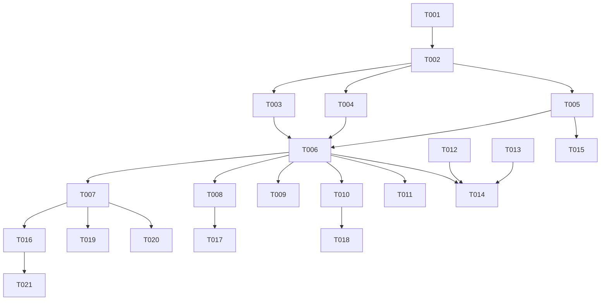

# Execution Tasks: Unified Chat UI — Conversation List

**Feature Branch:** `008-chat-ui-list`
**Generated:** April 6, 2026

## Phase 1: Setup

> **Goal:** Create foundational directories and UI types for the shared chat widgets.

- [X] T001 Create directory `lib/widgets/shared/chat/` for universal chat components
- [X] T002 Create `ChatListFilter` enum (all, unread, groups) in `lib/widgets/shared/chat/chat_list_types.dart`

## Phase 2: Foundational Components

> **Goal:** Build stateless low-level widgets before wiring them to state.

- [X] T003 [P] Create `SharedChatEmptyState` displaying a "Start a new chat" actionable prompt in `lib/widgets/shared/chat/shared_chat_empty_state.dart`
- [X] T004 [P] Create `SharedChatHeader` containing title, dynamic connection status badge (Live/Offline), "+" modal button, and search toggle in `lib/widgets/shared/chat/shared_chat_header.dart`
- [X] T005 [P] Create `SharedConversationTile` displaying dynamic avatar (initials/icon), online dot, name, last message preview, timestamp, and unread badge in `lib/widgets/shared/chat/shared_conversation_tile.dart`

## Phase 3: [US1] Universal Conversation List & Screen Rollout

> **Goal:** Implement the main scrolling list consuming the `ChatBloc` and deploy it across all role dashboards to unify the UI.

- [X] T006 [US1] Create `SharedConversationList` (a `ListView.builder` with infinite scrolling) consuming `BlocBuilder<ChatBloc, ChatState>` in `lib/widgets/shared/chat/shared_conversation_list.dart`
- [X] T007 [P] [US1] Replace existing body with `SharedConversationList` providing required theme props (`accentColor`, `isDark`) in `lib/screens/student/chat/chat_screen.dart`
- [X] T008 [P] [US1] Replace existing body with `SharedConversationList` providing required theme props in `lib/screens/instructor/chat/instructor_chat_screen.dart`
- [X] T009 [P] [US1] Replace existing body with `SharedConversationList` providing required theme props in `lib/screens/ta/chat/ta_messages_screen.dart`
- [X] T010 [P] [US1] Replace existing body with `SharedConversationList` providing required theme props in `lib/screens/admin/messages/admin_messages_screen.dart`
- [X] T011 [P] [US1] Add/update missing chat screen using `SharedConversationList` in `lib/screens/it_admin/chat/it_admin_chat_screen.dart`

## Phase 4: [US2] Filter and Search Conversations

> **Goal:** Add text search and filter chips to the unified list to let users rapidly locate threads.

- [X] T012 [P] [US2] Create responsive `SharedChatSearchBar` handling query text input in `lib/widgets/shared/chat/shared_chat_search_bar.dart`
- [X] T013 [P] [US2] Create `SharedChatFilterChips` with explicit "All", "Unread", and "Groups" toggles in `lib/widgets/shared/chat/shared_chat_filter_chips.dart`
- [X] T014 [US2] Integrate search bar and filter chips into the top of `SharedConversationList` or its header, wiring changes to emit `SearchConversations` and `FilterConversations` events to `ChatBloc` in `lib/widgets/shared/chat/shared_conversation_list.dart`

## Phase 5: [US3] Conversation Swipe Actions

> **Goal:** Implement trailing right-to-left swipe actions on individual tiles.

- [X] T015 [US3] Wrap the main tile container in `Dismissible` or `Slidable` to implement Trailing (Right-to-Left) swipe actions (Pin, Mute, Delete). "Pin" and "Mute" must be implemented purely via local state (e.g., `SharedPreferences`) as a mobile-only UX pattern, while "Delete" emits the respective BLoC event in `lib/widgets/shared/chat/shared_conversation_tile.dart`

## Phase 6: Polish & Cross-Cutting Concerns

> **Goal:** Aggressively delete legacy chat widgets, enforce the static data elimination policy, and clean up unneeded mock files from past TA courses iteration.

- [X] T016 [P] Delete legacy student chat widgets directory: `lib/widgets/student/chat/`
- [X] T017 [P] Delete legacy instructor chat widgets directory: `lib/widgets/instructor/chat/`
- [X] T018 [P] Delete legacy admin messages widgets directory: `lib/widgets/admin/messages/`
- [X] T019 [P] Audit workspace for unused legacy UI files mapped to outdated role-specific filters ("Courses", "Students", "Colleagues") and delete them to enforce 1:1 UI parity.
- [X] T020 Search for and completely delete unused files related to the TA courses feature generated before backend integration (e.g., `mock_ta_courses.dart` or legacy static mock data inside `lib/screens/ta/` and `lib/models/ta/`) as per `courses_backend_integration_plan.md` policy.
- [X] T021 Run a strict grep audit (e.g., `git grep -E "_generateSample|_simulateReply|_mockMessages|isMe: true" lib/`) to enforce the **VII. Static Data Elimination** rule, then run `flutter analyze` and `flutter test` across the workspace to ensure no references to the deleted legacy chat or TA course files remain broken.

---
## Implementation Strategy

1. **MVP First**: The primary blocker is getting the `SharedConversationList` rendering live Socket/REST data from `ChatBloc` and swapping it into the 5 role screens (`T001` through `T011`). Getting this up immediately proves out the universal data flow.
2. **Incremental Delivery**: Search and Filter UI (`T012` to `T014`) are decoupled visual modifiers adding interactivity on top of the list. Swipe actions (`T015`) strictly target the tile internal mechanics.
3. **Aggressive Deletion**: Phase 6 validates the project constitution's rule on eliminating static data and mock files, applying specifically to legacy Chat widgets AND old un-integrated TA courses logic.

## Dependencies

