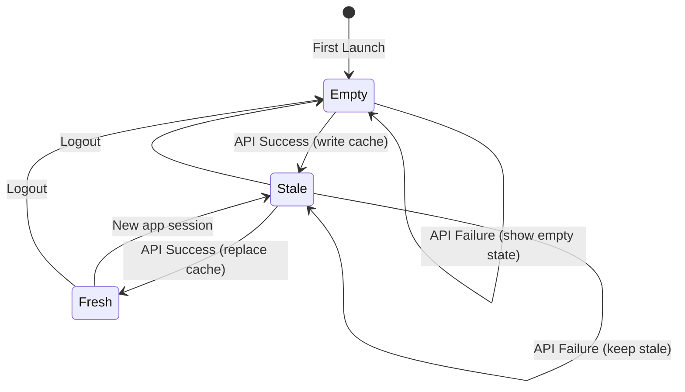

# Data Model: Chat Cache Structures

**Feature**: 014-chat-cleanup-polish | **Date**: 2026-04-09

---

## 1. Cache Storage Schema (SharedPreferences)

### Key: `chat_cached_conversations`

Stores the serialized JSON list of the user's filtered conversation models. Updated on every successful `GET /api/messages/conversations` response.

```json
[
  {
    "id": 1,
    "type": "direct",
    "participants": [
      {
        "userId": 42,
        "displayName": "Jane Doe",
        "profileImage": "https://..."
      }
    ],
    "lastMessage": {
      "id": 101,
      "content": "Hey!",
      "senderId": 42,
      "createdAt": "2026-04-09T19:55:00Z",
      "type": "text"
    },
    "unreadCount": 2,
    "updatedAt": "2026-04-09T19:55:00Z"
  }
]
```

### Key: `chat_cached_messages_{conversationId}`

Stores the last 50 messages for a specific conversation thread. Updated on every successful message page load.

```json
[
  {
    "id": 101,
    "conversationId": 1,
    "senderId": 42,
    "content": "Hey!",
    "type": "text",
    "createdAt": "2026-04-09T19:55:00Z",
    "isRead": true,
    "readBy": [42, 99],
    "replyTo": null,
    "attachments": []
  }
]
```

---

## 2. Serialization Strategy

Both `ConversationModel` and `ChatMessageModel` already implement `toJson()` and `fromJson()` factory constructors. No new model changes are required.

**Serialization:** `jsonEncode(models.map((m) => m.toJson()).toList())`
**Deserialization:** `(jsonDecode(cached) as List).map((j) => Model.fromJson(j)).toList()`

---

## 3. Cache Size Constraints

| Constraint | Value | Rationale |
|---|---|---|
| Conversation list | Max 200 (guard) | Backend returns all; cap at 200 to ensure deserialization completes within 2s (FR-001/SC-001) on older devices |
| Messages per thread | 50 | Spec requirement; sufficient for immediate display |
| Total cache keys | 1 + N (N = active thread count) | One per conversation + one for the list |

> **Performance Note**: `SharedPreferences.getString()` + `jsonDecode()` + `ConversationModel.fromJson()` × N must complete within 2 seconds to meet FR-001 / SC-001. If benchmarking on low-end devices shows deserialization exceeding this threshold, reduce the conversation cache cap or switch to a binary serialization format. The 200-conversation guard provides a safety margin for typical use (most users have < 100 conversations).

---

## 4. Cache Lifecycle



---

## 5. New State Fields for ChatState

No new fields needed in `ChatState`. The existing `ConnectionStatus connectionStatus` and `ChatStatus status` already cover all cache/loading/error states. The cache is transparent to the UI — it only affects what data is available in `conversations` and `activeConversationMessages` when the BLoC initializes.

---

## 6. Connection Status Badge Mapping

| ChatSocketService Status | ChatState.connectionStatus | Badge Color | Badge Text |
|---|---|---|---|
| `connected` | `ConnectionStatus.live` | Green | "Live" |
| `disconnected` | `ConnectionStatus.offline` | Red | "Offline" |
| `reconnecting` | `ConnectionStatus.connecting` | Amber | "Connecting..." |
